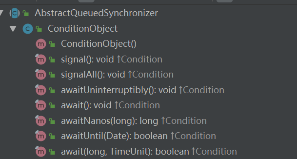

#### 想要了解AQS，必然就有如下的几个问题，让我们带着疑问来学习
1. AQS的共享模式和独占模式的区别？共享和独占到底指的是什么共享，什么独占?
2. AQS加锁，解锁的到底什么？
3. 一个线程在AQS的模型里面是怎么样的？
***
#### 一、AQS的组成部分

1. Node：同步队列上的节点,双端队列
2. ConditionObject：等待队列上的节点，链表
3. 其他的一些局部变量：volatile修饰的head，tail，state以及类变量：unsafe修饰的stateOffset，headOffset等，为了使用Unsafe的API来改变volatile修饰的变量
4. 各种针对Node的和Condition的api：实现同步队列的独占/共享模式，完成线程之间的通信

##### 什么是Node？
1. Node是什么？Node就是AQS为了抽象线程状态而建立的Java对象，是放置在同步队列上的节点，为了让线程排队，抽象出来的概念，注意：立刻获取锁的线程并不会形成Node节点
2. Node有什么作用？定义了线程当前在同步队列里面的状态以及提供线程与线程之间交互的api
```java
static final class Node {
    /** Marker to indicate a node is waiting in shared mode */
    // 标记节点正在以共享模式等待
    static final Node SHARED = new Node();
    // 标记节点正在以独占模式等待
    /** Marker to indicate a node is waiting in exclusive mode */
    static final Node EXCLUSIVE = null;
    /** waitStatus value to indicate thread has cancelled */
    // 标记节点已经被取消
    static final int CANCELLED =  1;
    /** waitStatus value to indicate successor's thread needs unparking */
    // 标记当前节点的后继节点需要被unPark，唤醒
    static final int SIGNAL    = -1;
    /** waitStatus value to indicate thread is waiting on condition */
    // 标记当前节点在condition等待队列上
    static final int CONDITION = -2;
    /**
     * waitStatus value to indicate the next acquireShared should
     * unconditionally propagate
     */
    // 标记当前节点的下一个共享节点应该无条件传播
    static final int PROPAGATE = -3;
    // 等待状态，就是上述四种情况之一，还有一个0，当node节点被刚刚初始化：线程被唤醒，占有资源，此时状态为0
    volatile int waitStatus;
    // 前驱节点
    volatile Node prev;
    // 后继节点
    volatile Node next;
    // 当前node代表的线程
    volatile Thread thread;
    // 当前节点的模式，上述两种模式之一，是共享的，还是独占的
    Node nextWaiter;
    // 判断是否是共享
    final boolean isShared() {
        return nextWaiter == SHARED;
    }
    // 返回当前node节点的前驱节点
    final Node predecessor() throws NullPointerException {
        Node p = prev;
        if (p == null)
            throw new NullPointerException();
        else
            return p;
    }
    Node() {    // Used to establish initial head or SHARED marker
    }
    // 将线程以特定的模式创建节点
    Node(Thread thread, Node mode) {     // Used by addWaiter
        this.nextWaiter = mode;
        this.thread = thread;
    }
    // 将线程以特定的状态创建节点；估计就是因为这个重载方法，才把独占/共享模式也定义成Node,所以创建节点的时候传入Node，让人看不懂，其实这个Node相当于一个int，指的是一个类型
    Node(Thread thread, int waitStatus) { // Used by Condition
        this.waitStatus = waitStatus;
        this.thread = thread;
    }
}
```
##### 什么是ConditionObject?
1. 什么是ConditionObject？为了控制线程与线程之间的交互，比如CyclicBarrier使用condition来使得线程都达到屏障就使用condition来唤醒相关联的线程
```java
public class ConditionObject implements Condition, java.io.Serializable {
    private static final long serialVersionUID = 1173984872572414699L;
    /** First node of condition queue. */
    private transient Node firstWaiter;
    /** Last node of condition queue. */
    private transient Node lastWaiter;
    /**
     * Creates a new {@code ConditionObject} instance.
     */
    public ConditionObject() { }
    // Internal methods
    
    /** Mode meaning to reinterrupt on exit from wait */
    private static final int REINTERRUPT =  1;
    /** Mode meaning to throw InterruptedException on exit from wait */
    private static final int THROW_IE    = -1;
}
```

#### 二、AQS独占模式解析

独占模式核心的两个API
   - acquire：独占模式竞争锁
   - release：独占模式释放锁
   
##### acquire方法源码解析

**acquire的源码：**
```
public final void acquire(int arg) {
    if (!tryAcquire(arg) &&
        acquireQueued(addWaiter(Node.EXCLUSIVE), arg)) // 1.获取失败，添加到同步队列中 2. 尝试获取锁
        selfInterrupt(); //如果当前节点竞争到资源之后并且是被中断过的，重新设置中断，在上面acquireQueued中如果线程被唤醒CAS继续尝试获取锁资源，那么此时线程都不可被中断（在tryAcquire里用户可能自定义中断，此时不起作用），直到获取锁成功之后，再将中断还原到当前线程
}
```
**条件分三段：**
1. tryAcquire(arg)：当前线程尝试获取锁，在AQS内是空实现，在子类中定义了两个内容，一个是锁的是什么？比如ReentrantLock里面就是volatile修饰的state；第二个是当前线程尝试去获取定义好的这个“锁”，锁指的是：**所有线程可见的资源数目**
2. addWaiter(Node.EXCLUSIVE)：如果当前线程竞争锁失败，新建一个独占节点，将节点放到同步队列中
  
- addWaiter(Node mode)源码：
```
private Node addWaiter(Node mode) {
    Node node = new Node(Thread.currentThread(), mode); //将当前线程以独占模式创建一个node节点
    // Try the fast path of enq; backup to full enq on failure
    Node pred = tail; // pred：指向之前的尾部的节点；假设当前pred=tail=@300，node为@400
    if (pred != null) { // 如果存在尾节点
        node.prev = pred; // 当前节点指向尾节点 // @400的前驱改为@300
        if (compareAndSetTail(pred, node)) { // 使用Unsafe的API，CAS替换尾节点为当前节点；node替换成功tail，此时tail=@400
            pred.next = node; // 如果替换成功，将之前的尾节点指向当前节点；@300指向@400，形成双端链表
            return node; // 返回尾节点
        }
    }
    enq(node); // 如果失败，自旋
    return node;
}
```
- enq(node)源码：如果当前线程竞争锁失败并且第一次CAS替换为最后一个节点失败，让当前自旋（死循环）去竞争替换最后一个节点
```
private Node enq(final Node node) {
for (;;) {
    Node t = tail;
    if (t == null) { // Must initialize // 如果没有尾就必须创建尾
        if (compareAndSetHead(new Node())) // 新建一个节点作为尾
            tail = head;
    } else {
        node.prev = t; // 当前节点的前驱节点为尾节点
        if (compareAndSetTail(t, node)) { // CAS将当前节点放在尾部，和上面一样
            t.next = node;
            return t;
        }
    }
}
```
3. acquireQueued()：如果当前线程竞争锁失败，并且放到创建一个独占节点放到同步队列尾部成功，再次去尝试获取锁

- acquireQueued(final Node, int arg)源码
```
final boolean acquireQueued(final Node node, int arg) {
    boolean failed = true; // 默认失败
    try {
        boolean interrupted = false; // 默认没有被中断
        for (;;) {
            final Node p = node.predecessor(); // p:node的前驱节点
            if (p == head && tryAcquire(arg)) { // 如果p是头节点说明当前节点将要获取到资源，当前线程尝试去获取资源
                setHead(node); // 如果当前线程获取资源成功，设置当前节点为头节点
                p.next = null; // help GC 
                failed = false; // 失败得到了失败->成功
                return interrupted; // 返回中断标志
            }
            if (shouldParkAfterFailedAcquire(p, node) &&
                parkAndCheckInterrupt()) // 如果当前节点获取资源失败需要1. 找到安全点，即前一个节点是SIGNAL的 2. 挂起当前线程进行等待 3.如果被unPark唤醒，设置线程不可中断
                interrupted = true; // 当前线程被唤醒并且被唤醒的时候当前线程处于中断状态，用局部变量interrupted标识当前线程是被中断的，在唤醒后cas成功后返回中断标记
        }
    } finally { // 子继承了AQS，tryAcquire方法可能抛出异常
        if (failed)
            cancelAcquire(node);
    }
}    
```
- tryAcquire:当前线程尝试去获取资源，需要子类实现
- setHead:设置当前节点为头节点，头节点的线程置为null，头节点没有线程了，头节点的也没有前驱节点
```
private void setHead(Node node) {
    head = node;
    node.thread = null;
    node.prev = null;
}
```
- shouldParkAfterFailedAcquire:找到安全点：如果是初始化状态或者是废弃状态就自旋一下，不挂起线程
```
private static boolean shouldParkAfterFailedAcquire(Node pred, Node node) {
    int ws = pred.waitStatus; // ws：前驱节点的状态
    if (ws == Node.SIGNAL) // 如果前驱节点是SIGNAL，说明当前node节点将被唤醒，当前node节点包裹的是当前线程信息，返回成功
        /*
         * This node has already set status asking a release
         * to signal it, so it can safely park.
         */
        return true;
    if (ws > 0) {
        /*
         * Predecessor was cancelled. Skip over predecessors and
         * indicate retry.
         */
        do {
            node.prev = pred = pred.prev; // 如果前驱节点是已取消的状态，替换当前node节点的前驱节点，直到waitStatus<=0，是正常状态
        } while (pred.waitStatus > 0);
        pred.next = node;
    } else {
        /*
         * waitStatus must be 0 or PROPAGATE.  Indicate that we
         * need a signal, but don't park yet.  Caller will need to
         * retry to make sure it cannot acquire before parking.
         */
        compareAndSetWaitStatus(pred, ws, Node.SIGNAL); // 如果是-2，-3，0状态，CAS尝试修改前驱节点为SIGNAL
    }
    return false; // 只有前驱节点是SIGNAL才是成功的
}
```
- parkAndCheckInterrupt():如果前驱节点的waitStatus是SIGNAL，让当前线程持有当前AQS对象并挂起当前线程，等待唤醒，为了恢复现场？
```
private final boolean parkAndCheckInterrupt() {
    LockSupport.park(this); // 挂起当前线程
    return Thread.interrupted(); // 停止当前线程的中断，开始继续执行，并返回中断标志；表明当前线程是否被中断过；如果被中断过，在被唤醒的时候恢复中断标志
}
```
- LockSupport的park方法：挂起当前线程
```
public static void park(Object blocker) {
    Thread t = Thread.currentThread();
    setBlocker(t, blocker);
    UNSAFE.park(false, 0L);
    setBlocker(t, null);
}
private static void setBlocker(Thread t, Object arg) {
    // Even though volatile, hotspot doesn't need a write barrier here.
    UNSAFE.putObject(t, parkBlockerOffset, arg);
}
```
**最终还原中断**
1. selfInterrupt()
```
static void selfInterrupt() {
     Thread.currentThread().interrupt();
 }
```
    
【总结】独占锁请求锁流程：
1. 先调用tryAcquire，当前线程尝试去获取资源（这个锁的定义和获取锁的方式是自定义的），如果获取到了返回
2. 如果没有获取到，调用addWaiter方法，将当前线程封装成为一个独占节点不断自旋CAS放到同步队列的尾部
3. 放到同步队列的尾部之后，调用acquireQueue方法，检测当前线程封装的节点是否可以获取到锁（这个锁的定义和获取锁的方式是自定义的），如果获取到了锁，返回当前线程的中断标志，并进行中断
4. 如果当前线程封装的Node节点竞争锁失败，调用park进入阻塞状态，等待被唤醒
5. 如果当前线程被唤醒，取消当前线程的中断状态，继续CAS去获取锁，整个过程不可被中断，直到获取到锁
6. 返回第3步，如果之前当前线程是中断状态的，再次进行中断，防止中断丢失

问题：为什么在线程被唤醒之后，需要调用Thread.interrupted()返回线程中断状态并擦除
答：为了在当前线程CAS抢夺的过程中不可中断，使用一个interrupted的局部变量保存线程中断标志，当当前线程抢到锁之后，如果之前是中断的再次赋予中断
***
##### release方法源码解析
**release的源码**
```
public final boolean release(int arg) {
    if (tryRelease(arg)) { // 尝试释放锁
        Node h = head; // h：头节点
        if (h != null && h.waitStatus != 0) // 如果头节点不为空并且头节点不是0，去唤醒所有的后继节点。因为当前线程获取锁之后只是创建了一个独占节点，waitStatus只可能为0，只有下一个节点去竞争锁的时候，调用了shouldParkAfterFailedAcquire才把前一个节点的waitStatus的状态变为了SIGNAL，才会进去，说明存在下一个节点进行唤醒
            unparkSuccessor(h);
        return true;
    }
    return false;
}
```
1. tryRelease(arg)：当前线程释放锁，具体由子类去实现
2. unparkSuccessor(h):如果尝试释放锁成功，唤醒下一个独占节点
```
private void unparkSuccessor(Node node) {
    /*
     * If status is negative (i.e., possibly needing signal) try
     * to clear in anticipation of signalling.  It is OK if this
     * fails or if status is changed by waiting thread.
     */
    int ws = node.waitStatus; // ws：当前节点的节点状态，即当前头节点的状态
    if (ws < 0) // 如果当前节点可用，通过CAS替换当前节点为0，标记为初始化状态，清除可用标记
        compareAndSetWaitStatus(node, ws, 0); 

    /*
     * Thread to unpark is held in successor, which is normally
     * just the next node.  But if cancelled or apparently null,
     * traverse backwards from tail to find the actual
     * non-cancelled successor.
     */
    Node s = node.next; // s：头节点的下一个节点
    if (s == null || s.waitStatus > 0) { // 如果下一个节点是空或者是弃用状态
        s = null; 
        for (Node t = tail; t != null && t != node; t = t.prev) // 从后往前找到第一个未被弃用的节点，为什么不从头往前找？考虑到是共享节点？共享节点值为null
            if (t.waitStatus <= 0)
                s = t;
    }
    if (s != null)
        LockSupport.unpark(s.thread); // 唤醒s节点
}
```

【总结】：发现释放锁，并没有删除头节点，只是将头节点的waitStatus置为0，然后去唤醒下一个有效节点，在下一个有效节点的acquireQueued方法内，将头节点替换为唤醒的节点。
  
问题1：为什么释放锁的时候只要判断当前节点不为0的时候，进去唤醒下一个节点？ if (h != null && h.waitStatus != 0) unparkSuccessor(h);  
答：因为当前节点acquire获取锁的时候，只是创建了一个独占节点，独占节点的waitStatus为0，只有当其他线程也在竞争锁的时候，调用到acquireQueued里面的shouldPakAfterFailedAcquire方法，才会将前一个waitStatus置为SIGNAL，也就是说这一个条件进入的情况只可能是下一个节点在竞争锁，修改了状态，当前节点有后置节点等待唤醒，就去执行唤醒。  

问题2： release的时候直接使用head头节点去做判断为什么没问题 ？   
答案：
1. 如果当前线程立刻就获取了资源，第二个线程创建了空head和第二个线程的Node（addWaiter方法），head指的就是当前线程
2. 如果第二个线程获取到了资源，那么第二个线程的Node节点就变成了头节点（acquireQueue的setHead方法），在第二个线程里面去释放节点当然没问题，因为头节点就是第二个线程信息
***
再回到上面的问题
1. AQS的共享模式和独占模式的区别？共享和独占到底指的是什么共享，什么独占?（只回答了独占模式）

    独占模式就是一个资源只能被一个线程占用，如果没有资源可以获取，那么其他线程形成Node节点组成的双端链表，等待head节点的唤醒，即release操作
    
2. AQS加锁，解锁的到底什么？

    加锁解锁的是在外面自己定义的volatile的state资源，占有资源之后，AQS维护了一整套的Node节点来抽象线程与线程的关系，一个个形成同步队列进行排队获取资源。
    
3. 一个线程在AQS的模型里面是怎么样的？
    1. 一个线程在AQS模型里面如果没有立刻获取到资源，是被维护成一个又一个的Node节点，Node节点存储了thread信息，waitStatus：线程状态的信息。
    2. 如果当前线程立刻就获取到了资源，那么就不会形成Node节点，head节点第一次其实是空节点（可以比作是第一个线程的节点），是在第二个线程去抢占的时候生成的

4. 子类尝试获取锁，释放锁之后，AQS里面加锁解锁的是什么

    一旦加锁成功当前线程就往下执行，加锁失败就维护成Node，用park挂起。解锁成功就unPark唤醒Node节点上的线程

***
共享模式还没学完，下篇跟着小周一起学习什么是独占模式？

#### 三、AQS共享模式解析

共享模式核心的两个API
 - acquireShared:共享模式竞争锁
 - releasedShared:共享模式释放锁

##### acquireShared方法源码解析

acquireShared的源码：用共享模式去尝试获取锁，然后执行获取锁的逻辑
```
public final void acquireShared(int arg) {
    if (tryAcquireShared(arg) < 0)
        doAcquireShared(arg);
}
```

1. tryAcquiredShared(arg)：尝试获取共享锁，这是唯一一个tryXXX的方法有具体返回值的，其他都是true/false。如果返回值<0，说明当前线程可以获取锁并且下一个线程也有获取锁的权利

tryAcquiredShared源码
```
/**
 * Attempts to acquire in shared mode. This method should query if
 * the state of the object permits it to be acquired in the shared
 * mode, and if so to acquire it.
 *
 * <p>This method is always invoked by the thread performing
 * acquire.  If this method reports failure, the acquire method
 * may queue the thread, if it is not already queued, until it is
 * signalled by a release from some other thread.
 *
 * <p>The default implementation throws {@link
 * UnsupportedOperationException}.
 *
 * @param arg the acquire argument. This value is always the one
 *        passed to an acquire method, or is the value saved on entry
 *        to a condition wait.  The value is otherwise uninterpreted
 *        and can represent anything you like.
 * @return a negative value on failure; zero if acquisition in shared
 *         mode succeeded but no subsequent shared-mode acquire can
 *         succeed; and a positive value if acquisition in shared
 *         mode succeeded and subsequent shared-mode acquires might
 *         also succeed, in which case a subsequent waiting thread
 *         must check availability. (Support for three different
 *         return values enables this method to be used in contexts
 *         where acquires only sometimes act exclusively.)  Upon
 *         success, this object has been acquired.
 * @throws IllegalMonitorStateException if acquiring would place this
 *         synchronizer in an illegal state. This exception must be
 *         thrown in a consistent fashion for synchronization to work
 *         correctly.
 * @throws UnsupportedOperationException if shared mode is not supported
 */
protected int tryAcquireShared(int arg) {
    throw new UnsupportedOperationException();
}
```
看源码的注释； 
- negative value on failure;   
    负数代表失败 
- zero if acquisition in shared mode succeeded but no subsequent shared-mode acquire can succeed;  
    返回0代表：当前线程在共享模式下成功，但是没有后续的共享模式的线程能够获取成功
- and a positive value if acquisition in shared mode succeeded and subsequent shared-mode acquires might also succeed, in which case a subsequent waiting thread must check availability.  
    正数： 如果当前线程在共享模式下成功，并且后续也有线程可能会成功；需要检查后续线程的可用性

2. doAcquireShared(arg)：当前线程去获取共享锁（当前线程去替换成头节点）

 - doAcquireShared(arg)源码
```
private void doAcquireShared(int arg) {
    final Node node = addWaiter(Node.SHARED); // 创建一个共享节点放置到队列尾部
    boolean failed = true;
    try {
        boolean interrupted = false;
        for (;;) {
            final Node p = node.predecessor(); // p：当前节点的前驱节点
            if (p == head) { // 如果p是头节点，用来获取资源的节点
                int r = tryAcquireShared(arg); // 尝试获取资源
                if (r >= 0) { // 如果当前线程可以获取锁资源
                    setHeadAndPropagate(node, r); // 将当前节点置为头节点，并且传播唤醒之后的其他共享线程
                    p.next = null; // help GC
                    if (interrupted) // 如果之前被中断过，再次中断，返回；和独占模式的中断一样
                        selfInterrupt();
                    failed = false;
                    return;
                }
            }
            if (shouldParkAfterFailedAcquire(p, node) &&
                parkAndCheckInterrupt()) // 找到安全点，被park，进入waiting状态
                interrupted = true;
        }
    } finally {
        if (failed)
            cancelAcquire(node);
    }
}
```
- setHeadAndPropagate(Node node, int propagate)
```
private void setHeadAndPropagate(Node node, int propagate) {
    Node h = head; // Record old head for check below // h：原先头节点的一个记录
    setHead(node); // 设置当前node为头节点
    /*
     * Try to signal next queued node if:
     *   Propagation was indicated by caller,
     *     or was recorded (as h.waitStatus either before
     *     or after setHead) by a previous operation
     *     (note: this uses sign-check of waitStatus because
     *      PROPAGATE status may transition to SIGNAL.)
     * and
     *   The next node is waiting in shared mode,
     *     or we don't know, because it appears null
     *
     * The conservatism in both of these checks may cause
     * unnecessary wake-ups, but only when there are multiple
     * racing acquires/releases, so most need signals now or soon
     * anyway.
     */
    if (propagate > 0 || h == null || h.waitStatus < 0 || // 如果可传播或者头节点都是符合条件的节点
        (h = head) == null || h.waitStatus < 0) {
        Node s = node.next; // s：头节点的下一个节点
        if (s == null || s.isShared()) // 校验下一个节点是否是共享节点，如果是共享节点，释放当前线程资源，让其他线程抢占
            doReleaseShared(); // 用共享模式释放资源
    }
}
```
- doReleaseShared():以共享模式释放节点
```
/**
 * Release action for shared mode -- signals successor and ensures
 * propagation. (Note: For exclusive mode, release just amounts
 * to calling unparkSuccessor of head if it needs signal.)
 */
private void doReleaseShared() {
    /*
     * Ensure that a release propagates, even if there are other
     * in-progress acquires/releases.  This proceeds in the usual
     * way of trying to unparkSuccessor of head if it needs
     * signal. But if it does not, status is set to PROPAGATE to
     * ensure that upon release, propagation continues.
     * Additionally, we must loop in case a new node is added
     * while we are doing this. Also, unlike other uses of
     * unparkSuccessor, we need to know if CAS to reset status
     * fails, if so rechecking.
     */
    for (;;) {
        Node h = head; // h：头节点
        if (h != null && h != tail) { // 至少有两个节点
            int ws = h.waitStatus; // ws：头节点的状态
            if (ws == Node.SIGNAL) { // 如果节点是SIGNAL类型的并且节点CAS替换成0成功，需要唤醒下一个节点；CAS失败，继续循环尝试CAS
                if (!compareAndSetWaitStatus(h, Node.SIGNAL, 0))
                    continue;            // loop to recheck cases
                unparkSuccessor(h); // 唤醒后继节点
            }
            else if (ws == 0 &&
                     !compareAndSetWaitStatus(h, 0, Node.PROPAGATE)) // node此时为初始节点，修改为propagate，继续自旋修改
                continue;                // loop on failed CAS
        }
        if (h == head)                   // loop if head changed // 只有要么头节点是SIGNAL状态，唤醒下一个节点线程要么自己是刚被创建，是初始化状态，变成可传播；如果头节点没有被改变，就停止传播
            break;
    }
}
```
**判断锁是否可以获得**
1. 通过子类的是否可以获取锁的条件>=0来判断是否执行AQS的加锁

**共享加锁执行流程**
1. 添加一个共享模式节点到双端队列尾部，判断如果前驱节点那么就尝试获取共享资源，如果获取成功，就设置当前节点为头节点，如果当前节点是可传播的或者头节点是正常节点，并且满足下一个节点是共享节点/空节点，去尝试释放下一个节点
2. 如果当前节点是SIGNAL状态，则说明要唤醒下一个节点，CAS修改SIGNAL->0，唤醒后继节点；
3. 如果当前节点是初始化状态，CAS替换当前节点是可传播节点。（这里为什么不直接唤醒？因为SIGNAL的定义为唤醒下一个节点，PROPAGATE的定义为传播，其实只是让下一个线程先阻塞一下，将PROPAGATE替换为SIGNAL，然后就走上面这一条路了）只要符合了这两者的任意一个并且当前头节点没有被改变，当前节点线程就继续往下执行
4. 如果都不符合，就自旋，尝试去释放后继节点
总结：假如一个线程在获取资源的时候，如果获取到了并且后继节点发现是共享节点，就尝试去唤醒下一个节点来共同竞争锁资源

##### releasedShared源码解析
releasedShared源码：用共享模式去释放锁，然后执行释放锁的逻辑
```
public final boolean releaseShared(int arg) {
    if (tryReleaseShared(arg)) {
        doReleaseShared();
        return true;
    }
    return false;
}
```
1. tryReleaseShared：尝试释放共享锁，没啥好说的，子类实现
```
protected boolean tryRelease(int arg) {
    throw new UnsupportedOperationException();
}
```

2. doReleaseShared:源码上面分析了
    
    1. 如果头节点是SIGNAL节点，就CAS替换为0并唤醒后继节点
    2. 如果头节点是初始节点，就CAS替换为PROPAGATE状态，此时其他线程只能调用到shouldParkAfterFailedAcquire方法，发现头节点状态是0，那么让他自旋不让他挂起，说不定直接就抢到资源了呢，不用挂起线程。
```
private static boolean shouldParkAfterFailedAcquire(Node pred, Node node) {
    int ws = pred.waitStatus; // ws：前驱节点的状态
    if (ws == Node.SIGNAL) // 如果前驱节点是SIGNAL，说明当前node节点将被唤醒，当前node节点包裹的是当前线程信息，返回成功
        /*
         * This node has already set status asking a release
         * to signal it, so it can safely park.
         */
        return true;
    if (ws > 0) {
        /*
         * Predecessor was cancelled. Skip over predecessors and
         * indicate retry.
         */
        do {
            node.prev = pred = pred.prev; // 如果前驱节点是已取消的状态，替换当前node节点的前驱节点，直到waitStatus<=0，是正常状态
        } while (pred.waitStatus > 0);
        pred.next = node;
    } else {
        /*
         * waitStatus must be 0 or PROPAGATE.  Indicate that we
         * need a signal, but don't park yet.  Caller will need to
         * retry to make sure it cannot acquire before parking.
         */
        compareAndSetWaitStatus(pred, ws, Node.SIGNAL); // 如果是-2，-3，0状态，CAS尝试修改前驱节点为SIGNAL
    }
    return false; // 只有前驱节点是SIGNAL才是成功的
}
```
***
##### 独占模式和共享模式的总结

相同点：
1. 加锁的判断：独占模式和共享模式获取锁都是先调用子类的tryXXX方法
2. 加锁的模式：如果获取到，则使用AQS的队列，将当前线程更改为头节点，继续往下执行；而没有获取到锁的线程就先判断头节点是否是SIGNAL，如果不是，进行一次CAS，说不定下次循环就获取到锁了呢。

不同点：
1. 独占模式加完锁之后，当前头节点线程获取到锁，其他线程一直都处于挂起状态，等待获取到资源的线程执行release操作
2. 共享模式加完锁之后，当前头节点线程获取到锁，会尝试释放它的后继节点，让其他线程继续去抢占锁资源，向下传播
3. 独占模式释放锁，是满足释放条件的时候，只要当前头节点是waitStatus<0或者头节点是废弃节点并且后继节点是非废弃的，都直接唤醒下一个线程  
4. 共享模式，满足释放条件的时候，只有头节点的waitStatus处于SIGNAL状态的时候才唤醒后继节点；当在共享模式下锁竞争时，如果下一个是共享节点，会去唤醒下一个节点，当其他线程抢占到资源的时候调用setHeadAndPropagate里面的Head方法的时候，将头节点改为了0，一旦被改成了0，如果propagate值又是0，标识下一个线程可以尝试获取锁资源，此时获取到锁的线程，就无法去执行setHeadAndPropagate里面的doReleaseShared()方法，也就无法继续去释放锁资源，把值改为PROPAGATE就是为了让头节点可以被一直release，实现release的传递

**问题：为什么要PROPAGATE状态？**
是为了共享模式的release传播，因为线程成功竞争资源之后，会将head置为0，而共享模式下，获取锁之后会尝试再去唤醒后继节点，一旦唤醒了之后再去抢占，假设该线程抢占成功并且tryAcquire的返回值为0，此时头节点的waitStatus为0，要是不将头节点改为PROPAGATE状态，那么该线程就不会去唤醒其他的后继节点；  
总结一下：就是为了共享模式下，修改抢占到资源的线程的头节点状态，让他能够传播释放后继节点 

***
#### 四、Condition

##### 什么是Condition？
Condition是干什么的？

Condition又称等待队列或者条件队列，是当我们进行独占/共享获取锁资源之后，此时业务逻辑往下执行，我们还想要进一步控制线程之间关联关系，就将获取锁的线程维护到Condition的链表中，使用await进行park挂起；后面调用signal/signalAll将条件队列上的节点转移到阻塞队列中，继续抢占

##### Condition的组成部分
Condition有很多方法，先看一下Condition的局部变量
1. firstWaiter：前一个Node节点
2. lastWaiter：后一个Node节点
```
public class ConditionObject implements Condition, java.io.Serializable {
        private static final long serialVersionUID = 1173984872572414699L;
        /** First node of condition queue. */
        private transient Node firstWaiter; // 头节点
        /** Last node of condition queue. */
        private transient Node lastWaiter; // 尾节点
}
```

再看一下Condition对外暴露的方法  


##### Condition源码分析
我们挑选三个比较关键的方法进行分析
1. await：挂起当前线程
2. signal：唤醒下一个线程
3. signalAll：唤醒所有被挂起的线程

##### await方法源码解析
await的源码
```
public final void await() throws InterruptedException {
    if (Thread.interrupted()) // 如果线程被中断，抛出异常
        throw new InterruptedException();
    Node node = addConditionWaiter(); // 创建一个条件节点，并且放在条件链表的最后
    int savedState = fullyRelease(node); // 释放所有节点：注意这里是用独占模式去释放
    int interruptMode = 0;
    while (!isOnSyncQueue(node)) { 
        LockSupport.park(this); // 如果不在同步队列中，进入阻塞状态
        if ((interruptMode = checkInterruptWhileWaiting(node)) != 0)
            break;
    }
    if (acquireQueued(node, savedState) && interruptMode != THROW_IE) // 被唤醒之后添加到同步队列的尾部重新去抢占资源
        interruptMode = REINTERRUPT;
    if (node.nextWaiter != null) // clean up if cancelled
        unlinkCancelledWaiters();
    if (interruptMode != 0)
        reportInterruptAfterWait(interruptMode);
}
```
isOnSyncQueue：判断是否在同步队列中
```
final boolean isOnSyncQueue(Node node) {
    if (node.waitStatus == Node.CONDITION || node.prev == null)
        return false;
    if (node.next != null) // If has successor, it must be on queue
        return true;
    /*
     * node.prev can be non-null, but not yet on queue because
     * the CAS to place it on queue can fail. So we have to
     * traverse from tail to make sure it actually made it.  It
     * will always be near the tail in calls to this method, and
     * unless the CAS failed (which is unlikely), it will be
     * there, so we hardly ever traverse much.
     */
    return findNodeFromTail(node);
}
```  
##### signal源码解析
signal源码：很简单，就是将等待队列（条件队列）上的firstWaiter对应的Node节点转移到等待队列（阻塞队列）的尾部，重新去抢占资源
```
public final void signal() {
    if (!isHeldExclusively()) // 如果不是当前线程占有，抛出异常
        throw new IllegalMonitorStateException();
    Node first = firstWaiter;
    if (first != null)
        doSignal(first); // 唤醒头节点
}
```
doSignal方法
```
private void doSignal(Node first) {
    do {
        if ( (firstWaiter = first.nextWaiter) == null)
            lastWaiter = null;
        first.nextWaiter = null;
    } while (!transferForSignal(first) &&
             (first = firstWaiter) != null);
}
```
transferForSignal方法:将当前的条件节点从Condition设置为0，并且
```
final boolean transferForSignal(Node node) {
    /*
     * If cannot change waitStatus, the node has been cancelled.
     */
    if (!compareAndSetWaitStatus(node, Node.CONDITION, 0))
        return false;
    // 此时下面的waiStatus=0
    /*
     * Splice onto queue and try to set waitStatus of predecessor to
     * indicate that thread is (probably) waiting. If cancelled or
     * attempt to set waitStatus fails, wake up to resync (in which
     * case the waitStatus can be transiently and harmlessly wrong).
     */
    Node p = enq(node); //自旋放到同步队列尾部
    int ws = p.waitStatus;
    if (ws > 0 || !compareAndSetWaitStatus(p, ws, Node.SIGNAL)) // 如果前驱节点是废弃节点或者前驱节点修改为SIGNAL状态失败，唤醒当前节点线程
         LockSupport.unpark(node.thread);
    return true;
}
```
##### signalAll
signalAll就是唤醒所有条件队列上的节点，全部转移到同步队列中
```
private void doSignalAll(Node first) {
    lastWaiter = firstWaiter = null;
    do {
        Node next = first.nextWaiter;
        first.nextWaiter = null;
        transferForSignal(first);
        first = next;
    } while (first != null);
}
```

#### 五、总结AQS的同步队列（Node双端链表）和条件队列（Condition单向链表）
1. AQS的同步队列总共分为两种模式：独占/共享；独占模式下，一个线程抢占资源之后，之后线程执行释放操作，其他资源才能进行抢占；共享模式，当一个线程抢占到资源之后，会唤醒后继的共享节点也同时抢占；
2. AQS的条件队列，就是当线程获取到锁之后，向下执行业务代码时候，通过await方法将这些线程再挂起到条件队列里面去维护，当我们需要使用的时候，可以通过signal/signalAll的方式，将条件队列上的节点转移到阻塞队列中，继续去抢占

后续分析一下，AQS的特性在具体的工具类中如何体现
   