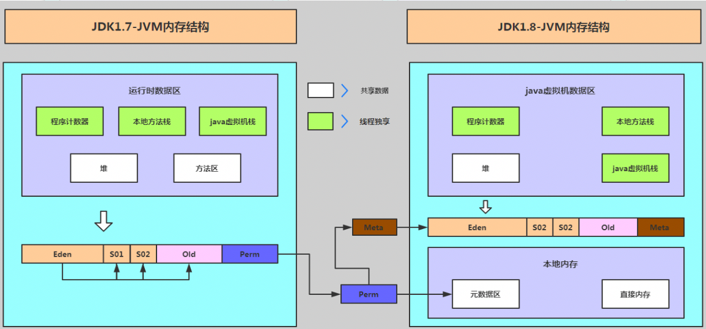
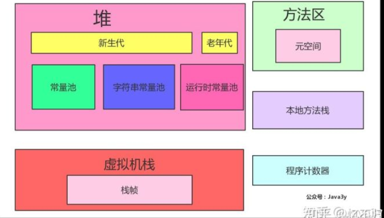
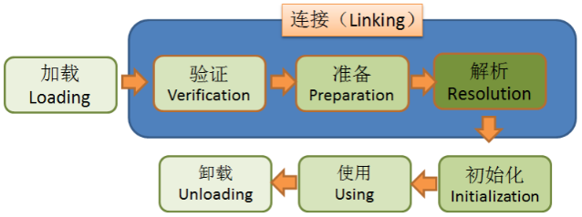

#### JVM
JVM五大个组成部分：程序计数器，虚拟机栈，堆，方法区，本地方法栈

##### 一、程序计数器（线程私有）
1. 字节码指令地址；如果是一个Java方法，记录的是虚拟机字节码指令地址；如果是Native方法，为空

##### 二、虚拟机栈（线程私有）
方法执行时会创建一个栈帧
1. 局部变量表：虚拟机栈和堆区引用关系桥梁
2. 操作数栈
3. 动态链接：虚拟机栈和方法区引用关系的桥梁
4. 返回地址
5. 附加信息

##### 三、堆区（线程公有）
1. 存储内容：实例对象（InstanceKlassMirror），数组，字符串常量池（jdk1.7之后，否则在永久代，也就是方法区）
2. 空间划分：
    1. 年轻代内部空间划分：eden：from survivor : to survivor = 8 : 1 : 1
    2. 总体空间划分：老年代：年轻代 = 2 ： 1
3. 调优：为了减少Full GC -Xms -Xmx 最大最小值调整为一样
4. 年轻代为什么年龄为15时进入老年代？对象头上gc标志为只有4为，4bit最大表示15
5. YongGC？FullGC？
    1. YongGC就是Minor GC，当eden区满的时候，触发，首先将eden区仍然存活的对象通过复制算法放到to survivor中，清空eden区；然后将from survivor中仍旧存活的对象年龄+1也是通过复制算法放到to survivor中，清空 from survivor区
    2. FullGC就是Old GC,当 老年代满的时候，触发，有标记整理和标记清除算法
##### 四、方法区（线程公有）
1. 方法区是一个规范，实际上永久代在堆区，但是逻辑上还是称为在方法区，jdk1.8之前永久代就是方法区的一个实现，只是拎出来单独说；1.8之后在JVM外部变为元空间，
2. 存储内容：
    1. jdk1.8之前（永久代）：【编译之后的代码】：类的元信息(InstanceKlass)，常量，静态变量，字符串常量池【编译期间代码】运行时常量池（存放编译期生成的字面量和引用）
    2. jdk1.8之后（元空间）：将常量，静态变量，运行时常量池，字符串常量池放入堆中；类的元信息（InstanceKlass）放到直接内存
3. 引用：<https://www.cnblogs.com/cosmos-wong/p/12925299.html>
##### 五、本地方法栈（线程私有）
1. 通过JNI调用c，c++动态链接库需要的栈，JNI技术被socket淘汰了

***
#### 判断对象是否死亡的算法

##### 一、引用计数法
方法：给对象添加一个引用计数器，每当被引用，+1，会有aba问题

##### 二、可达性分析
1. 方法：通过 GCRoot作为起点，搜索，如果一个对象没有和任意一个GCRoot节点关联，认为对象已经死亡  
2. GCRoot：本质上就是在堆里面筛选出来一部分比较稳定的对象作为GCRoot，不像引用计数那样所有对象    
    1. 虚拟机栈-栈帧-局部变量表引用的对象
    2. 本地方法栈-native方法引用的对象
    3. 方法区-静态变量，常量引用的对象
    
##### 三、垃圾回收算法
1. 复制算法：将内存分为大小相等两块，每次只用一块，一块内存使用完毕，将存活的放到另一块上，清除之前那一块内存
2. 标记清除算法：先标记出需要回收的对象，标记完成后统一回收被标记的对象
3. 标记整理算法：在标记清除的基础上，将所有存活的对象向一侧移动

##### 四、回收对象
1. 强引用：对象默认都是强引用，显示设置为null，表示可以被回收
2. 软引用：内存不够用被回收，ReferenceQueue
3. 弱引用：GC时被回收，WeakReference
4. 虚引用：感知对象是否被回收，PhantomReference
*** 
#### 类加载

##### 类的生命周期（不是实例）
类的生命周期为7个，类的加载指前五个
1. 加载
   1. 加载完毕：在方法区产生类的元信息；在堆区产生实例对象
   2. 类的加载为懒加载
   3. 加载时机：new；反射；初始化子类加载父类
2. 验证
   1. 验证内容：文件格式；元数据；字节码；符号引用
3. 准备
   1. 为静态变量赋予初值
   2. final修饰直接完成赋值
4. 解析
   1. 间接引用转换为直接引用
5. 初始化
   1. 执行静态代码块，完成静态变量的赋值
6. 使用
7. 卸载
