### 模块一、OOM实战
OOM分为方法区OOM、堆区OOM、栈区OOM

#### 一、方法区OOM——类的元信息（反射，字节码增强）
1. OOM代码：利用CGLIB
```
public class MetaspaceOverFlowTest {

    public static void main(String[] args) {

        while (true) {
            try {
                Thread.sleep(10);
            } catch (InterruptedException e) {
                e.printStackTrace();
            }

            Enhancer enhancer = new Enhancer();
            enhancer.setSuperclass(MetaspaceOverFlowTest.class);
            enhancer.setUseCache(false);
            enhancer.setCallback(new MethodInterceptor() {
                @Override
                public Object intercept(Object o, Method method, Object[] objects, MethodProxy methodProxy) throws Throwable {
                    return methodProxy.invoke(o, args);
                }
            });
            enhancer.create();
        }

    }
}
```

2. GC调优参数
```
-XX:+PrintGCDetails 
-XX:MetaspaceSize=20m :最小元空间 
-XX:MaxMetaspaceSize=20m：最大元空间

调优原则：1.预留20%以上空间 2.元空间最大、最小设置成一样大
```

3. 出现GC之后的报错
- MiniGC
```
[GC (Metadata GC Threshold) [PSYoungGen: 9151K->320K(31744K)] 17715K->9188K(117760K), 0.0011472 secs] [Times: user=0.00 sys=0.00, real=0.00 secs]
```
1. PSYongGen():Parallel Scavenge 新生代收集器
2. 9151K->320K(31744K)：代表新生代堆区从9151K变成320K，总新生代堆区占用31744K
3. 17715K->9188K(117760K)：代表总堆区从17715K变成9188K，总堆区占用117760K
4. 0.0011472 secs：垃圾回收时间
- FullGC
```
[Full GC (Metadata GC Threshold) [PSYoungGen: 64K->0K(26624K)] [ParOldGen: 4756K->4751K(109056K)] 4820K->4751K(135680K), [Metaspace: 20022K->20022K(1069056K)], 0.0202492 secs] [Times: user=0.13 sys=0.00, real=0.02 secs]
```
1. PSYoungGen：Parallel Scavenge新生代收集器；ParOldGen：Parallel Old老年代收集器


#### 二、堆区OOM——对象创建

1. OOM代码：利用无限创建对象
```
public class HeadOverFlowTest {
    public static void main(String[] args) {
        List<HeadOverFlowTest> headOverFlowTests = new ArrayList<>();
        for (;;) {
            try {
                Thread.sleep(1);
            } catch (InterruptedException e) {
                e.printStackTrace();
            }
            headOverFlowTests.add(new HeadOverFlowTest());
        }
    }
}
```
2. GC参数 
```
-XX:+PrintGCDetails
-Xms10m：初始堆区
-Xmx10m：最大堆区空间
-XX:+HeapDumpOnOutOfMemoryError：报错导出堆文件
 
调优原则：1.预留30%以上空间 2.最大，最小设置成一样

-Xmn2g：年轻代2G
-XX:SurvivorRatio=4:eden区和survivor区的比值为4:1:1
-XX:NewRatio=4：年轻代和老年代的比例为1:4

```

3. 运行一段时间之后的报错日志

    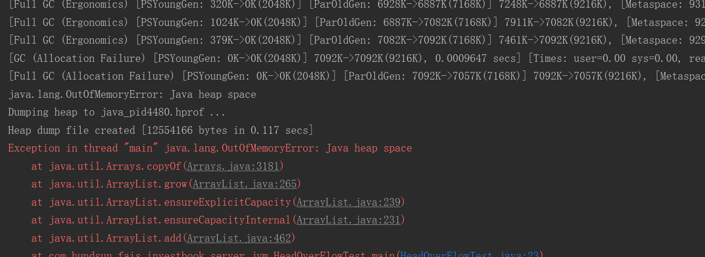

4. 用VisualVM查看堆信息——载入

    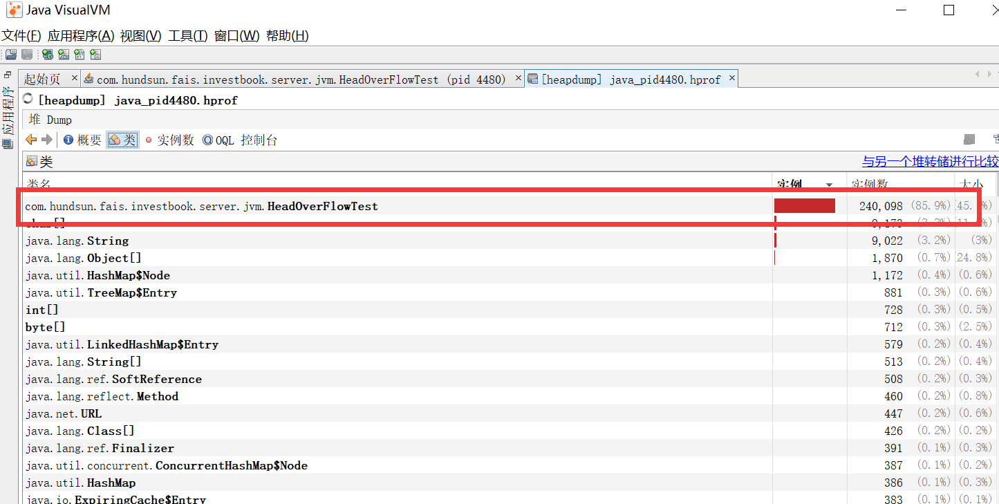

5. 用VisualVM查看新生代老年代——应用信息

    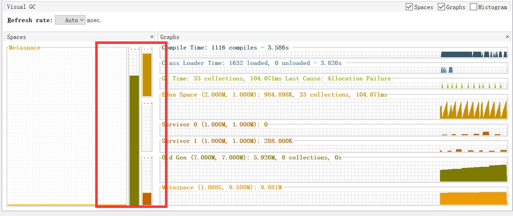

#### 栈区OOM——方法递归调用

1. OOM代码：利用虚拟机栈（栈帧大小有限制）

```
public class StackOverFlowTest {

    private int a = 1;

    public static void main(String[] args) {

        StackOverFlowTest stackOverFlowTest = new StackOverFlowTest();

        try {
            stackOverFlowTest.test();
        } catch (Throwable e) {
            System.out.println(stackOverFlowTest.a);
            e.printStackTrace();
        }
    }

    private void test() {
        a++;
        test();
    }
}
```
2. GC调优参数

```
-XX:+PrintGCDetails
-Xss156k :最大栈大小156K
```

3. 出现GC之后的报错
     
     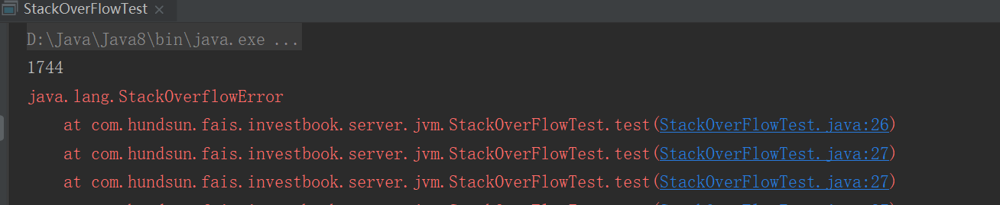
     
(4)总结：
1. 调优的主要目的一个是为了减少Full GC，因为频繁的Full GC会导致程序挂掉；而减少Full GC那就要根据我们使用的内存情况分配合理的堆内存，经过我的验证大概一个简单对象30W个大概占用100M，所以如果一个Java程序如果使用了很多内存缓存的话，建议将堆内存调整的大一点，不然如果回收不了就会OOM，抛出异常导致我们程序终止。
2. 堆调优——如果在一个方法内部，创建对象很多，可以调整堆空间大小：-Xmx?(最大堆区)/-Xms?(初始堆区)
3. 方法区调优——如果频繁用到动态代理，可以调整元空间大小：-XX:MetaspaceSize=?(初始元空间大小设置)或者-XX：MaxMetaspaceSize=?(最大元空间大小设置)
4. 栈区调优——如果一个方法内部递归太深入，调整栈帧大小：-Xss256k(一个方法栈能够占用的空间，这个参数如果内部无任何逻辑能够递归1742次，尽量递归不要太深)

(5)疑问：
启动了堆区的例子，然后用visualVM观察发现eden区：survivor from:survivor to = 3 : 1 : 1；yong:old=1：2；新生代比例和理论的8:1:1不符啊，不知道为什么？  
 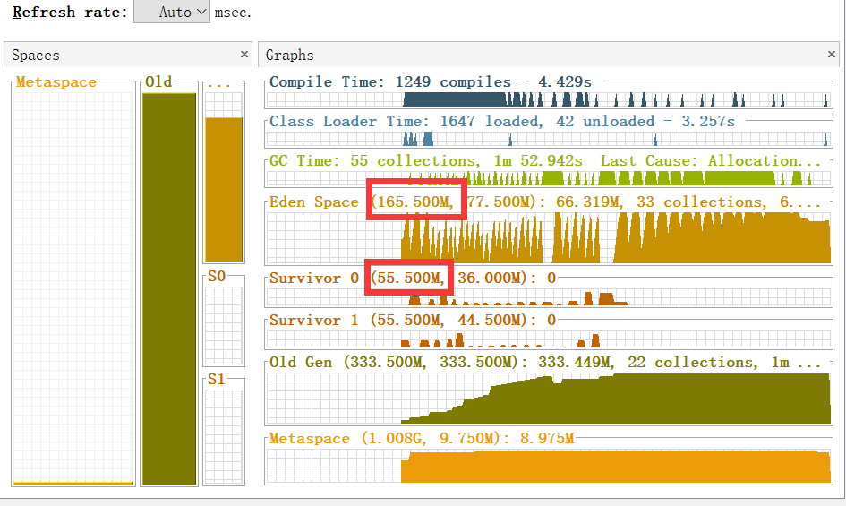
 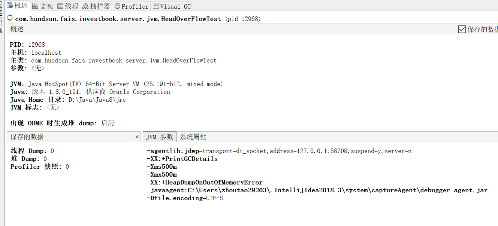
    
***

### 模块二、常见问题排查

#### 一、CPU占用过高

1. 首先用top命令查看占用CPU最高的进程
2. 用top -H -p pid 查看占用CPU最高的线程
3. 使用jstack命令定位线程信息
```
jstack pid | grep (线程id十进制转十六进制) -C 30(查看前后30行，-A：后，-B：前)
```
【其实用工具也可以看到，VisualVM/JProfile】
##### 其他命令
1. jps -l:查看Linux中的Java进程（jps命令是读取/tmp/xxx 下面的文件，如果进程意外关闭，并不会删除，从而导致没有进程，但是仍旧有jps信息存在）

***
### 模块三、垃圾收集器总结
垃圾收集器之前的一些摘抄,忘了出自哪的了

#### 1.Serial收集器
Serial收集器是最基本、历史最久的收集器，曾是新生代收集唯一选择，是单线程，只会使用一个CPU或者一条收集线程去完成垃圾收集工作，并且在它收集时，必须暂停其他所有工作线程，直到结束。是虚拟机运行在client模式下默认的新生代收集器：简单高效，没有线程切换的开销  
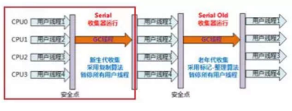
#### 2.ParNew收集器
ParNew收集器是Serial收集器的多线程版本，除了多线程，收集算法、stop the world、对象分配规则、回收策略等)同Serial收集器一样。   
是许多运行在Server模式下的JVM中首选的新生代收集器，其中另一个原因是除了Serial外，只有他能和老年代CMS收集器配合工作  
 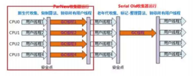
#### 3. Parallel Scavenge收集器
 
新生代收集器，并行的多线程收集器，它的目标是达到一个可控的吞吐量(CPU运行用户代码的时间和CPU总消耗时间的比值 吞吐量 =  运行用户代码的时间 /(运行用户代码的时间 + 垃圾收集的时间), 可以高效率的利用CPU时间，尽快完成程序的运算任务，适合在后台运行而不需要太多交互的任务
#### 4. Serial Old收集器
 
Serial收集器的老年代版本，单线程，标记整理算法，主要给Client模式下的虚拟机使用  
在Sever模式下 JDK1.5之前可以和Parallel Scavenge收集器搭配使用  
作为CMS后备方案，当CMS发生Concurrent Mode Failure时使用  
 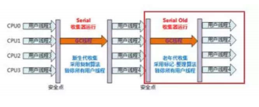
#### 5. Parallel Old收集器
Parallel Scavenge的老年代版本，多线程，标记整理算法，JDK1.6之后出现。此前Parallel Scavenge只能和Serial Old搭配使用，由于后者性能差
 
在吞吐量和CPU敏感的场合，可以使用Parallel Scavenge/Parallel Old组合  
 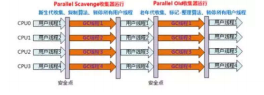
#### 6. CMS收集器
CMS(Concurrent Mark Sweep)收集器是一种以获取最短回收停顿为目标的收集器，停顿时间短，基于“标记清除”算法，并发收集、低停顿
 
 - 初始标记：仅仅标记GC Roots能直接关联到的对象，速度快，但是需要Stop the World
 - 并发标记：进行追踪引用链的过程，可以和用户线程并发执行，耗时最长
 - 重新标记：修正并发标记阶段因用户线程继续运行而导致标记发生变化的那部分对象的标记记录，比初始标记时间长但比并发标记时间短，需要Stop the World
 - 并发清除：清除标记为可以回收对象，可以和用户线程并发执行
 
整个过程耗时最长的并发标记和并发清除都可以和用户线程一起工作，从总体上来看,CMS收集器的内存回收过程和用户线程是并发执行的

缺点：
 - 对CPU资源非常敏感
 - 并发收集虽然不会暂停用户线程，但因为占用一部分CPU资源，还是会导致应用程序变慢，总吞吐量降低。  
 - CMS的默认收集线程数目 = （CPU数目+3）/4；当CPU数量多余4个，收集线程占用的CPU资源多于25%，影响大；不足4个，影响更大
 - 无法处理浮动垃圾（在并发清除时，用户线程新产生的垃圾，可能出现Concurrent Mode Failure失败）Full GC  
 - 并发清除时需要预留一定内存空间，不能像其他收集器在老年代几乎填满再进行收集；如果预留内存空间会出现Concurrent Mode Failure失败；此时JVM启动后备方案启用Serial Old收集器，导致一次Full GC产生  
 - 产生大量内存碎片：CMS基于标记-清除算法，清楚后不进行压缩操作产生大量不连续的内存碎片，当对象较大会触发Full GC
 
 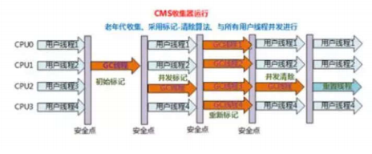

#### 7. G1收集器
G1(Garbage-First)是JDK-U4才正式推出商用的收集器。G1是面向服务端应用的垃圾收集器。它的使命是未来可以替换掉CMS收集器
 
特性：
  - 并行和并发：能充分利用多CPU、多核环境的硬件又是，缩短停顿时间，能和用户线程并发执行。
  - 分代收集：G1可以不需要和其它GC收集器配合就能地理管理整个堆，采用不同的方式处理新生对象和已经存活一段时间的对象
  - 空间整合：整体上看采用标记整理算法，局部看采用复制算法，两个Region之间，不会有内存碎片，优于CMS收集器
  - 可预测的停顿：可以建立可以预测停顿的时间模型，能够让使用者明确指定再一个长度为Mms的时间片段内，消耗再垃圾收集上的时间不超过Nms
  
**为什么能做到可预测?**  
- 因为可以有计划避免再整个Java堆中进行全区域的垃圾收集
- G1收集器将内存大小分为两个相等的独立区域(Region)，新生代和老年代概念保留，不再物理隔离
- G1跟踪各个Region获得其收集价值大小，在后台维护一个优先列表
- 每次根据允许的收集时间，优先回收价值最大的Region(Garbage-First名称由来)
 
**对象被其他Region的对象引用了怎么办?**
- 分代收集器都有这个问题,JVM使用Remembered Set来避免全局扫描
- 每个Region都有一个对应的Remembered Set
- 每次Reference类型数据写操作时，都会产生一个Write Barrier暂时中断操作
- 然后检查将要写入的引用指向的对象是否和该Reference类型数据再不同的Region(其他收集器：检查老年代对象是否引用了新生代对象）
- 如果不同，通过CardTable把将官引用信息记录到引用只想对象所在的Region对应的Remembered Set中
- 进行垃圾收集时，再GC根节点的枚举范围加入Remembered Set,就可以保证不进行全局扫描，也不会有遗漏
 
**比计算维护Remembered Set的操作，回收过程可以分为4个步骤(类似CMS)**
- 初始标记：仅仅标记GC Roots能直接关联到的对象，并修改TAMS(Next Top at Mark Start)的值，让下一阶段用户程序并发运行时能再正确可用的Region中创建新对象，需要Stop the world
- 并发标记：从GC Roots开始进行可达性分析，找出存活时间长，耗时长，可与用户线程并发执行
- 最终标记：修正并发表及阶段因用户线程继续运行而导致标记发生变化的那部分对象的标记记录。并发标记时虚拟机将对象变化记录在线程Remember Set Logs里面，最终标记阶段将Remember Set LoGS整合到Remember Set 中，比初始标记时间长但远比标记时间段，需要Stop the world
- 筛选回收：首先对各个Region的回收价值和成本进行排序，然根据用户期望的GC停顿时间来定制回收计划，最后按计划回收一些价值高的Region中垃圾对象。回收时采用复制算法，从一个或多个Region复制存活对象到堆上另一个空的Region，并且在此过程中压缩和释放内存；可以并发进行，降低停顿时间，并且增加吞吐量
 
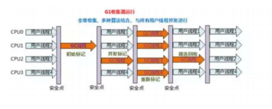
 
 
**JVM中各种垃圾收集器的特点**  
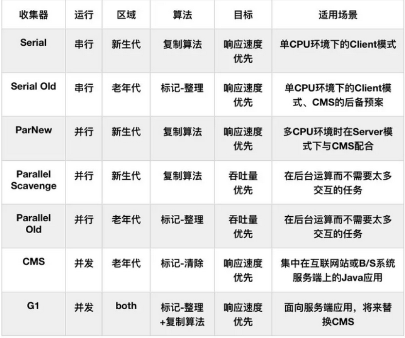
 