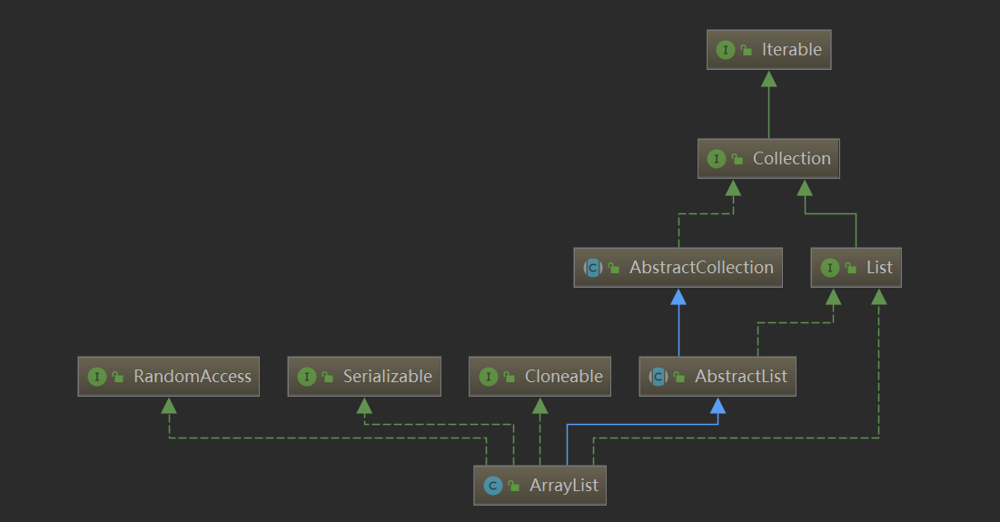

1. 如果没有指定，默认扩容为10，如果制定了，就用指定的容量
2. 默认扩容为2倍+1
3. 数据结构为数组
4. contains方法：简单循环遍历equals判断，区分null，非null情况                                ZS
```
public boolean contains(Object o) {
    return indexOf(o) >= 0;
}
public int indexOf(Object o) {
    if (o == null) {
        for (int i = 0; i < size; i++)
            if (elementData[i]==null)
                return i;
    } else {
        for (int i = 0; i < size; i++)
            if (o.equals(elementData[i]))
                return i;
    }
    return -1;
}
```
5.    