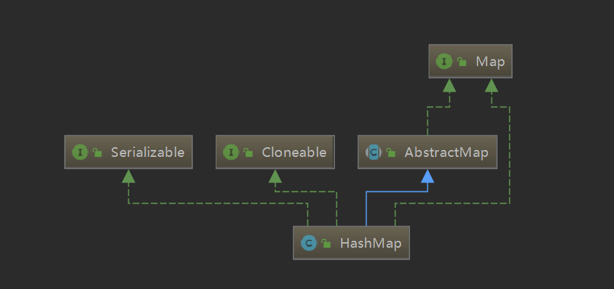

##### 为什么初始容量必须是2的幂次？

减少hash冲突，-1之后就是111111

##### jdk1.7环形链表产生原因：jdk8之前都是使用头插法，当多线程情况下在transfer方法内

推演：
1. 线程A执行到【1】，此时：e=@1，next=e.next=@2
2. 线程B执行e=@1,next=e.next=@2,i=3,e.next=newTable[3]=@300,newTable[3]=@1,e=next=@2;此时e=@2，newTable[3]=@1,@1->@300；
3. 线程B继续执行e=@2,最后状态newTable[3]=@2,@2->@1->@300
3. 当前线程A状态：e=@1,next=e.next=@2，当时本应该是@300的下一个节点变成了next=@2
4. 线程A继续执行，e.next=newTable[3]=@2(拿到的已经是线程B修改的值),newTable[3]=e=@1,e=next=@2;此时e=@2,newTable[3]=@1,@1->@2
5. 当前节点状态：@1->@2,@2->@1，线程A继续执行@2,会死循环
总结：
    1. 因为是头插法，线程B完成了其他节点的重hash，之前为1->2的最终形成2->1的线路；线程A开始执行，e.next=newTable[i]=2，可能会导致和线程B最终产生的节点关系形成一个环
    2. 假设线程A正好停在【1】，next=e.next,保留了之前的值1，会导致1->2->1的死循环；如果没有停在【1】，也形成了环路，当hash值正好为3的时候，会陷入1->2->1死循环
```
void transfer(Entry[] newTable) {
    Entry[] src = table;
    int newCapacity = newTable.length;
    for (int j = 0; j < src.length; j++) {
        Entry<K,V> e = src[j];
        if (e != null) {
            src[j] = null;
            do {
                Entry<K,V> next = e.next; // 【1】
                int i = indexFor(e.hash, newCapacity);
                e.next = newTable[i]; 
                newTable[i] = e;
                e = next;
            } while (e != null);
        }
    }
}
```
##### HashMap中jdk1.7和jdk1.8的区别

1. 7插入元素使用头插法；8使用尾插法
2. resize之后的数据位置不同，7是重hash；8是根据hash&newCap的那一位是1/0，放到前一半还是后一半
3. 7使用数组+链表；8使用数组+链表+红黑树（链表节点>=8并且cap>=64链表转换为红黑树，如果节点是红黑树节点，如果节点<=6,转换为普通链表），红黑树实现：TreeNode
4. 7对于null特殊处理；8不做特殊处理
5. 7先扩容再插入；8先插入后扩容（如果第一次进来没有，则首次扩容）

##### 为什么选择红黑树转换节点数目为8？
1. 遵循泊松分布，超过8的概率比较小
2. 红黑树节点数目是普通节点数目的2倍，不能随便转换
3. 转换链表为6，如果当七个元素的时候，add，remove频繁，消耗资源

##### jdk1.8的构造函数

构造函数并不会设置最大cap以及初始化数组，只是设置了threshold,负载大小;只有put的时候需要扩容，在resize()的里面才会

1.空构造
``` 
public HashMap() {
        this.loadFactor = DEFAULT_LOAD_FACTOR; // all other fields defaulted
}
```
2. 带容量构造
```
public HashMap(int initialCapacity) {
        this(initialCapacity, DEFAULT_LOAD_FACTOR);
}
```
3. 带容量和负载因子构造：会计算threshold为<initialCapacity的2的整数倍
```
public HashMap(int initialCapacity, float loadFactor) {
        if (initialCapacity < 0)
            throw new IllegalArgumentException("Illegal initial capacity: " +
                                               initialCapacity);
        if (initialCapacity > MAXIMUM_CAPACITY)
            initialCapacity = MAXIMUM_CAPACITY;
        if (loadFactor <= 0 || Float.isNaN(loadFactor))
            throw new IllegalArgumentException("Illegal load factor: " +
                                               loadFactor);
        this.loadFactor = loadFactor;
        this.threshold = tableSizeFor(initialCapacity);
}
```
4. 拷贝map
```
public HashMap(Map<? extends K, ? extends V> m) {
        this.loadFactor = DEFAULT_LOAD_FACTOR;
        putMapEntries(m, false);
}
```
##### jdk1.8 put实现
1. 先根据key计算hash值，key.hashCode^高16位
2. 如果是第一次，需要resize扩容
3. 如果没有碰撞，直接加到数组中
4. 如果发生碰撞
    1. 如果key相等/值equals相同，新值替换旧址
    2. 如果是红黑树，调用红黑树插入
    3. 尾插法，插入后如果打到阈值8，转换为红黑树
5. 如果大于threshold，扩容

##### jdk1.8 get实现
1. 如果要查询的节点hash和key相等，直接返回
2. 如果节点是红黑树，用红黑树方法
3. key不相等，在hash桶中链表查询
```
final Node<K,V> getNode(int hash, Object key) {
        Node<K,V>[] tab; Node<K,V> first, e; int n; K k;
        if ((tab = table) != null && (n = tab.length) > 0 &&
            (first = tab[(n - 1) & hash]) != null) {
            if (first.hash == hash && // always check first node
                ((k = first.key) == key || (key != null && key.equals(k))))
                return first;
            if ((e = first.next) != null) {
                if (first instanceof TreeNode)
                    return ((TreeNode<K,V>)first).getTreeNode(hash, key);
                do {
                    if (e.hash == hash &&
                        ((k = e.key) == key || (key != null && key.equals(k))))
                        return e;
                } while ((e = e.next) != null);
            }
        }
        return null;
}
```

##### 其他
1. 默认大小：16，默认负载因子：0.75
2. 扩容两倍
3. 红黑树节点转换条件：1.容量达到64 2.链表达到阈值8
4.   