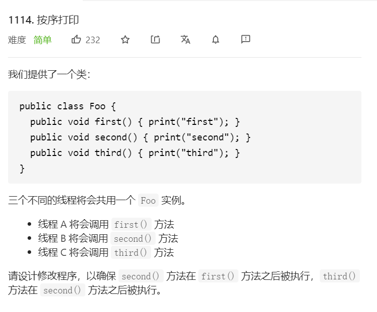
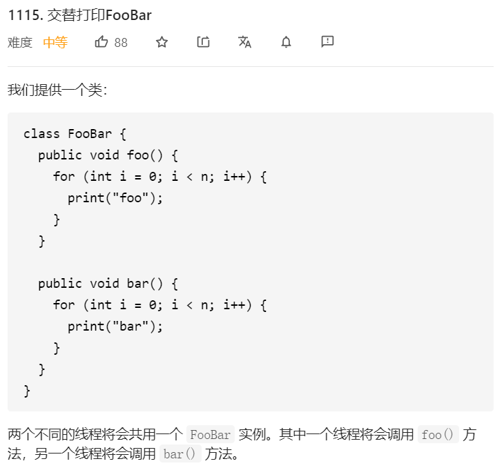
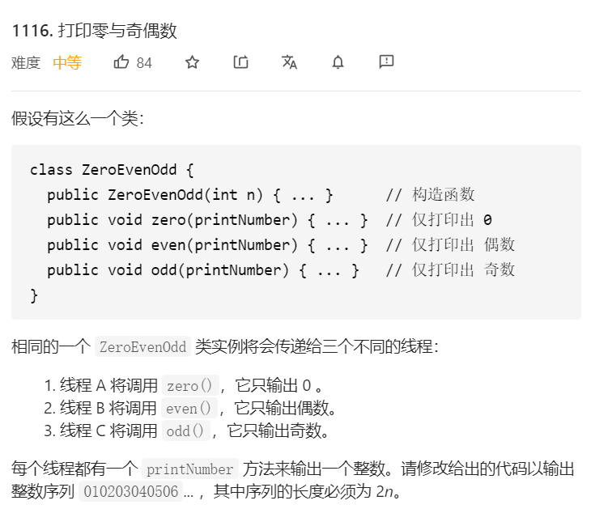

#### 多线程顺序打印总结
##### 如何控制多线程在运行时的打印顺序呢？
1. 首先对于多线程，肯定需要有一个锁，保证运行某一个方法的时候只能一个线程在运行
2. 锁的内容可以是什么呢？用synchronized/ReentrantLock
3. 那其实就有方案：首先可以用synchronized锁对象/实例，然后唤醒通过notifyAll（不知道唤醒哪一个）；其次可以用ReentrantLock+Condition（存储了唤醒哪一个线程）

##### 代码怎么写呢？
1. 定义一个类，用来加锁
2. 定义一个标识符，用来判断当前线程是否需要挂起

#### 几道Leetcode样例加深印象

##### 一、1114. 按序打印


思路
1. 定义一个Object的锁
2. flag状态在0->1->2->0流转
3. 唤醒使用notifyAll

```
class Foo {

    private Integer flag = 0;
    private Object lock = new Object();

    public Foo() {
        
    }

    public void first(Runnable printFirst) throws InterruptedException {
        
        synchronized(lock) {
            while (flag != 0) {
                lock.wait();
            }
        
            // printFirst.run() outputs "first". Do not change or remove this line.
            printFirst.run();
            flag = 1;
            lock.notifyAll();
        }
    }

    public void second(Runnable printSecond) throws InterruptedException {
        
        synchronized(lock) {
            while (flag != 1) {
                lock.wait();
            }
            // printFirst.run() outputs "first". Do not change or remove this line.
            printSecond.run();
            flag = 2;
            lock.notifyAll();
            }
    }

    public void third(Runnable printThird) throws InterruptedException {
        
        synchronized(lock) {
            while (flag != 2) {
                lock.wait();
            }
        
            // printFirst.run() outputs "first". Do not change or remove this line.
            printThird.run();
            flag = 0;
            lock.notifyAll();
        }
    }
}
```
##### 二、1115. 交替打印FooBar


思路：
1. 每一个线程要打印多少次，for循环就有多少个
2. 定义一个Object的锁
3. flag状态在0->1->0流转
4. 唤醒使用notifyAll

```
class FooBar {
    private int n;
    private int flag = 0;
    private Object lock = new Object();
    public FooBar(int n) {
        this.n = n;
    }

    public void foo(Runnable printFoo) throws InterruptedException {
        
        for (int i = 0; i < n; i++) {
            synchronized(lock) {
                while (flag != 0) {
                    lock.wait();
                }
        	    // printFoo.run() outputs "foo". Do not change or remove this line.
        	    printFoo.run();
                flag = 1;
                lock.notifyAll();
            }
        }
    }

    public void bar(Runnable printBar) throws InterruptedException {
        
        for (int i = 0; i < n; i++) {
            
            synchronized(lock) {
                while (flag != 1) {
                    lock.wait();
                }
                // printBar.run() outputs "bar". Do not change or remove this line.
        	    printBar.run();
                flag = 0;
                lock.notifyAll();
            }
        }
    }
}
```

##### 三、1116. 打印零与奇偶数



思路：
1. 每一个线程要打印多少次，for循环就有多少个，奇数就是1开始每次+2，偶数就是2开始每次+2
2. 定义一个Object的锁
3. flag状态：表示0/递增数字，在0->1->0流转；flag1：表示奇数偶数，在0->1->0流转
4. 唤醒使用notifyAll

```
class ZeroEvenOdd {
    private int flag = 0;
    private int flag1 = 0;
    private Object lock = new Object();
    private int n;
    
    public ZeroEvenOdd(int n) {
        this.n = n;
    }

    // printNumber.accept(x) outputs "x", where x is an integer.
    public void zero(IntConsumer printNumber) throws InterruptedException {
        
        for (int i = 1; i <= n; i++) {
            synchronized(lock) {
                while (flag != 0) {
                    lock.wait();
                }
                flag = 1;
                printNumber.accept(0);
                lock.notifyAll();
            }
        }
    }

    public void even(IntConsumer printNumber) throws InterruptedException {
        
        for (int i = 2; i <= n; i+=2) {
            synchronized(lock) {
                while (flag != 1 || flag1 != 1) {
                    lock.wait();
                }
                flag = 0;
                flag1 = 0;
                printNumber.accept(i);
                lock.notifyAll();
            }
        }
    }

    public void odd(IntConsumer printNumber) throws InterruptedException {
        
        for (int i = 1; i <= n; i+=2) {
            synchronized(lock) {
                while (flag != 1 || flag1 != 0 ) {
                    lock.wait();
                }
                flag = 0;
                flag1 = 1;
                printNumber.accept(i);
                lock.notifyAll();
            }
        }
    }
}
```

##### 四、线程顺序打印，要求ABCABCABC...打印十次

思路：
1. 利用ReentrantLock对线程加锁
2. 利用Condition来挂起线程，比notifyAll效率高
3. 每一个被唤醒的线程，都存储了下一个需要唤醒的线程

```
package com.hundsun.fais.investbook.server.service;

import java.util.concurrent.locks.Condition;
import java.util.concurrent.locks.ReentrantLock;

/**
 * @Description:
 * @Author: XinYuZang
 * @Date: 2021/1/24 21:40
 */
public class MultiThread implements Runnable {

    private static String key;
    private static Integer count;
    private Integer rest = 0;
    private Condition now;
    private Condition next;
    private ReentrantLock lock;
    private String nextName;

    public MultiThread(Condition now, Condition next, ReentrantLock lock, String nextName) {
        this.now = now;
        this.next = next;
        this.lock = lock;
        this.nextName = nextName;
    }

    public static void setKey(String key) {
        MultiThread.key = key;
    }

    public static void setCount(Integer count) {
        MultiThread.count = count;
    }

    @Override
    public void run() {

        while (rest++ < count) {
            try {
                // 只允许一个线程走下面
                lock.lock();
                // 如果当前线程与需求的key不一致，就挂起到条件队列
                while (!Thread.currentThread().getName().equals(key)) {
                    try {
                        now.await();
                    } catch (InterruptedException e) {
                        e.printStackTrace();
                    }
                }
                key = nextName;
                System.out.println("线程" + Thread.currentThread().getName() + "第" + rest + "次打印");
                // 唤醒
                next.signal();
            } finally {
                lock.unlock();
            }
        }
    }

    public static void main(String[] args) {

        ReentrantLock lock = new ReentrantLock();
        Condition condition1 = lock.newCondition();
        Condition condition2 = lock.newCondition();
        Condition condition3 = lock.newCondition();
        // 设置首次打印的key
        MultiThread.setKey("thread1");
        MultiThread.setCount(10);
        new Thread(new MultiThread(condition1, condition2, lock, "thread2"), "thread1").start();
        new Thread(new MultiThread(condition2, condition3, lock, "thread3"), "thread2").start();
        new Thread(new MultiThread(condition3, condition1, lock, "thread1"), "thread3").start();
    }
}

```

***
总结：
1. 解法一：使用synchronized关键字+flag+Object(wait/notify)，效率低，代码难度低
2. 解法二：使用ReentrantLock(lock/unlock)+Condition(await/signal),效率高，代码难度大