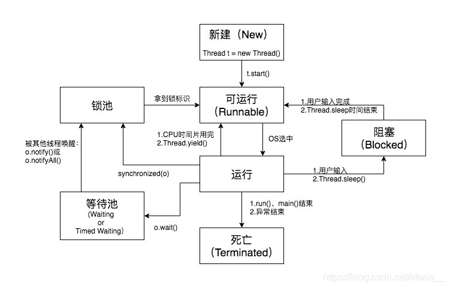

##### 线程
1. 同步： 线程间协作
2. 互斥： 独占锁
3. 分工： 大任务的拆解

并发特性：原子性，有序性，可见性
并发带来的问题：
1. 性能损耗，上下文切换
2. 活跃性问题，死锁，饥饿，活锁
3. 线程安全问题 加锁 通过三个并发特性分析线程安全问题

java线程：内核级线程
java thread -> os thread -> 内核线程(pthread_create)
用户态                    -> 内核态

volatile可见性
汇编是lock指令
锁缓存行 64byte 8个行为一个块
缓存一致性协议mesi meosi（o是广播，直接从cpu一级缓存copy） 原子性操作：如果变成M，会立即刷回主内存
锁缓存行不能保证线程安全，两个线程同时在cpu层执行+1，+2操作，因为mesi协议，导致一者被设置为无效
M：修改
E：独占
S：分享
I：无效

#### 线程状态流转

1. 首先创建一个线程，调用start方法，进入Runnable状态
2. 线程在Runnable状态下，等待CPU调度，调用run方法
3. 如果线程获取到CPU时间片，就进入run状态，开始执行
4. 此时如果对运行中的线程使用sleep(ttl)方法，会将当前的线程阻塞，sleep不会释放当前cpu信息，直到过期
5. 如果对运行中的线程使用synchronized关键字，并且使用wait方法，会进入等待状态，直到调用notify方法，唤醒

