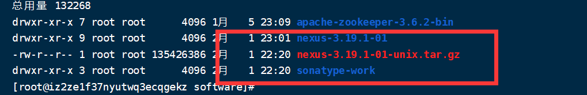
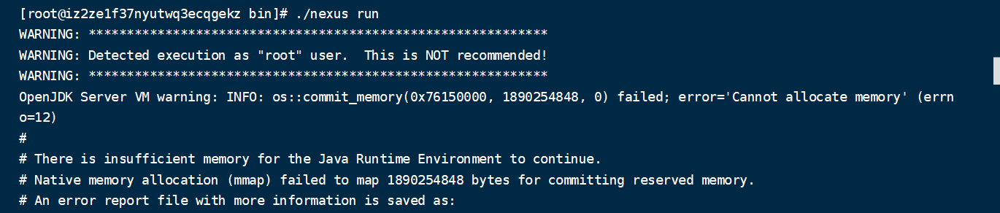
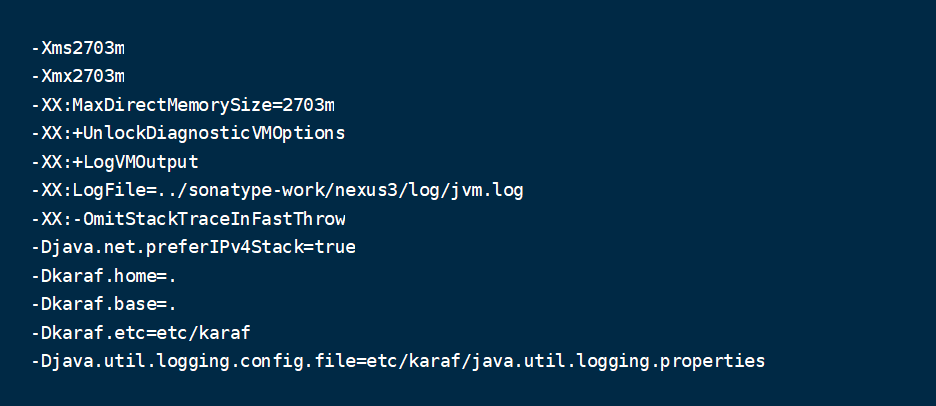
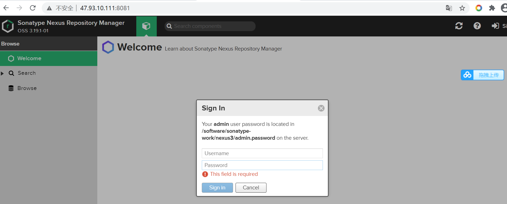

#### 一、下载Nexus的Linux版本安装包
1. Nexus官方网站：https://blog.sonatype.com/#step2top  
2. Nexus全称为Nexus-OSS 官方下载地址：https://help.sonatype.com/repomanager3/download?_ga=2.137712688.1630417104.1612185514-825172416.1612185514
3. 官方下载地址太不稳定下载不下来，网上找了一个包 https://link.csdn.net/?target=https%3A%2F%2Fpan.baidu.com%2Fs%2F1Cdo4kNpcv__cHmhtD1RMig 密码3pqx

#### 二、解压并启动
1. 利用tar -zxvf 命令解压文件

    
2. 进入nexus-3.19.1-01/bin目录下执行./nexus run，发现报错信息

    
因为小周的服务器只有可怜的两个G的运行内存，nexus发现起不来，我们修改/bin目录下的nexus.vmoptions配置，也就是修改JVM参数，默认是2个G的，此时就很明显nexus服务端就是Java开发的~~（ps：好多有名的中间件都是Java开发的啊，比如Zookeeper）  

   

我这边最后修改堆最大、最小以及直接内存都为256M，就运行成功

#### 三、开放端口
一般阿里云/腾讯云都会限制端口，我这边就将8081端口开放了（默认）

#### 四、登录并重置密码
按照提示在服务器上找到初始密码登录并重置密码



#### 五、setting.xml文件
我这边配置好了一份setting.xml文件，直接拿去用就行，记得将本地仓库地址改成自己的
```
<?xml version="1.0" encoding="UTF-8"?>

<settings xmlns="http://maven.apache.org/SETTINGS/1.0.0"
          xmlns:xsi="http://www.w3.org/2001/XMLSchema-instance"
          xsi:schemaLocation="http://maven.apache.org/SETTINGS/1.0.0 http://maven.apache.org/xsd/settings-1.0.0.xsd">

    <localRepository>F:\XinYuZang\MavenRepository</localRepository>
   
    <servers>
		<server>
            <id>nexus-xinyuzang</id>
			<username>admin</username>
            <password>xinyuzang</password>
        </server>
        
		<server>
            <id>snapshots</id>
			<username>admin</username>
            <password>xinyuzang</password>
        </server>

        <server>
            <id>releases</id>
            <username>admin</username>
            <password>xinyuzang</password>
        </server>
    </servers>

    <mirrors>
        <mirror>
            <id>nexus-xinyuzang</id>
            <name>internal nexus repository</name>
            <url>http://47.93.10.111:8081/repository/maven-public/</url>
            <mirrorOf>*</mirrorOf>
        </mirror>
         <mirror>
            <id>alimaven</id>
            <name>aliyun maven</name>
            <url>https://maven.aliyun.com/repository/central</url>
            <mirrorOf>central</mirrorOf>
        </mirror>
    </mirrors>

  <profiles>
      <profile>
          <id>jdk-1.8</id>
          <activation>
              <activeByDefault>true</activeByDefault>
              <jdk>1.8</jdk>
          </activation>
          <properties>
              <maven.compiler.source>1.8</maven.compiler.source>
              <maven.compiler.target>1.8</maven.compiler.target>
              <maven.compiler.compilerVersion>1.8</maven.compiler.compilerVersion>
          </properties>
      </profile>

        <profile>
            <id>nexus-xinyuzang</id>
            <repositories>
                <repository>
                    <id>central</id>
                    <name>Nexus Central</name>
                    <url>http://47.93.10.111:8081/repository/maven-public/</url>
                    <layout>default</layout>
                    <releases>
                        <enabled>true</enabled>
                    </releases>
                    <snapshots>
                        <enabled>true</enabled>
                    </snapshots>
                </repository>
            </repositories>
            <pluginRepositories>
                <pluginRepository>
                    <id>nexus-xinyuzang</id>
                    <name>Nexus Central</name>
                    <url>http://47.93.10.111:8081/repository/maven-public/</url>
                    <layout>default</layout>
                    <snapshots>
                        <enabled>true</enabled>
                    </snapshots>
                    <releases>
                        <enabled>true</enabled>
                    </releases>
                </pluginRepository>
            </pluginRepositories>
        </profile>

    </profiles>

    <activeProfiles>
        <activeProfile>nexus</activeProfile>
        <activeProfile>jdk-1.8</activeProfile>
        <!-- <activeProfile>nexus-os</activeProfile> -->
    </activeProfiles>
</settings>

```