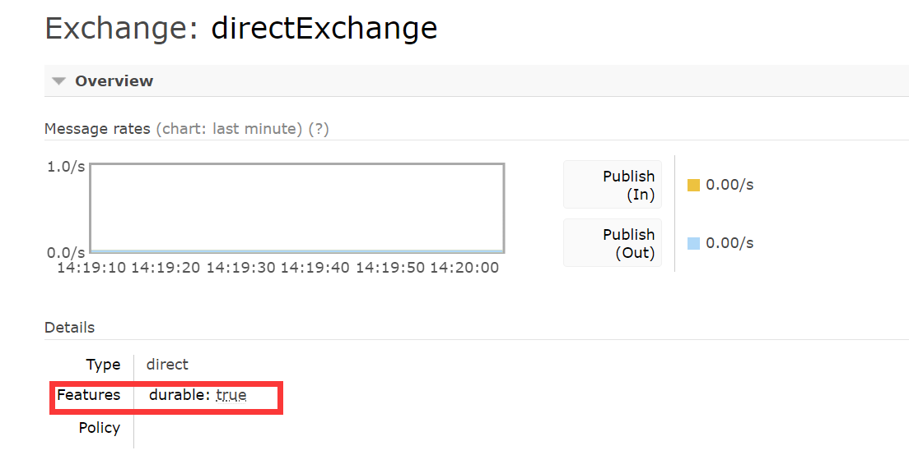

#### MQ的优势
1. 异步
2. 解耦
3. 削峰

#### 不同MQ的优缺点

|特性|RabbitMQ|ActiveMQ|RocketMQ|Kafka|
|:-:|:-:|:-:|:-:|:-:|
|单机吞吐量|万级|万级|十万级|十万级|
|topic数量对吞吐量影响|||topic达到几百/几千，吞吐量小幅度下降，支持大量topic|topic达到几百/几千，吞吐量大幅度下降|
|时效性|ms|us|ms|ms|
|消息可靠性|较低几率丢失|基本不丢|参数优化，做到不丢|参数优化，做到不丢|
|可用性|高，主从架构|高，主从架构|非常高，分布式|非常高，分布式|
|功能支持|MQ功能完善|基于erlang开发，并发高强，性能好，延时低|MQ功能完善，分布式，扩展性好|功能简单，大数据实时计算和日志被大规模使用|

#### 如何防止消息被重复消费
##### 出现重复消费的场景
1. 当消费者消费时准备提交，然后进程被重启了
2. 当消费者中间报错了，如果未开启retry参数，直到进程挂掉，一直在重复跑业务代码

##### 如何保证消息不被重复消费
1. 业务代码实现幂等，就是可以重复执行
2. 开启retry参数，当失败一定次数丢弃消息

#### 如何防止消息丢失
**消费者**：  
1. 默认有ack机制，如果消费未被消费，会让消息进入uncheck状态，直到不消费重新范围到ready状态
2. 将消息持久化，防止重启的时候丢失 （amqp默认都是持久化的）
    1. exchange持久化：创建exchange时将durable参数设置为true  
          
    2. queue持久化：创建queue时将durable参数设置为true  
        
    3. 将消息持久化：发送消息的时候，CorrelationData->Message->MessageProperties->MessageDeliveryMode->PERSISTENT(2) 表示持久化。对应的参数为delivery_mode为2  
        
3. 如果开启了spring.rabbitmq.listener.simple.retry.enabled=true,当消费者重试几次之后会将消息丢失，可以将异常捕获存储到mysql/redis中后续统一作处理  
  
**生产者**:   
默认情况下当消息发出去之后，broker代理服务器不会返回信息，有两种方式可以保证消息发出
1. 事务：在AMQP协议层面支持（同步）
    1. txSelect：设置channel为transaction模式
    2. txCommit：提交事务
    3. txRollBack：回滚
    4. 使用事务机制会降低mq的吞吐量
2. confirm模式：将信道设置为confirm，所有消息都会被指派一个唯一的id，到达匹配队列后，broker异步发送消息给生产者，如果正常返回ack，异常返回nack
    1. confirmSelect：设置channel为confirm模式
    2. waitForConfirms：消息回调的方法  
    
事务优先于confirm，两者不能共存
#### 如何保证消息的顺序性
1. 假如发送方是按照顺序的，让消息都进同一个队列，mq内存队列保证顺序
2. 假如消费有多个，尽量让消息只进一个消费点，按顺序消费
3. 假如发送方不是按照顺序，或者消费者也有多个，在业务逻辑里面作处理，存在redis中，假如这条消息是一个指令，有新增，修改，撤销，如果先来的修改，看缓存里面有没有新增的，如果没有就缓存起来，如果修改号大于缓存里面的就执行，否则不执行，撤销就全部都不执行，根据业务逻辑来。配合上分布式锁，锁住代码逻辑，当当前服务的业务代码执行完毕才执行下一次的mq消费。