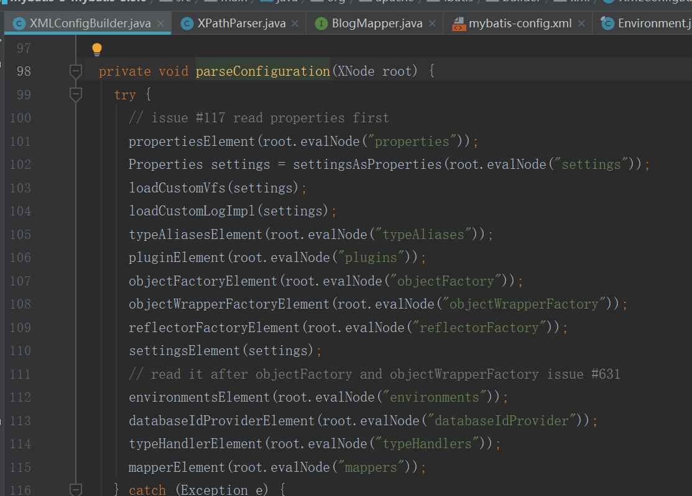
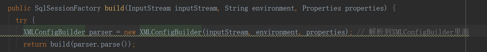
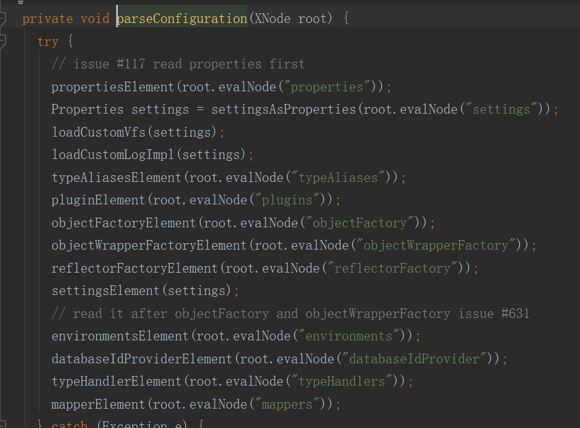
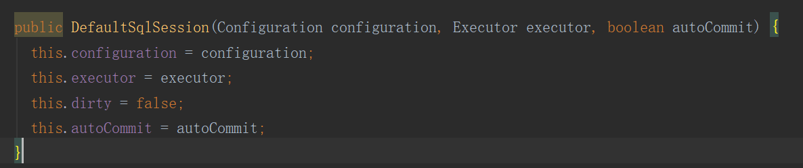
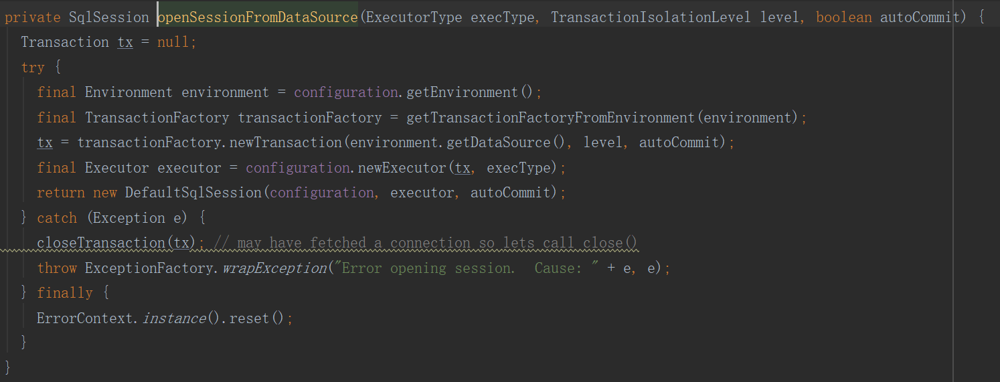
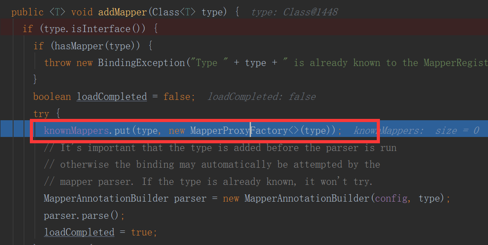
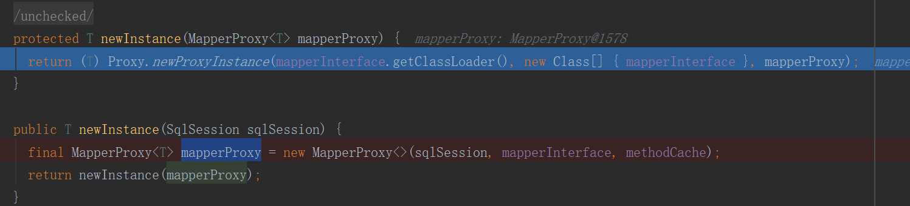
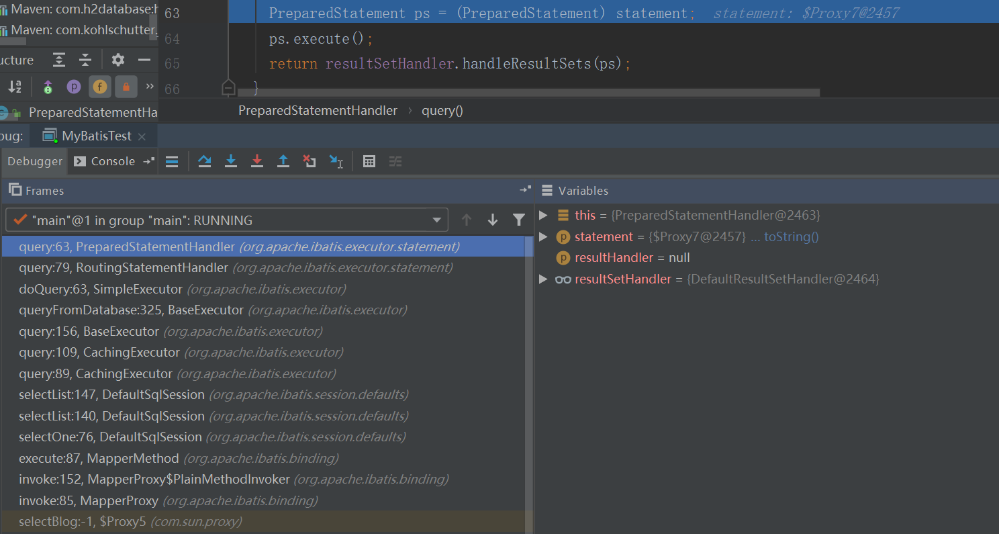
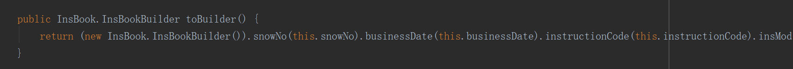

### MyBatis框架
***
简介：主要介绍一个SQL在MyBatis中大概是如何被执行的，以及介绍建造者模式


#### 一、一个SQL的调用路径？

##### 示例代码
1. 流程代码
```java
public abstract class MyBatisTest {

  public static void main(String[] args) throws IOException {

      String config = "mybatis-config.xml";
      InputStream inputStream = Resources.getResourceAsStream(config); // (1)
      SqlSessionFactory sqlSessionFactory = new SqlSessionFactoryBuilder().build(inputStream); // (1)
      SqlSession sqlSession = sqlSessionFactory.openSession(); // (2)
      BlogMapper mapper = sqlSession.getMapper(BlogMapper.class); // (3)
      Blog blog = mapper.selectBlog(1); // (4)
      System.out.println(blog);
  }
}
```
2. 配置文件
```xml
<?xml version="1.0" encoding="UTF-8" ?>
<!DOCTYPE configuration
  PUBLIC "-//mybatis.org//DTD Config 3.0//EN"
  "http://mybatis.org/dtd/mybatis-3-config.dtd">
<configuration>

  <properties resource="jdbc.properties">
  </properties>
  <environments default="development">
    <environment id="development">
      <transactionManager type="JDBC"/>
      <dataSource type="POOLED">
        <property name="driver" value="${driver}"/>
        <property name="url" value="${url}"/>
        <property name="username" value="${username}"/>
        <property name="password" value="${password}"/>
      </dataSource>
    </environment>
  </environments>
  <mappers>
    <mapper class="org.apache.ibatis.ztest.BlogMapper"></mapper>
  </mappers>
</configuration>
```

3. 解答疑惑

我们目前项目中无需配置这个mybatis-config.xml,是因为mybatis-spring这个包里面构建了SqlSessionFactory，这个类的build方法支持传入一个Configuration，是被多重载的方法。其实IO流最后还是调用到了传入Configuration的方法
```
public SqlSessionFactory build(Reader reader, String environment, Properties properties) {
   try {
     XMLConfigBuilder parser = new XMLConfigBuilder(reader, environment, properties);
     return build(parser.parse());
   // xxxxx
}

public SqlSessionFactory build(Configuration config) {
return new DefaultSqlSessionFactory(config);
}
```

##### (1)解析配置文件——SqlSessionFactory
```
InputStream inputStream = Resources.getResourceAsStream(config); // (1)
SqlSessionFactory sqlSessionFactory = new SqlSessionFactoryBuilder().build(inputStream); // (1)
```
就是解析xml，最后存储到Configuration这个类上，就是解析xml的node，没有什么可以介绍的，主要介绍一下它的设计思路  
   
1. 先将一些环境信息，文件流信息，通过构造方法构造成一个XMLConfigBuilder类，将资源以及建立一个初始化的Configuration存入当前类的成员变量  
   

2. 通过XMLConfigBuilder的parse方法解析上面传入的数据，分类型setConfiguration进去  
 

3. 通过getConfiguration方法对外暴露解析的内容

##### (2)准备执行器，拦截器和自动提交策略（默认false）——SqlSession
```
SqlSession sqlSession = sqlSessionFactory.openSession(); // (2)
```
 
 
1. openSession()方法调用openSessionFromDataSource方法
2. openSessionFromDataSource方法会创建一个执行器，默认是SIMPLE执行器，除此之外还有REUSE（重用）和BATCH（批量）执行器  
 

3. cacheEnabled参数开启，会缓存执行器
```
if (cacheEnabled) {
      executor = new CachingExecutor(executor);
}
``
4. 拦截器记录要拦截的执行器
``
executor = (Executor) interceptorChain.pluginAll(executor);
```

##### (3)根据对象类型找到代理类——BlogMapper
```
BlogMapper mapper = sqlSession.getMapper(BlogMapper.class); // (3)
```
1. 去Configuration的mapperRegistry通过key为BlogMapper的类找到对应的代理类
```
public <T> T getMapper(Class<T> type, SqlSession sqlSession) {
return mapperRegistry.getMapper(type, sqlSession);
}
```
2. 在mapperRegistry里存放的是接口的代理对象，MapperProxyFactory（其实只是一个包装类）
 

3. 最终返回（真）代理对象，通过JDK动态代理，将mapper接口委托给mapperProxy
 

##### (4)执行SQL并返回
```
Blog blog = mapper.selectBlog(1);
```
1. 通过代理最终还是使用的JDBC去连接数据库
```
Connection conn = getConnection();
PreparedStatement ps = conn.prepareStatement(sql);
ps.execute();
ResultSet rs = ps.getResultSet();
```
 


#### 二、建造者模式

在封装environment参数时，使用了建造者模式
```
TransactionFactory txFactory = transactionManagerElement(child.evalNode("transactionManager"));
DataSourceFactory dsFactory = dataSourceElement(child.evalNode("dataSource"));
DataSource dataSource = dsFactory.getDataSource();
Environment.Builder environmentBuilder = new Environment.Builder(id)
    .transactionFactory(txFactory)
    .dataSource(dataSource);
configuration.setEnvironment(environmentBuilder.build());
```
**建造者模式原理**
1. 准备入参
2. 构造类内部新建静态内部类，提供每一个参数的方法
3. 构造类内部静态内部类上提供一个build方法，返回构造类对象  
A a = new ABuilder.builder().name("a").age(25).build();

**建造者模式优势**
1. 创建过程更加清晰，参数不会漏设置
2. 将对象于对象创建解耦，使用同一个创建列类可以创建多种类型的对象

**MyBatis源码实例**
1. 构造类
```java
package org.apache.ibatis.mapping;

import javax.sql.DataSource;

import org.apache.ibatis.transaction.TransactionFactory;

/**
 * @author Clinton Begin
 */
public final class Environment {
  private final String id;
  private final TransactionFactory transactionFactory;
  private final DataSource dataSource;

  public Environment(String id, TransactionFactory transactionFactory, DataSource dataSource) {
    if (id == null) {
      throw new IllegalArgumentException("Parameter 'id' must not be null");
    }
    if (transactionFactory == null) {
      throw new IllegalArgumentException("Parameter 'transactionFactory' must not be null");
    }
    this.id = id;
    if (dataSource == null) {
      throw new IllegalArgumentException("Parameter 'dataSource' must not be null");
    }
    this.transactionFactory = transactionFactory;
    this.dataSource = dataSource;
  }

  public static class Builder {
    private final String id;
    private TransactionFactory transactionFactory;
    private DataSource dataSource;

    public Builder(String id) {
      this.id = id;
    }

    public Builder transactionFactory(TransactionFactory transactionFactory) {
      this.transactionFactory = transactionFactory;
      return this;
    }

    public Builder dataSource(DataSource dataSource) {
      this.dataSource = dataSource;
      return this;
    }

    public String id() {
      return this.id;
    }

    public Environment build() {
      return new Environment(this.id, this.transactionFactory, this.dataSource);
    }

  }

  public String getId() {
    return this.id;
  }

  public TransactionFactory getTransactionFactory() {
    return this.transactionFactory;
  }

  public DataSource getDataSource() {
    return this.dataSource;
  }

}
```
**Lombok的@Builder注解**
1. 可以在一个类上加上@Builder注解，就可以很方便地使用建造者模式的代码
2. 如果建造完毕之后还想修改，设置toBuilder=true，此时注意lombok的toBuilder()方法是利用全参构造方法创建了一个全新的对象  
     

 
