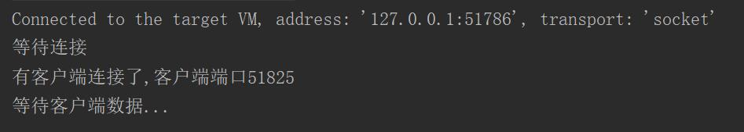
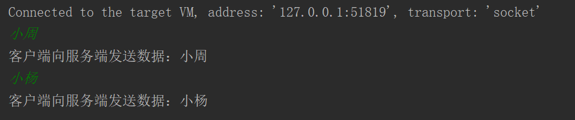
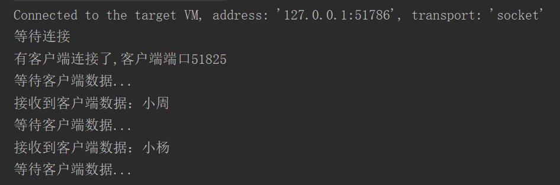
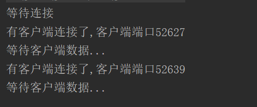
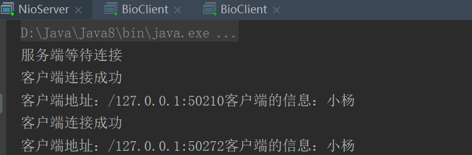
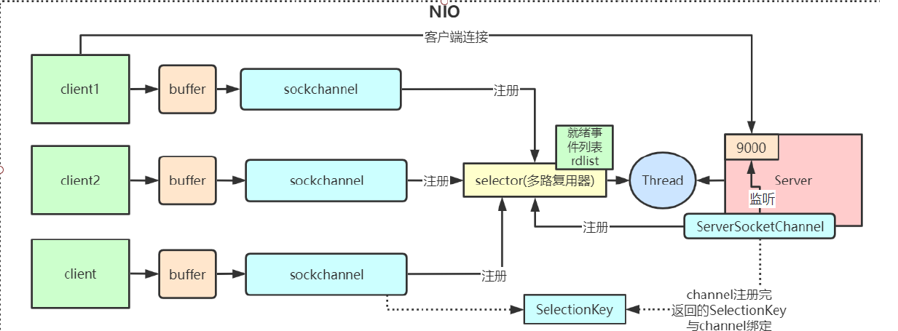

### IO

**介绍BIO代码之前，先介绍对于BIO,NIO,AIO的区别**
1. BIO：同步阻塞模型
2. NIO：同步非阻塞模型
3. AIO：异步非阻塞模型

**那么什么是同步？异步？阻塞？非阻塞呢？**
1. 同步，异步：其实很好理解，一个任务用一个线程跑就是同步，一个任务用多个线程跑就是异步
2. 阻塞，非阻塞：就是阻塞当前线程，直到某个事件被触发；可以类比CountDownLatch计数器主线程的await方法；异步，就是不管你触不触发，我都往下继续执行
#### BIO代码实现

##### 一服务端一客户端
此时当客户端与服务端建立连接，会在 `int read = clientSocket.getInputStream().read(bytes);`这行代码阻塞，导致无法有多个客户端连接服务端

**服务端代码**
```
public class BioServer {

    public static void main(String[] args) throws IOException {

        ServerSocket serverSocket = new ServerSocket(9000);
        System.out.println("等待连接");
        Socket clientSocket = serverSocket.accept();
        System.out.println("有客户端连接了,客户端端口" + clientSocket.getPort());
        while (true) {
            byte[] bytes = new byte[1024];
            System.out.println("等待客户端数据...");
            int read = clientSocket.getInputStream().read(bytes);
            if (read != -1) {
                System.out.println("接收到客户端数据：" + new String(bytes, 0, read));
            }
        }
    }
}
```
**客户端代码**
```
public class BioClient {

    public static void main(String[] args) throws IOException {
        Socket socket = new Socket("localhost", 9000);
        Scanner scanner = new Scanner(System.in);
        while (scanner.hasNextLine()) {
            String message = scanner.nextLine();
            socket.getOutputStream().write(message.getBytes());
            socket.getOutputStream().flush();
            System.out.println("客户端向服务端发送数据：" + message);
        }
        socket.close();
    }
}
```
1. 首先建立连接


2. 客户端发送数据



3. 服务端接收数据



##### 一服务端多客户端
只需要将客户端对于连接的阻塞的读操作通过线程去跑，就可以让多个客户端同事打印输出
**服务端代码**
```
public class BioServer {

    public static void main(String[] args) throws IOException {

        ServerSocket serverSocket = new ServerSocket(9000);
        System.out.println("等待连接");
        while (true) {
            Socket clientSocket = serverSocket.accept();
            System.out.println("有客户端连接了,客户端端口" + clientSocket.getPort());
            new Thread(new Runnable() {
                @Override
                public void run() {
                    while (true) {
                        byte[] bytes = new byte[1024];
                        System.out.println("等待客户端数据...");
                        int read = 0;
                        try {
                            read = clientSocket.getInputStream().read(bytes);
                        } catch (IOException e) {
                            e.printStackTrace();
                        }
                        if (read != -1) {
                            System.out.println("接收到客户端数据：" + new String(bytes, 0, read));
                        }
                    }
                }
            }).start();
        }
    }
}
```
1. 服务端使用多线程连接多个客户端




##### BIO带来的问题
由上述可见，由于BIO的同步阻塞性质：此时就会出现一个问题：每多一个客户端，就需要开线程来提供对应的服务端的读线程；如果客户端很多，那么对于服务端来说，消耗资源会很多；可能有人说那就用线程池呗，可是线程池只是保证了你最大可以连接的数目以及部分客户端关闭的时候那些空闲的线程能够复用，一旦你的客户端连接数目达到上万级别，那用线程池明显是不切实际的，所以就引入的NIO，也就是同步非阻塞模型，一个线程可以同时处理多个连接（Selector-IO多路复用）

下篇文章详细叙述NIO是什么
***
### NIO代码实现

#### 一、普通的NIO
**服务端代码**
```
public class NioServer {

    private static List<SocketChannel> socketChannels = new ArrayList<>();

    public static void main(String[] args) throws IOException {

        ServerSocketChannel serverSocketChannel = ServerSocketChannel.open();
        serverSocketChannel.bind(new InetSocketAddress(9000));
        // 设置为非阻塞
        serverSocketChannel.configureBlocking(false);
        System.out.println("服务端等待连接");
        while (true) {
            SocketChannel socketChannel = serverSocketChannel.accept();
            if (socketChannel != null) {
                System.out.println("客户端连接成功");
                socketChannel.configureBlocking(false);
                socketChannels.add(socketChannel);
            }
            Iterator<SocketChannel> iterator = socketChannels.iterator();
            while (iterator.hasNext()) {
                SocketChannel next = iterator.next();
                ByteBuffer byteBuffer = ByteBuffer.allocate(1024);
                long read = next.read(byteBuffer);
                if (read > 0) {
                    System.out.println("客户端地址：" + next.getRemoteAddress() + "客户端的信息：" + new String(byteBuffer.array()));
                } else if (read == -1){
                    iterator.remove();
                    System.out.println("客户端断开");
                }
            }
        }
    }
}
```
**客户端代码**

可以复用上一节BIO客户端的代码
```
public class BioClient {

    public static void main(String[] args) throws IOException {
        Socket socket = new Socket("localhost", 9000);
        Scanner scanner = new Scanner(System.in);
        while (scanner.hasNextLine()) {
            String message = scanner.nextLine();
            socket.getOutputStream().write(message.getBytes());
            socket.getOutputStream().flush();
            System.out.println("客户端向服务端发送数据：" + message);
        }
        socket.close();
    }
}
```
1. 多个客户端连接时服务端输出


2. 此时通过NIO可以达到一个线程连接多个客户端的方法，即**同步非阻塞模型**，而不需要和BIO一样服务端需要通过多开线程而接收客户端的信息，但是此时可能还有另一个问题：当我们客户端连接很多时，假如此时连接了10W个客户端，那么我们这个迭代器的while就需要进行10W次遍历，其中可能就只有100个连接正在传输数据，很影响性能，此时就延申出来了我们的**IO多路复用**：多路复用意思其实是指多个事件驱动复用同一个对象存储

#### 二、多路复用的NIO
**服务端代码**
```
public class NioSelectorServer {

    public static void main(String[] args) throws IOException {
        ServerSocketChannel serverSocketChannel = ServerSocketChannel.open();
        serverSocketChannel.socket().bind(new InetSocketAddress(9000));
        serverSocketChannel.configureBlocking(false);
        Selector selector = Selector.open();
        // 建立监听连接的事件
        serverSocketChannel.register(selector, SelectionKey.OP_ACCEPT);
        System.out.println("服务端等待连接");
        while (true) {
            selector.select();
            Set<SelectionKey> selectionKeys = selector.selectedKeys();
            Iterator<SelectionKey> iterator = selectionKeys.iterator();
            while (iterator.hasNext()) {
                SelectionKey next = iterator.next();
                if (next.isAcceptable()) {
                    ServerSocketChannel channel = (ServerSocketChannel) next.channel();
                    SocketChannel accept = channel.accept();
                    accept.configureBlocking(false);
                    // 读事件
                    accept.register(selector, SelectionKey.OP_READ);
                    System.out.println("客户端连接成功");
                } else if (next.isReadable()) {
                    SocketChannel socketChannel = (SocketChannel) next.channel();
                    ByteBuffer byteBuffer = ByteBuffer.allocate(1024);
                    int read = socketChannel.read(byteBuffer);
                    if (read > 0) {
                        System.out.println("客户端地址：" + socketChannel.getRemoteAddress() + "客户端的信息：" + new String(byteBuffer.array()));
                    } else if (read == -1){
                        socketChannel.close();
                        System.out.println("客户端断开");
                    }
                }
                // 事件只能被使用一次
                iterator.remove();
            }
        }
    }
}
```
1. NIO多路复用模型:利用了事件驱动这一设计思路，将建立连接和传输数据抽象为两个SelectionKey驱动事件，这样每次只需要在select阻塞然后遍历所有的事件就可以了，按需来处理逻辑，对于建立连接事件就将他与多路复用器selector绑定；对于读事件则直接读取数据处理
2. NIO的核心三大组件：Channel,Buffer,Selector；在上面代码也有实现
3. 引用别人的图


***
**注：以下内容参考于大佬的总结；原文地址：https://zhuanlan.zhihu.com/p/64138532**
#### 三、select和epoll

首先要声明，select和epoll都是上述selector.select()在不同版本进行对于socket的响应；1.5之前是select,1.5及之后是epoll

我们下面来介绍一下这两种方式有什么区别

##### 1）Select
1. 利用select建立socket的伪代码
```
int s = socket(AF_INET, SOCK_STREAM, 0);  
bind(s, ...)
listen(s, ...)

int fds[] =  存放需要监听的socket

while(1){
    int n = select(..., fds, ...)
    for(int i=0; i < fds.count; i++){
        if(FD_ISSET(fds[i], ...)){
            //fds[i]的数据处理
        }
    }
}
```
2. 一个socket连接经历的过程
 - 假设进程A监听三个socket，socket1,socket2,socket3；然后通过通过select让这三个socket把线程A放到socket内部的等待队列中
 - 当任何一个socket接收到数据之后，将三个socket中所有有关进程A的信息删除，中断程序唤醒线程A，放入到工作队列
 - 此时A被唤醒，A再去遍历一遍所有的socket列表，就可以找到就绪的socket。如果一个都没有就阻塞

3. select有缺点：
 - 每次调用select都需要将进程放入到所有监视的socket的等待队列中，默认一个select只能监视1024个socket
 - 进程被唤醒之后还要去遍历一遍，看哪些socket就绪

总结：select就是将操作放到socket里面去作处理，一个selector.select最多建立1024个连接，然后通过遍历所有的socket来找到可用的事件驱动

##### 2）Epoll
1. 建立socket连接的步骤
```
int s = socket(AF_INET, SOCK_STREAM, 0);   
bind(s, ...)
listen(s, ...)

int epfd = epoll_create(...);
epoll_ctl(epfd, ...); //将所有需要监听的socket添加到epfd中

while(1){
    int n = epoll_wait(...)
    for(接收到数据的socket){
        //处理
    }
}
```
epoll的做法：
不依赖于socket，现在外面创建一个epollevent的对象，来保存所有有效的连接，不用每次都遍历所有的socket来判断是否可以触发事件

##### 3）总结：
**select**
1. 进程A进来，先将所有socket存储一个数组
2. 使用select去将进程A放到每一个socket的等待队列中
3. 然后循环所有的socket，查看是否有socket接收到了数据
4. 如果没有socket接收到了数据，就阻塞
5. 如果有socket接收到了数据，将进程A中断，并且去删除所有socket的等待队列面带有A的信息
6. 此时进程A被唤醒，需要再去所有的socket列表看哪一个socket有内容，放到工作队列中执行

**epoll**
1. 进程A进来，先用epoll_create创建一个epollevent，epollevent里面会存储进程与socket的关系，以及就绪队列（类似上述socket里面的等待队列）
2. 然后使用epoll_ttl，将socket信息加入到创建的epollevent内
3. 利用epoll_wait，去遍历所有的socket看是否有socket有数据
4. 如果有socket有数据（就绪队列里面有数据），中断返回，否则阻塞
5. 此时进程A被唤醒，直接去epollevent的就绪队列上查看有哪些socket，放到工作队列中去执行

**epoll的操作系统的原语**
- epoll_create:创建一个epollevent对象
- epoll_ctl:绑定
- epoll_wait:没有信息就阻塞
***
##### 四、真实面试题
小周当时觉得自己知道epoll模型已经很牛逼了，结果有一次面试官继续问：**你知道epoll模型的水平触发和边缘触发吗？** 才知道山外有山，人外有人，还要不断虚心学习，努力提升

- 水平触发：只要缓冲区有数据，epoll_wait就一直会触发，直到缓存区为空  
优点：保证了数据完整输出  
缺点：数据较大时，需要不断从用户态向内核态切换  
应用场景：一般用于请求较少，可以一次性接收所有数据

- 边沿触发：只要所监听的时间改变或者有事件发生时，epoll_await才会触发  
默认读取一定的字节，无法保证数据完整性
边沿触发+非阻塞IO；epoll_wait先触发一次，然后进入while(1) 通过非阻塞IO去读取数据最后再去调用epoll_wait