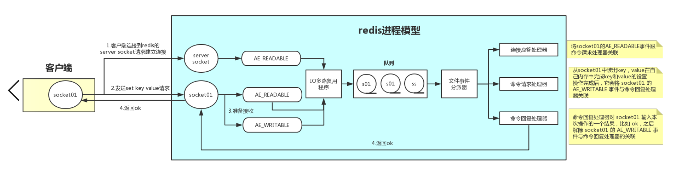

引用：<https://www.jianshu.com/p/8f2fb61097b8>
#### 文件处理器
Redis内部实现是通过文件处理器，因为下面的第三个组件文件事件分派器队列的消费是单线程的，所以redis是单线程的  

##### 文件处理器字组成部分
1. 多个socket
2. IO多路复用程序（将请求放到队列里等待文件事件分派器去消费）
3. 文件事件分派器（消费）
4. 事件处理器
   1. 连接应答处理器
   2. 命令请求处理器
   3. 命令回复处理器

#### 流程
##### 1.建立连接
1. 客户端socket01向redis的server socket请求建立连接，server socket产生AE_READABLE事件
2. IO多路复用监听到server socket产生的AE_READABLE事件，将其压入到队列
3. 文件事件分派器从队列中获取到该事件，交给事件处理器中的连接应答处理器
4. 连接应答处理器创建一个和客户端连接通信的socket01'，并且将socket01'的AE_READABLE事件和命令请求处理器关联

##### 2.发送操作请求
1. 客户端socket01发送set key value的请求，socket01'产生AE_READABLE事件
2. IO多路复用监听到socket01'产生的AE_READABLE事件，将其压入到队列
3. 文件事件分派器从队列中获取到该事件，此时已经和命令请求处理器关联，由命令请求处理器处理
4. 命令请求处理器读取socket01'上的命令，并在内存完成，操作完毕，将socket01'的AE_WAITABLE事件和命令回复处理器关联

##### 3.返回应答
1. socket01'产生AE_WAITABLE事件
2. IO多路复用监听到socket01'产生的AE_WAITABLE事件，将其压入队列
3. 文件事件分派器从队列中获取到该事件，此时已经和命令回复处理器关联，由命令回复处理器处理
4. 命令回复处理器对soctket01'输入本次操作的结果，然后解除socket01'的AE_WAITABLE事件和命令回复处理器的关联