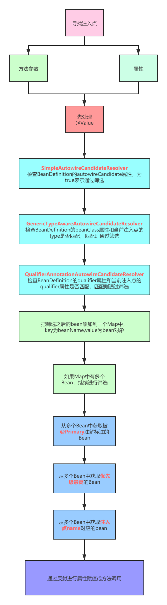
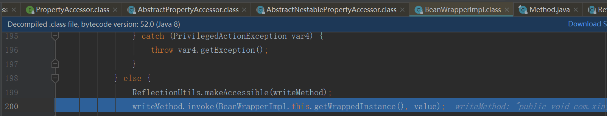
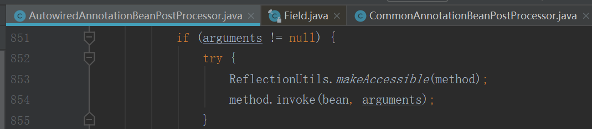

#### 依赖注入
##### 到底什么是Spring的依赖注入?  
Spring依赖注入就是：Spring容器协助你做了A a = new A(),B b = new B(),a.setB(b)的动作
***
##### Spring依赖注入就是@Autowired吗?
不是，在bean生命周期的填充属性中,@Autowired只是Spring提供的其中一个后置处理器AutowiredAnnotationBeanPostProcessor的功能,可以理解为@Autowired注解只是Spring开发的一个插件方便开发者使用（AOP也是一个插件）
***  
##### Spring中依赖注入分别都有哪些?（简略）  
1. 手动注入——xml中的property
    - set
    - constructor
2. 自动注入  
    - Spring的自动注入：利用xml中的autowired属性。byType,byName,constructor,default,no  
    - 后置处理器的自动注入： @Autowired，@Resource，@Value自动注入  
        1. AutowiredAnnotationBeanPostProcessor
        2. CommonAnnotationBeanPostProcessor
        3. 注：代码逻辑是先Spring的注入，后面是后置处理器的注入，所以会覆盖，并不是不执行Spring的自动注入了
***
##### Spring中依赖注入分别都有哪些?（详细）  
1. 手动注入：xml中的set方法  
    ```xml
    <beans>
        <bean name="provideService" class="com.xinyuzang.game.spring.ProvideService"/>
        <bean name="consumerService" class="com.xinyuzang.game.spring.ConsumerService">
            <property name="provideService" ref="provideService"/>
        </bean>
    </beans>
    ```
    ```java
    /**
     * @Desc 提供方
     * @Author: xinyuzang
     * @Date: 2020/11/16 14:12
     */
     public class ProvideService {
     }
    ```
    ```java
    /**
     * @Desc 消费方   
     * @Author: xinyuzang
     * @Date: 2020/11/16 14:12
     */
    public class ConsumerService { 
        
        private ProvideService provideService;
        
        public void setProvideService(ProvideService provideService) {
           this.provideService = provideService;
       }
     }
    ```
2. 手动注入：xml中的构造方法
    ```xml
    <bean name="consumerService" class="com.xinyuzang.game.spring.ConsumerService">
        <constructor-arg index="0" ref="provideService"/>
    </bean>
    ``` 
    ```java
    /**
     * @Desc 消费方
     * @Author: xinyuzang
     * @Date: 2020/11/16 14:12
     */
    public class ConsumerService {
    
        private ProvideService provideService;
    
        public ConsumerService(ProvideService provideService) {
            this.provideService = provideService;
        }
    }
    ```
3. Spring本身的自动注入：xml的autowired属性(不用手动写xml的property属性了)  
   ```     
   bean标签
    1.default：使用<beans default-autowired=""/>上的属性
    2.no：默认是no
    3.byType：根据类型注入，使用DefaultListableBeanFactory中的resolveDependency方法（划重点——@Autowired核心实现都在这里）
    4.byName：根据名称注入
    5.constructor：根据构造方法注入
    注1.如果是byType或者byName，如果没有构造方法某人会有一个无参的构造，如果有非空入参的构造，则需要有一个空的构造方法
    注2.如果是构造方法注入，和实例化的时候推断构造方法的逻辑有关——很复杂,后续讲，@Autowired也参与进去
    ```
4. 后置处理器的自动注入：@AutowiredAnnotationBeanPostProcessor

    1.寻找注入点  
    **生命周期阶段**:实例化和实例化之后之间  
    **代码**：位于AbstractAutowiredCapableBeanFactory的applyMergedBeanDefinitionPostProcessors方法，其实就是调用后置处理器里面的postProcessorMergedBeanDefinition的方法。后置处理器贯穿了生命周期的全程。  
    **实际找的注入点**：@Autowired,@Value,@Inject
    ```java
    public class AutowiredAnnotationBeanPostProcessor {
        // 154
        /**
         * Create a new {@code AutowiredAnnotationBeanPostProcessor} for Spring's
         * standard {@link Autowired @Autowired} and {@link Value @Value} annotations.
         * <p>Also supports JSR-330's {@link javax.inject.Inject @Inject} annotation,
         * if available.
         */
        @SuppressWarnings("unchecked")
        public AutowiredAnnotationBeanPostProcessor() {
            this.autowiredAnnotationTypes.add(Autowired.class);
            this.autowiredAnnotationTypes.add(Value.class);
            try {
                this.autowiredAnnotationTypes.add((Class<? extends Annotation>)
                        ClassUtils.forName("javax.inject.Inject", AutowiredAnnotationBeanPostProcessor.class.getClassLoader()));
                logger.trace("JSR-330 'javax.inject.Inject' annotation found and supported for autowiring");
            }
            catch (ClassNotFoundException ex) {
                // JSR-330 API not available - simply skip.
            }
        }
        // 174
    }
    ```
    2.执行注入逻辑  
    **生命周期阶段**：实例化之后  
    **代码**：位于AbstractAutowiredCapableBeanFactory中填充属性子方法populateBean里面的实例化之后postProcessAfterInstantiation（Spring书写逻辑不一定和我们看到的Spring流程一致，这里就将实例化之后放到了填充属性的方法里面）  
    **代码逻辑**：调用的是@AutowiredAnnotationBeanPostProcessor的postProcessorAfterInstantiation,后面详细说  
5.  后置处理器的自动注入：@CommonAnnotationBeanPostProcessor  
     @Resource就在这里完成（该类不仅仅提供@Resource的逻辑，还有@Lazy）  
     也是一个后置处理器，可以联想到其实调用和AutowiredAnnotationBeanPostProcessor是一样的，只是里面的逻辑不一样，后面详细说
***        
##### 源码解析Spring本身自带的自动注入
1. 入口：填充属性代码里面
    ```java
    public abstract class AbstractAutowiredCapableBeanFactory{
        // 1467 上面代码找了注入点，为后面的@Autowired服务
        // 是否在BeanDefinition中设置了属性值
    	PropertyValues pvs = (mbd.hasPropertyValues() ? mbd.getPropertyValues() : null);

    	int resolvedAutowireMode = mbd.getResolvedAutowireMode();
    	if (resolvedAutowireMode == AUTOWIRE_BY_NAME || resolvedAutowireMode == AUTOWIRE_BY_TYPE) {
    		// by_name是根据根据属性名字找bean
    		// by_type是根据属性所对应的set方法的参数类型找bean
    		// 找到bean之后都要调用set方法进行注入

    		MutablePropertyValues newPvs = new MutablePropertyValues(pvs);
    		// Add property values based on autowire by name if applicable.
    		if (resolvedAutowireMode == AUTOWIRE_BY_NAME) {
    			autowireByName(beanName, mbd, bw, newPvs);
    		}
    		// Add property values based on autowire by type if applicable.
    		if (resolvedAutowireMode == AUTOWIRE_BY_TYPE) {
    			autowireByType(beanName, mbd, bw, newPvs);
    		}
    		pvs = newPvs;

    		// 总结一下
    		// 其实就是Spring自动的根据某个类中的set方法来找bean，byName就是根据某个set方法所对应的属性名去找bean
    		// byType，就是根据某个set方法的参数类型去找bean
    		// 注意，执行完这里的代码之后，这是把属性以及找到的值存在了pvs里面，并没有完成反射赋值
    	}
    	// 1492
    }
    ```
2. byName：通过byName的方式注入  
   **过滤**：unsatisfiedNonSimpleProperties方法里面先对pds(BeanWrapper->PropertyDescriptor)进行一遍过滤
    ```
    1. 属性有set方法
    2. 没有被排除，是否允许自动注入
    3. 没有在beanDefinition中给属性赋过值
    4. 类型不是简单类型
    ```
    ```
    if (pd.getWriteMethod() != null && !isExcludedFromDependencyCheck(pd) && !pvs.contains(pd.getName()) &&
        !BeanUtils.isSimpleProperty(pd.getPropertyType())) {
    ```
    **过滤完毕之后通过getBean进行注入**  
    ```java
    /**
     * Fill in any missing property values with references to
     * other beans in this factory if autowire is set to "byName".
     * @param beanName the name of the bean we're wiring up.
     * Useful for debugging messages; not used functionally.
     * @param mbd bean definition to update through autowiring
     * @param bw the BeanWrapper from which we can obtain information about the bean
     * @param pvs the PropertyValues to register wired objects with
     */protected void autowireByName(
       String beanName, AbstractBeanDefinition mbd, BeanWrapper bw, MutablePropertyValues pvs) {
    
   // 找到有对应set方法的属性
     	String[] propertyNames = unsatisfiedNonSimpleProperties(mbd, bw);
     	for (String propertyName : propertyNames) {
     		if (containsBean(propertyName)) {
     			// 根据属性名去找bean，这就是byName
     			Object bean = getBean(propertyName);
     			// 给属性赋值
     			pvs.add(propertyName, bean);
     			registerDependentBean(propertyName, beanName);
     			if (logger.isTraceEnabled()) {
     				logger.trace("Added autowiring by name from bean name '" + beanName +
     						"' via property '" + propertyName + "' to bean named '" + propertyName + "'");
     			}
     		}
     		else {
     			if (logger.isTraceEnabled()) {
     				logger.trace("Not autowiring property '" + propertyName + "' of bean '" + beanName +
     						"' by name: no matching bean found");
     			}
     		}
     	}
     }   
     ```
3. byType：通过byType的类型注入  
    **过滤**：和上面一样  
    **过滤之后操作**：核心：resolveDependency方法，后置处理器其实也是用的该方法去注入，该方法是一个通用的方法，根据DependencyDescriptor类型的不同  
4. 核心流程图——resolveDependency方法  
    
5. 核心流程图——findAutowireCandidates方法  
    
6. 详细流程图  
     
***
#### 总结
整体Spring的依赖注入核心其实都在上面已经描述了，@AutowiredAnnotationBeanProcessor和@CommonAnnotationBeanProcessor的只是有基于Spring依赖注入有自己的扩展点，下篇文章直接贴源码进行叙述​。  
**依赖注入，其实无非就是byName根据名字去找bean或者byType根据类型经过一些列的过滤找到bean，只不过Spring考虑了方方面面，帮我们做了处理**  
***


##### 通过xml的注入与后置处理器自动注入的区别
1. 注入方式
    1. 通过xml的注入，可以手动注入/自动注入，都必须写setXXX方法，相当于注入点；手动注入在xml必须写property，自动注入在xml必须写autowired类型
    2. 通过后置处理器的注入，通过@Autowired,@Resource等注解实现，在psv(PropertyValues)里面没有信息
2. 实际实现方式——都是反射
    1. 通过xml的注入，利用pvs，pvs里面就是需要被注入的对象，再进一步说，其实就是BeanDefinition解析出来的内容，使用反射赋值给需要被注入的实例
      - 
    2. 通过后置处理器的注入，使用前面扫描的注入点的信息来反射赋值给需要被注入的实例
      -   
    3. 都有参数或者方法的反射
***
##### resolveDependency方法  
内部参数1.DependencyDescriptor:属性描述封装为对象
1. 在byType内，传入的为AutowireByTypeDependencyDescriptor
2. 在AutowiredAnnotationBeanPostProcessor内，第一次为DependencyDescriptor，后面缓存了为ShortcutDependencyDescriptor
3. 在CommonAnnotationBeanPostProcessor内，为LookupDependencyDescriptor
```java
/**
 * Resolve the specified dependency against the beans defined in this factory.
 * @param descriptor the descriptor for the dependency (field/method/constructor)
 * @param requestingBeanName the name of the bean which declares the given dependency
 * @param autowiredBeanNames a Set that all names of autowired beans (used for
 * resolving the given dependency) are supposed to be added to
 * @param typeConverter the TypeConverter to use for populating arrays and collections
 * @return the resolved object, or {@code null} if none found
 * @throws NoSuchBeanDefinitionException if no matching bean was found
 * @throws NoUniqueBeanDefinitionException if more than one matching bean was found
 * @throws BeansException if dependency resolution failed for any other reason
 * @since 2.5
 * @see DependencyDescriptor
 *
 * DependencyDescriptor表示依赖，需要给这个依赖注入值，这个依赖可能是field/method/constructor
 *
 */
@Nullable
Object resolveDependency(DependencyDescriptor descriptor, @Nullable String requestingBeanName,
		@Nullable Set<String> autowiredBeanNames, @Nullable TypeConverter typeConverter) throws BeansException;
```
***
**下面的代码只是贴了一些核心实现**
***
##### 后置处理器：AutowiredAnnotationBeanPostProcessor
***注意：这里只叙述和依赖注入有关的内容，该处理器在推断构造方法中也起了作用***  
1. 寻找注入点（postProcessMergedBeanDefinition）
```java
private InjectionMetadata findAutowiringMetadata(String beanName, Class<?> clazz, @Nullable PropertyValues pvs) {
		// Fall back to class name as cache key, for backwards compatibility with custom callers.
		String cacheKey = (StringUtils.hasLength(beanName) ? beanName : clazz.getName());
		// Quick check on the concurrent map first, with minimal locking.
		InjectionMetadata metadata = this.injectionMetadataCache.get(cacheKey);
		if (InjectionMetadata.needsRefresh(metadata, clazz)) {
			synchronized (this.injectionMetadataCache) {
				metadata = this.injectionMetadataCache.get(cacheKey);
				if (InjectionMetadata.needsRefresh(metadata, clazz)) {
					if (metadata != null) {
						metadata.clear(pvs);
					}
					// 寻找当前clazz中的注入点，把所有注入点整合成为一个InjectionMetadata对象
					metadata = buildAutowiringMetadata(clazz);
					this.injectionMetadataCache.put(cacheKey, metadata);
				}
			}
		}
		return metadata;
	}
```	
2. 注入（postProcessProperties）  
AutowiredFieldElement继承了InjectionMetadata.InjectedElement方法，当调用inject的时候会调用AutowiredAnnotationBeanPostProcessor里面的方法，而CommonAnnotationBeanPostProcessor调用的还是原来的方法。  
```java
@Override
protected void inject(Object bean, @Nullable String beanName, @Nullable PropertyValues pvs) throws Throwable {
    Field field = (Field) this.member;
	Object value;
	if (this.cached) {
		// 当前注入点已经注入过了，有缓存了，则利用cachedFieldValue去找对应的bean
		value = resolvedCachedArgument(beanName, this.cachedFieldValue);
	}
	else {
		//  Spring在真正查找属性对应的对象之前, 会先将该属性的描述封装成一个DependencyDescriptor, 里面保存了Filed、是否强制需要即required, 以及属性所在的类(即Field所在的类Class对象)
		DependencyDescriptor desc = new DependencyDescriptor(field, this.required);
		desc.setContainingClass(bean.getClass());
		Set<String> autowiredBeanNames = new LinkedHashSet<>(1);
		Assert.state(beanFactory != null, "No BeanFactory available");
		TypeConverter typeConverter = beanFactory.getTypeConverter();
		try {
			// 根据field去寻找合适的bean
			value = beanFactory.resolveDependency(desc, beanName, autowiredBeanNames, typeConverter);
		}
		catch (BeansException ex) {
			throw new UnsatisfiedDependencyException(null, beanName, new InjectionPoint(field), ex);
		}
		synchronized (this) {
			if (!this.cached) {
				if (value != null || this.required) {
					this.cachedFieldValue = desc;
					// 注册当前bean依赖了哪些其他的bean的name
					registerDependentBeans(beanName, autowiredBeanNames);
					if (autowiredBeanNames.size() == 1) {
						String autowiredBeanName = autowiredBeanNames.iterator().next();
						if (beanFactory.containsBean(autowiredBeanName) &&
								beanFactory.isTypeMatch(autowiredBeanName, field.getType())) {
							// 对得到的对象进行缓存
							this.cachedFieldValue = new ShortcutDependencyDescriptor(
									desc, autowiredBeanName, field.getType());
						}
					}
				}
				else {
					this.cachedFieldValue = null;
				}
				this.cached = true;
			}
		}
	}
	// 反射设值
	if (value != null) {
		ReflectionUtils.makeAccessible(field);
		//这里通过反射设置beanWrapper里面的wrappedObject对象
		field.set(bean, value);
	}
}
```
3. 缓存（ShortcutDependencyDescriptor）
4. 总结  
    发现没，其实后置处理器区别于byType就做了两件事情，
    1. 因为bd里面没有set方法，导致没有psv里面的属性，所以只能在注入点进行反射赋值
    2. 做了一层缓存，如果之前注入过，直接去BeanFactory找，不用再一层层去过滤找了
    3. resolveDependency类是AbstractAutowiredCapableFactoryBean的方法，该后置处理器的核心方法还是该方法，包括一些lazy注解也在该方法内部处理
***
##### 后置处理器：CommonAnnotationBeanPostProcessor

1. 寻找注入点
```java
private InjectionMetadata findResourceMetadata(String beanName, final Class<?> clazz, @Nullable PropertyValues pvs) {
		// Fall back to class name as cache key, for backwards compatibility with custom callers.
		String cacheKey = (StringUtils.hasLength(beanName) ? beanName : clazz.getName());
		// Quick check on the concurrent map first, with minimal locking.
		InjectionMetadata metadata = this.injectionMetadataCache.get(cacheKey);
		if (InjectionMetadata.needsRefresh(metadata, clazz)) {
			synchronized (this.injectionMetadataCache) {
				metadata = this.injectionMetadataCache.get(cacheKey);
				if (InjectionMetadata.needsRefresh(metadata, clazz)) {
					if (metadata != null) {
						metadata.clear(pvs);
					}
					metadata = buildResourceMetadata(clazz);
					this.injectionMetadataCache.put(cacheKey, metadata);
				}
			}
		}
		return metadata;
}
```
2. 注入  
调用的是本身的inject方法
```java
/**
 * Either this or {@link #getResourceToInject} needs to be overridden.
 */
protected void inject(Object target, @Nullable String requestingBeanName, @Nullable PropertyValues pvs)
		throws Throwable {

	// 如果是属性，则反射赋值
	if (this.isField) {
		Field field = (Field) this.member;
		ReflectionUtils.makeAccessible(field);
		field.set(target, getResourceToInject(target, requestingBeanName));
	}
	else {

		// 检查当前的属性是不是通过by_name和by_type来注入的
		if (checkPropertySkipping(pvs)) {
			return;
		}
		try {
			// 如果是方法，则通过方法赋值
			// 这里的方法并不是一定要setXX方法
			Method method = (Method) this.member;
			ReflectionUtils.makeAccessible(method);
			method.invoke(target, getResourceToInject(target, requestingBeanName));
		}
		catch (InvocationTargetException ex) {
			throw ex.getTargetException();
		}
	}
}
```
因为没有调用resolveDependency方法，所以@lazy注解需要后置处理器自己实现
```java
@Override
	protected Object getResourceToInject(Object target, @Nullable String requestingBeanName) {
		return (this.lazyLookup ? buildLazyResourceProxy(this, requestingBeanName) :
				getResource(this, requestingBeanName));
	}
```
3. 核心判断逻辑
```java
if (this.fallbackToDefaultTypeMatch && element.isDefaultName && !factory.containsBean(name)) {
	autowiredBeanNames = new LinkedHashSet<>();
	resource = beanFactory.resolveDependency(descriptor, requestingBeanName, autowiredBeanNames, null);
	if (resource == null) {
		throw new NoSuchBeanDefinitionException(element.getLookupType(), "No resolvable resource object");
	}
}
else {
	resource = beanFactory.resolveBeanByName(name, descriptor);
	autowiredBeanNames = Collections.singleton(name);
}
```
```java
/**
 * Build a DependencyDescriptor for the underlying field/method.
 */
public final DependencyDescriptor getDependencyDescriptor() {
	if (this.isField) {
		return new LookupDependencyDescriptor((Field) this.member, this.lookupType);
	}
	else {
		return new LookupDependencyDescriptor((Method) this.member, this.lookupType);
	}
}
```
1.首先判断@Resource(name = "")命名了和默认名称不一样的别名并且BeanFactory里面没有该beanName，就又去走我们的核心类resolveDependency一层层筛选
2.如果没有找到，就抛出异常  
3.如果是默认名称或者BeanFactory里面已经有该beanName，通过byName的方式去getBean

4. 总结  
    1. @Resource注解就是根据解析出来的名称去寻找是否有对应的bean，做了@Lazy注解以及本身功能的兼容，其实还是用的AbstractAutowiredBeanFactory的resolveBeanByName的功能
    2. @Resource如果手动指定了与名字的name，没有找到抛异常，找到了就返回

***
##### @Autowired和@Resource的对比
1. @Autowired主要的实现：resolveDependency方法,先byType，如果经过一系列的筛选，发现结果集还是有多个再byName
2. @Resource主要实现：resolveBeanByName方法，byName，如果手动配置了名字没找到抛异常，没有配置没找到就是空
***
**开发人员为了让我们用起来方便，幕后真的做了很多工作，看完文章请不要再说我只会@Autowired了~**
