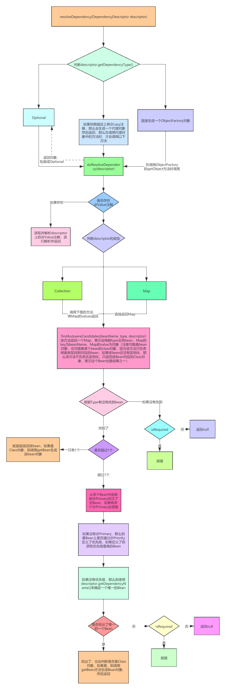
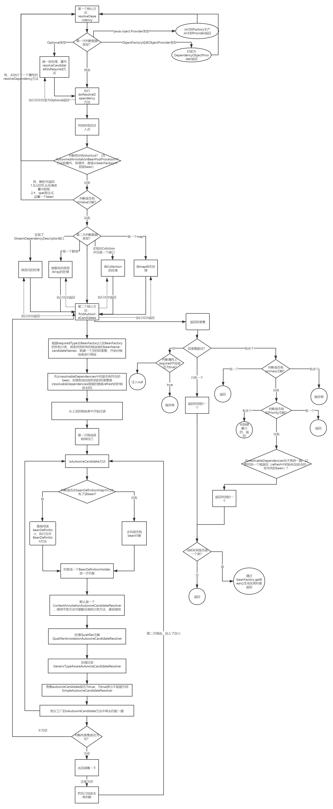

#### 依赖注入
##### 1. 到底什么是Spring的依赖注入?  
Spring依赖注入就是：Spring容器协助你做了A a = new A(),B b = new B(),a.setB(b)的动作
***
##### 2. 依赖注入就是@Autowired吗?
不是，在bean生命周期的填充属性中,@Autowired只是Spring提供的其中一个后置处理器AutowiredAnnotationBeanPostProcessor的功能,可以理解为@Autowired注解只是Spring开发的一个插件方便开发者使用（AOP也是一个插件）
***  
##### 3. Spring中依赖注入分别都有哪些?（简略）  
1. 手动注入——xml中的property
    - set
    - constructor
2. 自动注入  
    - Spring的自动注入：利用xml中的autowired属性。byType,byName,constructor,default,no  
    - 后置处理器的自动注入： @Autowired，@Resource，@Value自动注入  
        1. AutowiredAnnotationBeanPostProcessor
        2. CommonAnnotationBeanPostProcessor
        3. 注：代码逻辑是先Spring的注入，后面是后置处理器的注入，所以会覆盖，并不是不执行Spring的自动注入了
***
##### 4. Spring中依赖注入分别都有哪些?（详细）  
1. 手动注入  
    - xml中的set方法
        ```xml
        <beans>
            <bean name="provideService" class="com.xinyuzang.game.spring.ProvideService"/>
            <bean name="consumerService" class="com.xinyuzang.game.spring.ConsumerService">
                <property name="provideService" ref="provideService"/>
            </bean>
        </beans>
        ```
        ```java
        /**
         * @Desc 提供方
         * @Author: xinyuzang
         * @Date: 2020/11/16 14:12
         */
         public class ProvideService {
         }
        ```
        ```java
        /**
         * @Desc 消费方   
         * @Author: xinyuzang
         * @Date: 2020/11/16 14:12
         */
        public class ConsumerService { 
            
            private ProvideService provideService;
            
            public void setProvideService(ProvideService provideService) {
               this.provideService = provideService;
           }
         }
        ```
    - xml中的构造方法
        ```xml
        <bean name="consumerService" class="com.xinyuzang.game.spring.ConsumerService">
            <constructor-arg index="0" ref="provideService"/>
        </bean>
        ``` 
        ```java
        /**
         * @Desc 消费方
         * @Author: xinyuzang
         * @Date: 2020/11/16 14:12
         */
        public class ConsumerService {
        
            private ProvideService provideService;
        
            public ConsumerService(ProvideService provideService) {
                this.provideService = provideService;
            }
        }
        ```
2. 自动注入
    - Spring本身的自动注入——xml的autowired属性(不用手动写xml的property属性了)  
        ```
        bean标签
            1.default：使用<beans default-autowired=""/>上的属性
            2.no：默认是no
            3.byType：根据类型注入，使用DefaultListableBeanFactory中的resolveDependency方法（划重点——@Autowired核心实现都在这里）
            4.byName：根据名称注入
            5.constructor：根据构造方法注入
        注1.如果是byType或者byName，如果没有构造方法某人会有一个无参的构造，如果有非空入参的构造，则需要有一个空的构造方法
        注2.如果是构造方法注入，和实例化的时候推断构造方法的逻辑有关——很复杂,后续讲，@Autowired也参与进去
        ```
    - 后置处理器的自动注入  
        1. @AutowiredAnnotationBeanPostProcessor  
            ```
            1. 依赖注入分两块
                 1. 寻找注入点：
                    1. 生命周期阶段:实例化和实例化之后之间
                    2. 代码：位于AbstractAutowiredCapableBeanFactory的applyMergedBeanDefinitionPostProcessors方法，其实就是调用后置处理器里面的postProcessorMergedBeanDefinition的方法。后置处理器贯穿了生命周期的全程。
                    3. 实际找的注入点：@Autowired,@Value,@Inject
            ```
            ```java
            public class AutowiredAnnotationBeanPostProcessor {
                // 154
                /**
                 * Create a new {@code AutowiredAnnotationBeanPostProcessor} for Spring's
                 * standard {@link Autowired @Autowired} and {@link Value @Value} annotations.
                 * <p>Also supports JSR-330's {@link javax.inject.Inject @Inject} annotation,
                 * if available.
                 */
                @SuppressWarnings("unchecked")
                public AutowiredAnnotationBeanPostProcessor() {
                    this.autowiredAnnotationTypes.add(Autowired.class);
                    this.autowiredAnnotationTypes.add(Value.class);
                    try {
                        this.autowiredAnnotationTypes.add((Class<? extends Annotation>)
                                ClassUtils.forName("javax.inject.Inject", AutowiredAnnotationBeanPostProcessor.class.getClassLoader()));
                        logger.trace("JSR-330 'javax.inject.Inject' annotation found and supported for autowiring");
                    }
                    catch (ClassNotFoundException ex) {
                        // JSR-330 API not available - simply skip.
                    }
                }
                // 174
            }
            ```
            ```
            2. 执行注入逻辑
                1. 生命周期节点：实例化之后
                2. 代码：位于AbstractAutowiredCapableBeanFactory中填充属性子方法populateBean里面的实例化之后postProcessAfterInstantiation（Spring书写逻辑不一定和我们看到的Spring流程一致，这里就将实例化之后放到了填充属性的方法里面）
                3. 代码逻辑：调用的是@AutowiredAnnotationBeanPostProcessor的postProcessorAfterInstantiation,后面详细说
            ```
        2. @CommonAnnotationBeanPostProcessor
            ```
            1. @Resource就在这里完成（该类不仅仅提供@Resource的逻辑，还有@Lazy）
            2. 也是一个后置处理器，可以联想到其实调用和AutowiredAnnotationBeanPostProcessor是一样的，只是里面的逻辑不一样，后面详细说
            ```
***        
##### 5. Spring本身自带的自动注入——xml中的autowired属性
1. 入口：填充属性代码里面
    ```java
    public abstract class AbstractAutowiredCapableBeanFactory{
        // 1467 上面代码找了注入点，为后面的@Autowired服务
        // 是否在BeanDefinition中设置了属性值
    	PropertyValues pvs = (mbd.hasPropertyValues() ? mbd.getPropertyValues() : null);

    	int resolvedAutowireMode = mbd.getResolvedAutowireMode();
    	if (resolvedAutowireMode == AUTOWIRE_BY_NAME || resolvedAutowireMode == AUTOWIRE_BY_TYPE) {
    		// by_name是根据根据属性名字找bean
    		// by_type是根据属性所对应的set方法的参数类型找bean
    		// 找到bean之后都要调用set方法进行注入

    		MutablePropertyValues newPvs = new MutablePropertyValues(pvs);
    		// Add property values based on autowire by name if applicable.
    		if (resolvedAutowireMode == AUTOWIRE_BY_NAME) {
    			autowireByName(beanName, mbd, bw, newPvs);
    		}
    		// Add property values based on autowire by type if applicable.
    		if (resolvedAutowireMode == AUTOWIRE_BY_TYPE) {
    			autowireByType(beanName, mbd, bw, newPvs);
    		}
    		pvs = newPvs;

    		// 总结一下
    		// 其实就是Spring自动的根据某个类中的set方法来找bean，byName就是根据某个set方法所对应的属性名去找bean
    		// byType，就是根据某个set方法的参数类型去找bean
    		// 注意，执行完这里的代码之后，这是把属性以及找到的值存在了pvs里面，并没有完成反射赋值
    	}
    	// 1492
    }
    ```
2. byName：通过byName的方式注入
    1. 过滤：unsatisfiedNonSimpleProperties方法里面先对pds(BeanWrapper->PropertyDescriptor)进行一遍过滤
        1. 属性有set方法
        2. 没有被排除，是否允许自动注入
        3. 没有在beanDefinition中给属性赋过值
        4. 类型不是简单类型
            ```
            if (pd.getWriteMethod() != null && !isExcludedFromDependencyCheck(pd) && !pvs.contains(pd.getName()) &&
                !BeanUtils.isSimpleProperty(pd.getPropertyType())) {
            ```
    2. 过滤完毕之后通过getBean进行注入
        ```java
        /**
         * Fill in any missing property values with references to
         * other beans in this factory if autowire is set to "byName".
         * @param beanName the name of the bean we're wiring up.
         * Useful for debugging messages; not used functionally.
         * @param mbd bean definition to update through autowiring
         * @param bw the BeanWrapper from which we can obtain information about the bean
         * @param pvs the PropertyValues to register wired objects with
         */
        protected void autowireByName(
        		String beanName, AbstractBeanDefinition mbd, BeanWrapper bw, MutablePropertyValues pvs) {
    
        	// 找到有对应set方法的属性
        	String[] propertyNames = unsatisfiedNonSimpleProperties(mbd, bw);
        	for (String propertyName : propertyNames) {
        		if (containsBean(propertyName)) {
        			// 根据属性名去找bean，这就是byName
        			Object bean = getBean(propertyName);
        			// 给属性赋值
        			pvs.add(propertyName, bean);
        			registerDependentBean(propertyName, beanName);
        			if (logger.isTraceEnabled()) {
        				logger.trace("Added autowiring by name from bean name '" + beanName +
        						"' via property '" + propertyName + "' to bean named '" + propertyName + "'");
        			}
        		}
        		else {
        			if (logger.isTraceEnabled()) {
        				logger.trace("Not autowiring property '" + propertyName + "' of bean '" + beanName +
        						"' by name: no matching bean found");
        			}
        		}
        	}
        }   
        ```
3. byType：通过byType的类型注入
    1. 过滤：和上面一样
    2. 过滤之后操作，核心：resolveDependency方法，后置处理器其实也是用的该方法去注入
    3. luban简要版流程图——resolveDependency方法
        - 
    4. luban简要版流程图——findAutowireCandidates方法
    5. 详细流程图
        - 