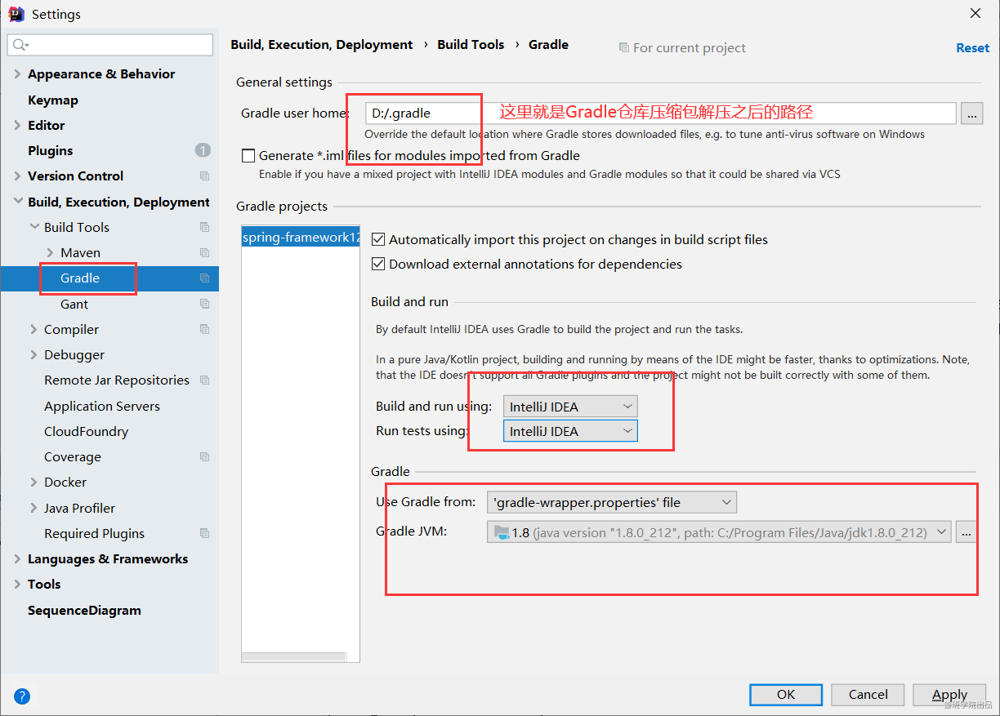

# Spring源码-鲁班学院

## 一、先把Gradle仓库下载下来：
    链接：https://pan.baidu.com/s/15kYgKth3RCEowmsio_os6Q
    提取码：2q3f 
## 二、导入
    git clone：https://gitee.com/archguide/spring-framework.git
## 三、替换
    使用网盘下载的.gradle替换要加载的.gradle，省去时间
