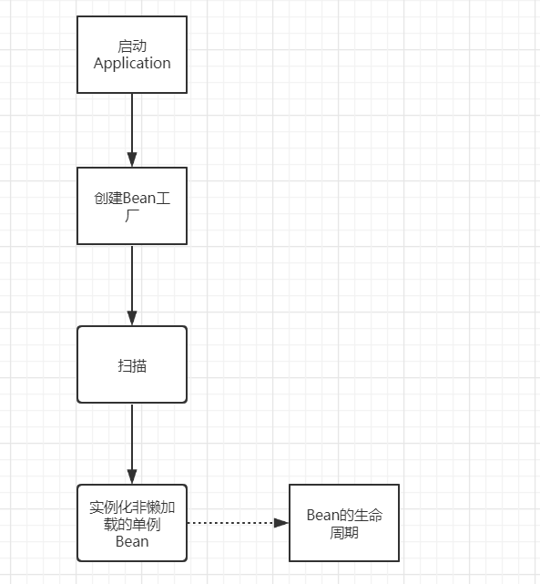
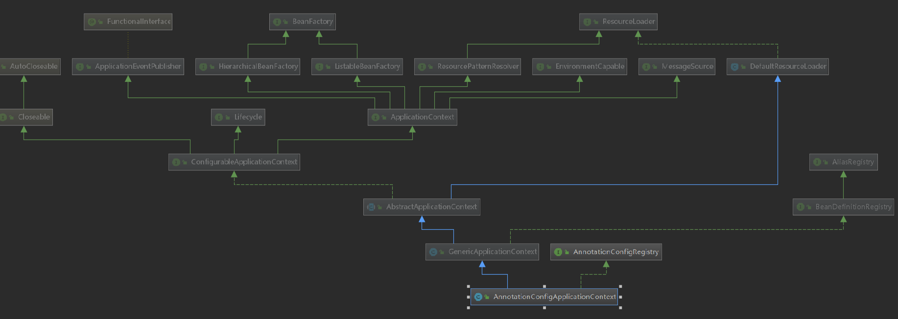
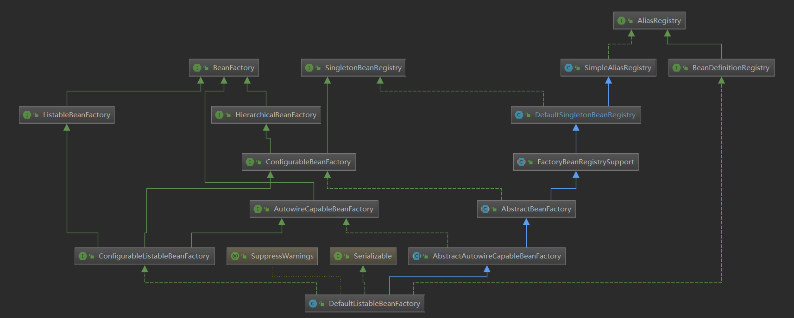

### 一、Spring框架

#### Spring整体流程


#### 手写一个Spring
[simple-spring源码](https://github.com/987423093/SimpleSpring.git)  

### 二、Application和BeanFactory的区别

#### AnnotationApplication：资源加载，国际化，监听器，简单的Bean创建

  

1. HierarchicalBeanFactory：拥有获取父BeanFactory的功能
2. ListableBeanFactory：拥有获取beanNames的功能
3. ResourcePatternResolver：资源加载器，可以一次性获取多个资源（文件资源等等）
4. EnvironmentCapable：可以获取运行时环境（没有设置运行时环境功能）
5. ApplicationEventPublisher：拥有广播事件的功能（没有添加事件监听器的功能）
6. MessageSource：拥有国际化功能
7. ConfigurableApplicationContext：继承了ApplicationContext接口，增加了，添加事件监听器、添加BeanFactoryPostProcessor、设置Environment，获取ConfigurableListableBeanFactory等功能
8. AbstractApplicationContext：实现了ConfigurableApplicationContext接口
9. GenericApplicationContext：继承了AbstractApplicationContext，实现了BeanDefinitionRegistry接口，拥有了所有ApplicationContext的功能，并且可以注册BeanDefinition，注意这个类中有一个属性(DefaultListableBeanFactory beanFactory)
10. AnnotationConfigRegistry：可以单独注册某个为类为BeanDefinition（可以处理该类上的@Configuration注解，已经可以处理@Bean注解），同时可以扫描
11. AnnotationConfigApplicationContext：继承了GenericApplicationContext，实现了AnnotationConfigRegistry接口，拥有了以上所有的功能

#### DefaultListableBeanFactory：强大的Bean创建工厂

  

1. AliasRegistry：支持别名功能，一个名字可以对应多个别名
2. BeanDefinitionRegistry：可以注册、保存、移除、获取某个BeanDefinition
3. BeanFactory：Bean工厂，可以根据某个bean的名字、或类型、或别名获取某个Bean对象
4. SingletonBeanRegistry：可以直接注册、获取某个单例Bean
5. SimpleAliasRegistry：它是一个类，实现了AliasRegistry接口中所定义的功能，支持别名功能
6. ListableBeanFactory：在BeanFactory的基础上，增加了其他功能，可以获取所有BeanDefinition的beanNames，可以根据某个类型获取对应的beanNames，可以根据某个类型获取{类型：对应的Bean}的映射关系
7. HierarchicalBeanFactory：在BeanFactory的基础上，添加了获取父BeanFactory的功能
8. DefaultSingletonBeanRegistry：它是一个类，实现了SingletonBeanRegistry接口，拥有了直接注册、获取某个单例Bean的功能
9. ConfigurableBeanFactory：在HierarchicalBeanFactory和SingletonBeanRegistry的基础上，添加了设置父BeanFactory、类加载器（表示可以指定某个类加载器进行类的加载）、设置Spring EL表达式解析器（表示该BeanFactory可以解析EL表达式）、设置类型转化服务（表示该BeanFactory可以进行类型转化）、可以添加BeanPostProcessor（表示该BeanFactory支持Bean的后置处理器），可以合并BeanDefinition，可以销毁某个Bean等等功能
11. FactoryBeanRegistrySupport：支持了FactoryBean的功能
12. AutowireCapableBeanFactory：是直接继承了BeanFactory，在BeanFactory的基础上，支持在创建Bean的过程中能对Bean进行自动装配
13. AbstractBeanFactory：实现了ConfigurableBeanFactory接口，继承了FactoryBeanRegistrySupport，这个BeanFactory的功能已经很全面了，但是不能自动装配和获取beanNames
14. ConfigurableListableBeanFactory：继承了ListableBeanFactory、AutowireCapableBeanFactory、ConfigurableBeanFactory
15. AbstractAutowireCapableBeanFactory：继承了AbstractBeanFactory，实现了AutowireCapableBeanFactory，拥有了自动装配的功能
16. DefaultListableBeanFactory：继承了AbstractAutowireCapableBeanFactory，实现了ConfigurableListableBeanFactory接口和BeanDefinitionRegistry接口，所以DefaultListableBeanFactory的功能很强大

### 三、手撕Spring——项目启动流程

#### 一、AnnotationConfigApplicationContext带参构造方法
```
public AnnotationConfigApplicationContext(Class<?>... componentClasses) {
    this(); // 1
    register(componentClasses); // 2
    refresh(); // 3
}
```
1. this():创建工厂，创建开天辟地五个bd，设置扫描器
```
1. 通过父类构造DefaultListableBeanFactory，Bean工厂创建
2. 初始化reader：设置JVM参数以及默认的五个bd
     1.ConfigurationClassPostProcessor
     2.AutowiredAnnotationBeanPostProcessor
     3.CommonAnnotationBeanPostProcessor
     4.EventListenerMethodProcessor
     5.DefaultEventListenerFactory
3. 初始化scanner：扫描器，添加默认的filter——Component
```
2. register(componentClasses)：注册当前的类为bd
```
BeanDefinition——接口，定义了基本信息
AbstractBeanDefinition——BeanDefinition基本实现类，内部有scope参数，beanClass等
BeanDefinitionHolder——有beanName，alias,beanDefinition
```
**Q1：经此步骤，bd里面现在有几个beanDefinition？**

3. refresh方法，核心类：
```
@Override
public void refresh() throws BeansException, IllegalStateException {
    synchronized (this.startupShutdownMonitor) {
        prepareRefresh();// 1
        ConfigurableListableBeanFactory beanFactory = obtainFreshBeanFactory();// 2
        prepareBeanFactory(beanFactory); // 3
        try {
            postProcessBeanFactory(beanFactory); // 4
            invokeBeanFactoryPostProcessors(beanFactory);// 5
            registerBeanPostProcessors(beanFactory);// 6
            initMessageSource();// 7
            initApplicationEventMulticaster();// 8
            onRefresh();// 9
            registerListeners();// 10
            finishBeanFactoryInitialization(beanFactory);// 11
            finishRefresh();// 12
        }
        catch (BeansException ex) {
            destroyBeans(); // 13
            cancelRefresh(ex);// 14
            throw ex;
        }
        finally {
            resetCommonCaches();// 15
        }
    }
}
```
#### 二、refresh方法详解

1. prepareRefresh():刷新前做一些操作：记录启动时间，子容器拓展等等
2. ConfigurableListableBeanFactory beanFactory = obtainFreshBeanFactory()：获得当前创建的BeanFactory
3. prepareBeanFactory(beanFactory):为BeanFactory添加一些默认值
```
1. 类加载器
2. SPEL表达式解析器
3. 类型转换器
4. 默认后置处理器——ApplicationContextAwareProcessor（回调），ApplicationListenerDetector（监听）
5. 忽略一些接口注入，注册一些直接返回的Bean
6. 注册一些环境变量到单例池
```
4. postProcessBeanFactory：子类实现，做一些工厂默认值
5. invokeBeanFactoryPostProcessors：**关键方法**，调用后置处理器,开始作处理
    1. 开天辟地的第一个bd经过了bean的生命周期，变成可用的bean，ConfigurationClassPostProcessor
    2. 开始递归扫描所有的bean——invokeBeanDefinitionRegistryPostProcessors（postProcessBeanDefinitionRegistry）方法放到BeanFactory里面
    3. 具体扫描类：ConfigurationClassPostProcessor的postProcessBeanDefinitionRegistry方法
    **Q2.@Configuration的@Bean和@Component的@Bean的区别**——invokeBeanFactoryPostProcessors（postProcessBeanFactory）方法，进一步处理
6. registerBeanPostProcessors():将其他的后置处理器的bd加载为bean和后置处理器，加到BeanFactory内
7. initMessageSource():国际化
8. initApplicationEventMulticaster():监听器
9. onRefresh(): 交给子类实现
**Q3,SpringBoot如何启动Tomcat——AnnotationConfigEmbeddedWebApplicationContext**
10. registerListeners：注册Listener
11. finishBeanFactoryInitialization(beanFactory): **关键方法**,初始化非懒加载的单例bean
    ```
    beanFactory.preInstantiateSingletons();
    ``` 
**Q4.FactoryBean的用处和&**
12. finishRefresh：发布事件
抛异常之后处理
13. destroyBeans 
14. cancelRefresh
finally
15. resetCommonCaches：去掉不必要的缓存