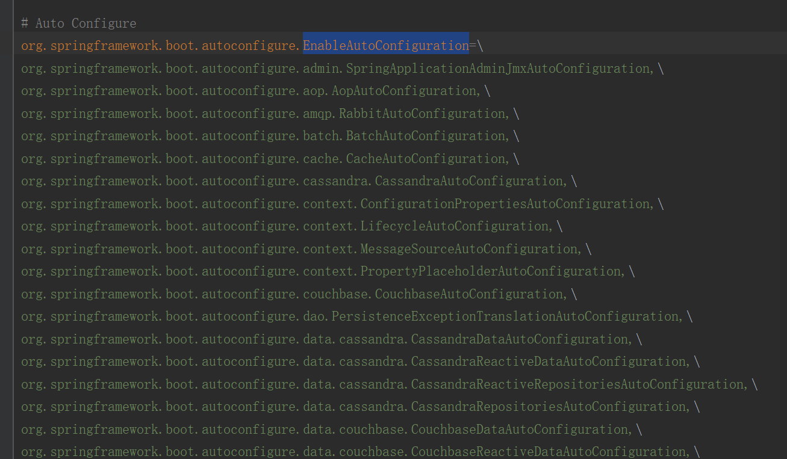

### 为什么使用SpringBoot？
1. 内嵌tomcat
2. **自动装配**
3. starter解决依赖

本文主要介绍自动装配
*** 
### 一、从使用上SpringBoot是如何实现自动装配？
1. 在启动类添加了@SpringBootApplication注解
```
@Target(ElementType.TYPE)
@Retention(RetentionPolicy.RUNTIME)
@Documented
@Inherited
@SpringBootConfiguration
@EnableAutoConfiguration
@ComponentScan(excludeFilters = { @Filter(type = FilterType.CUSTOM, classes = TypeExcludeFilter.class),
		@Filter(type = FilterType.CUSTOM, classes = AutoConfigurationExcludeFilter.class) })
public @interface SpringBootApplication {
}
```
2. 内部有一个@EnableAutoConfiguration注解
```
@Target(ElementType.TYPE)
@Retention(RetentionPolicy.RUNTIME)
@Documented
@Inherited
@AutoConfigurationPackage
@Import(AutoConfigurationImportSelector.class)
public @interface EnableAutoConfiguration {
}
```
3. 通过@Import导入AutoConfigurationImportSelector类
```
@Import(AutoConfigurationImportSelector.class)
```
***

### 从源码上解析SpringBoot是如何实现自动装配？
 
#### 一、Spring的@Import注解+Spring的SPI机制实现的
1. @Import：是Spring的注解，目的就是加载括号里面的类，到SpringIOC容器
2. Spring的SPI机制：打破双亲委派，让Spring加载自定义的文件

#### 二、SpringBoot整个加载和解析的过程

##### 简要原理
1. 当使用SpringBoot的run方法的时候，会调用Spring的refresh方法去加载@Import的类
2. @SpringBootApplication->@EnableAutoConfiguration->@Import({AutoConfigurationImportSelector.class})引入自动加载类
3. 使用SPI机制，从spring.factory里面获取类的全限定名然后通过自定义类加载器加载文件
4. 自动配置类继承ImportSelector，最终返回String[]数组，放在ConfigurationClassParser里面内部类DeferredImportSelectorHandler的deferredImportSelectors属性上
5. 加载到Spring容器


##### 详细流程
1. AbstractApplication的refresh方法内部——invokeBeanFactoryPostProcessors(beanFactory);
2. 循环BeanDefinitionRegisterPostProcessor，调用到ConfigurationClassPostProcessor的postProcessBeanDefinitionRegistry方法，ConfigurationClassPostProcessor是Spring启动的时候开天辟地的五个类之一，key是interXXX，value就是这个值，五个开天辟地类是在代码里面写死的
3. postProcessBeanDefinitionRegistry方法调用**processConfigBeanDefinitions方法**。解析和加载到Spring就在这个方法内部

***解析和加载源码***
```
// 【解析】
parser.parse(candidates);
parser.validate();

Set<ConfigurationClass> configClasses = new LinkedHashSet<>(parser.getConfigurationClasses());
configClasses.removeAll(alreadyParsed);

// Read the model and create bean definitions based on its content
if (this.reader == null) {
    this.reader = new ConfigurationClassBeanDefinitionReader(
            registry, this.sourceExtractor, this.resourceLoader, this.environment,
            this.importBeanNameGenerator, parser.getImportRegistry());
}

// 【加载】利用reader解析ConfigurationClass，同时注册BeanDefinition
this.reader.loadBeanDefinitions(configClasses);
```
4. 【解析】ConfigurationClassPostProcessor里面经过一系列的参数准备，生成ConfigurationClassParser
5. 【解析】ConfigurationClassParser的parse方法，就会扫描@Component,@ComponentScan等常用的注解，我们这一次介绍的主要是这一行代码
```
// 解析@Import，getImports方法返回AppConfig.class上定义的Import注解中所导入的类的信息
processImports(configClass, sourceClass, getImports(sourceClass), true);
```
6. 【解析】首先通过getImports方法，获得类上@Import注解对应的类，如果注解上的类上还有@Import，递归解析，最终返回类的集合
7. 【解析】执行processImports方法，去处理三种情况，我们这里只看ImportSelect的情况，因为我们注入的类AutoConfigurationImportSelector实现了DeferredImportSelector，而DeferredImportSelector实现了ImportSelector
    第一种：派生自ImportSelector：返回数组实现IOC。 
    ```
    public interface ImportSelector {
        /**
         * Select and return the names of which class(es) should be imported based on
         * the {@link AnnotationMetadata} of the importing @{@link Configuration} class.
         */
        String[] selectImports(AnnotationMetadata importingClassMetadata);
    }
    ```
    第二种：派生自ImportBeanDefinitionRegistrar:手动注册
    第三种: 普通类：直接导入IOC容器
    
    @Import整个判断流程源码
    ```
    if (candidate.isAssignable(ImportSelector.class)) {
        // Candidate class is an ImportSelector -> delegate to it to determine imports
        Class<?> candidateClass = candidate.loadClass();
        ImportSelector selector = ParserStrategyUtils.instantiateClass(candidateClass, ImportSelector.class,
                this.environment, this.resourceLoader, this.registry);
        if (selector instanceof DeferredImportSelector) {
            this.deferredImportSelectorHandler.handle(configClass, (DeferredImportSelector) selector);
        }
        else {
            String[] importClassNames = selector.selectImports(currentSourceClass.getMetadata());
            Collection<SourceClass> importSourceClasses = asSourceClasses(importClassNames);
            processImports(configClass, currentSourceClass, importSourceClasses, false);
        }
    }
    else if (candidate.isAssignable(ImportBeanDefinitionRegistrar.class)) {
        // Candidate class is an ImportBeanDefinitionRegistrar ->
        // delegate to it to register additional bean definitions
        // 如果@Import注解中的类实现了ImportBeanDefinitionRegistrar接口，就把该类的实例放入importBeanDefinitionRegistrars中，
        // 后面再执行该实例的registerBeanDefinitions方法
        Class<?> candidateClass = candidate.loadClass();
        ImportBeanDefinitionRegistrar registrar =
                ParserStrategyUtils.instantiateClass(candidateClass, ImportBeanDefinitionRegistrar.class,
                        this.environment, this.resourceLoader, this.registry);
        configClass.addImportBeanDefinitionRegistrar(registrar, currentSourceClass.getMetadata());
    }
    else {
        // Candidate class not an ImportSelector or ImportBeanDefinitionRegistrar ->
        // process it as an @Configuration class
        this.importStack.registerImport(
                currentSourceClass.getMetadata(), candidate.getMetadata().getClassName());
        processConfigurationClass(candidate.asConfigClass(configClass));
    }
    ```
8. 【解析】最后这些被import的类都被放在ConfigurationClassParser的内部类DeferredImportSelectorHandler里的deferredImportSelectors内，等待Spring加载
9. 【加载】this.reader.loadBeanDefinitions(configClasses)该方法最底层就是新建BeanDefinition，然后调用BeanDefinitionRegister的registerBeanDefinition方法
```
BeanDefinitionHolder definitionHolder = new BeanDefinitionHolder(configBeanDef, configBeanName);
definitionHolder = AnnotationConfigUtils.applyScopedProxyMode(scopeMetadata, definitionHolder, this.registry);
this.registry.registerBeanDefinition(definitionHolder.getBeanName(), definitionHolder.getBeanDefinition());
```

#### 三、SpringBoot的核心类AutoConfigurationImportSelector做了哪些工作？
该类继承DeferredImportSelector，DeferredImportSelector继承ImportSelector，重写了selectImports方法，方法内部利用Spring的SPI机制加载自动配置类
```
public class AutoConfigurationImportSelector implements DeferredImportSelector, BeanClassLoaderAware,
		ResourceLoaderAware, BeanFactoryAware, EnvironmentAware, Ordered {
	
	@Override
	public String[] selectImports(AnnotationMetadata annotationMetadata) {
		if (!isEnabled(annotationMetadata)) {
			return NO_IMPORTS;
		}
		AutoConfigurationEntry autoConfigurationEntry = getAutoConfigurationEntry(annotationMetadata);
		return StringUtils.toStringArray(autoConfigurationEntry.getConfigurations());
	}
}
```
1. 扫描：利用Spring的SPI机制获取所有类的全限定名

**什么是SPI机制？通过指定路径，文件，指明只加载这个文件，然后通自定义加载器加载**
```
protected List<String> getCandidateConfigurations(AnnotationMetadata metadata, AnnotationAttributes attributes) {
    List<String> configurations = SpringFactoriesLoader.loadFactoryNames(getSpringFactoriesLoaderFactoryClass(),
            getBeanClassLoader());
    Assert.notEmpty(configurations, "No auto configuration classes found in META-INF/spring.factories. If you "
            + "are using a custom packaging, make sure that file is correct.");
    return configurations;
}
// 拿到类的全限定名，为了过滤所有自动装配的类
protected Class<?> getSpringFactoriesLoaderFactoryClass() {
    return EnableAutoConfiguration.class;
}
```
为啥路径必须是META-INFO/spring.factory的原因就在这里，人家写死的
```
Enumeration<URL> urls = classLoader != null ? classLoader.getResources("META-INF/spring.factories") : ClassLoader.getSystemResources("META-INF/spring.factories");
```
2. 过滤：加载出所有spring.factory的key，value组成的list，然后做一些过滤，1.自己写exclude可以防止自动注入 2.根据是否pom里面有包，没有就不注入，最终返回较给Spring容器


3. 自定义类使用Spring的功能：此时那些自动配置类就已经是Bean了，已经是被Spring容器管理了，就可以使用Spring的一些功能，比如@Bean等等，所以为啥我们根本没有设置redisTemplate的Bean却可以注入，此时已经很明显了，只需要引入一个starter包然后加一些properties的配置就可以了，是不是很easy

举个RedisAutoConfiguration的例子
```
@Configuration(proxyBeanMethods = false)
@ConditionalOnClass(RedisOperations.class)
@EnableConfigurationProperties(RedisProperties.class)
@Import({ LettuceConnectionConfiguration.class, JedisConnectionConfiguration.class })
public class RedisAutoConfiguration {

	@Bean
	@ConditionalOnMissingBean(name = "redisTemplate")
	public RedisTemplate<Object, Object> redisTemplate(RedisConnectionFactory redisConnectionFactory)
			throws UnknownHostException {
		RedisTemplate<Object, Object> template = new RedisTemplate<>();
		template.setConnectionFactory(redisConnectionFactory);
		return template;
	}

	@Bean
	@ConditionalOnMissingBean
	public StringRedisTemplate stringRedisTemplate(RedisConnectionFactory redisConnectionFactory)
			throws UnknownHostException {
		StringRedisTemplate template = new StringRedisTemplate();
		template.setConnectionFactory(redisConnectionFactory);
		return template;
	}

}

```
#### 四、Spring的SPI（额外）
1. 在ConfigurationClassParser的asSourceClass方法内使用ClassUtils.forName()
```
SourceClass asSourceClass(@Nullable String className) throws IOException {
    if (className == null || className.startsWith("java.lang.annotation.")) {
        return this.objectSourceClass;
    }
    if (className.startsWith("java")) {
        // Never use ASM for core java types
        try {
            return new SourceClass(ClassUtils.forName(className,
                    this.resourceLoader.getClassLoader()));
        }
        catch (ClassNotFoundException ex) {
            throw new NestedIOException(
                    "Failed to load class [" + className + "]", ex);
        }
    }
    return new SourceClass(
            this.metadataReaderFactory.getMetadataReader(className));
}
```
2. 在ClassUtils里面，通过getDefaultClassLoader方法返回自定义类加载器去加载
```
@Nullable
public static ClassLoader getDefaultClassLoader() {
    // 先取当前线程对应的classloader
    // 再取ClassUtils类的classloader
    // 最后去系统指定的classloader

    ClassLoader cl = null;
    try {
        cl = Thread.currentThread().getContextClassLoader(); // APpClassLoader
    }
    catch (Throwable ex) {
        // Cannot access thread context ClassLoader - falling back...
    }
    if (cl == null) {
        // No thread context class loader -> use class loader of this class.
        cl = ClassUtils.class.getClassLoader();
        if (cl == null) {  // Bootstrap
            // getClassLoader() returning null indicates the bootstrap ClassLoader
            try {
                cl = ClassLoader.getSystemClassLoader(); // app
            }
            catch (Throwable ex) {
                // Cannot access system ClassLoader - oh well, maybe the caller can live with null...
            }
        }
    }
    return cl;
}
```
3. 自定义类加载器重写loadClass方法

### 总结
SpringBoot自动装配：其实自己啥也没干，都是用的Spring的类去解析，自己只是提供了spring.factory配置
1. 利用Spring的refresh方法去加载@Import注解上的信息 
2. 利用@Import注解的扩展自定义加载方法，自定义加载方法其实也就是利用Spring的SPI机制
3. SpringBoot本身就只是提供了spring.factory文件然后做了一些过滤操作