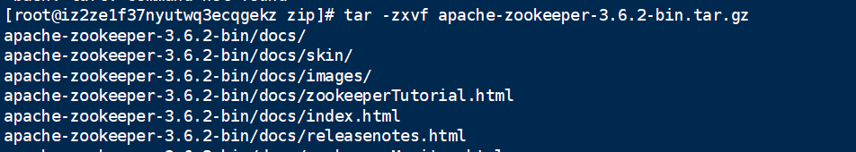
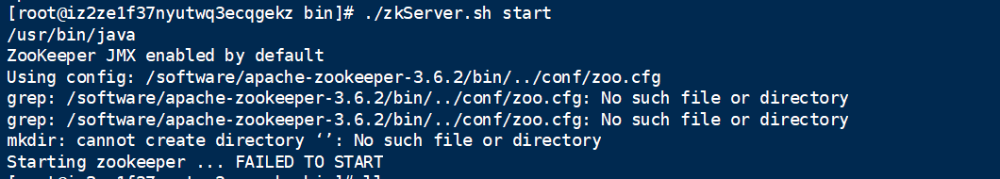
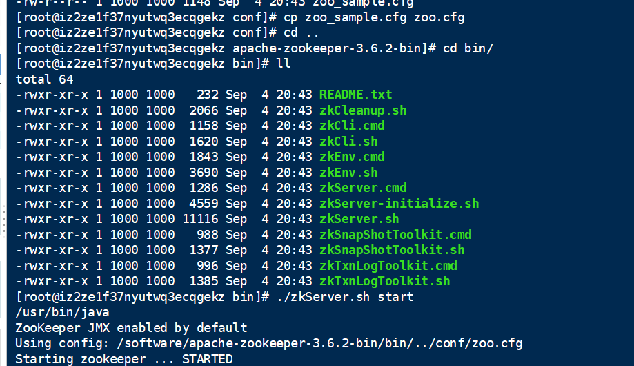
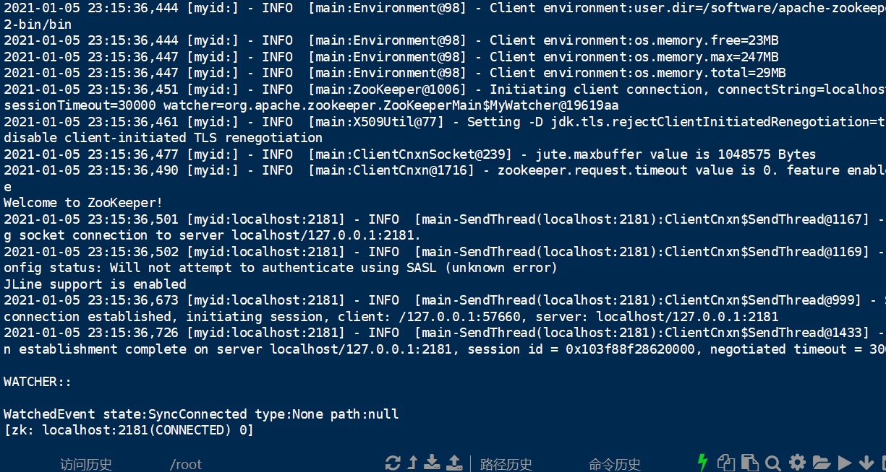
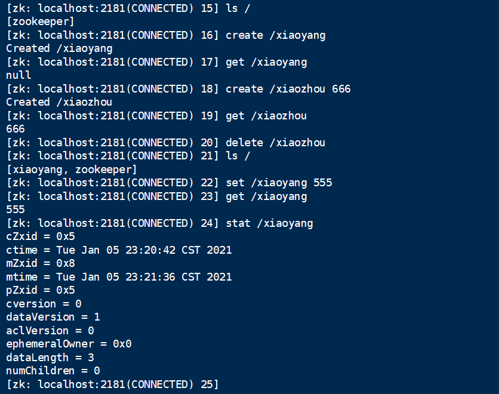
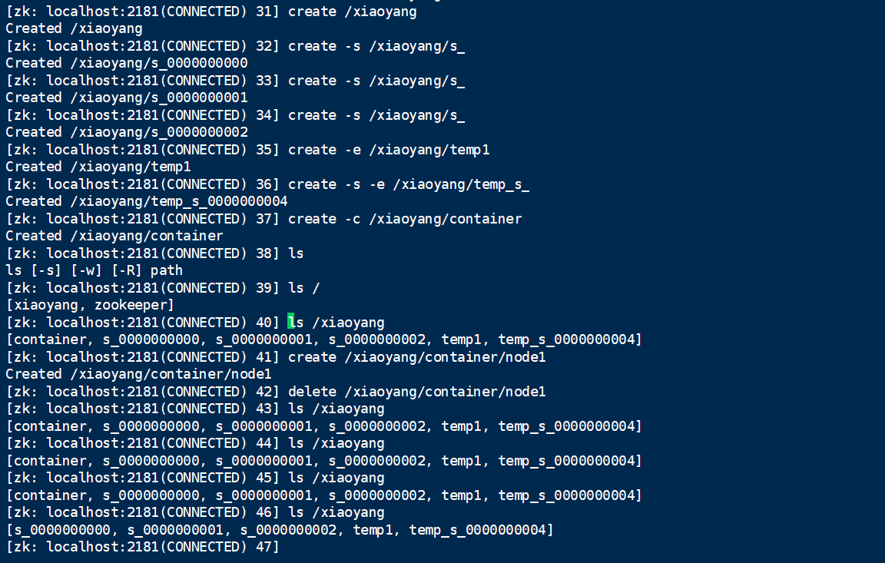

### 一、Zookeeper是什么？
Zookeeper就是一个分布式数据库，是使用Java开发的一个服务端。
#### Zookeeper有哪些特性？
1. 数据存储格式：数据存储结构是文件格式的，和我们操作系统的文件存储格式一致，每一种数据存储模式都有它的优势；比如Redis使用：Key/Value格式；数据库使用：行格式；
2. CP原则：Zookeeper占用了CAP里的CP,即保证一致性和分区容错性，一致性指的是分布式系统中，访问所有节点得到的数据都是一样的；分区容错性指系统中任意信息的丢失不会影响系统的正常运作；并没有高可用的A，不保证每个请求成功/失败都有响应

### 二、Zookeeper的安装并使用
1. 官网3.6.2运行包版本下载 https://www.apache.org/dyn/closer.lua/zookeeper/zookeeper-3.6.2/apache-zookeeper-3.6.2-bin.tar.gz
2. 将下载的gz包放到服务器上，使用tar命令解压缩  
       
3. 进入bin目录使用./zkServer.sh start命令启动，发现提示没有安装JDK，此时就可以知道其实Zk就是用Java写的，用yum命令快速安装一下(yum list |grep java/yum install -y java-1.8.0-openjdk*)
4. 此时再次使用./zkServer.sh start，发现还是报错  
       
    这是因为默认给了一个zoo_sample.cfg一个模板文件，需要自己cp一份  
      
5. 此时可以使用jps命令查看这个java进程  
      
5. 使用ZK自带客户端连接./zkCli.sh   
      
    
### 三、Zookeeper操作的命令（版本号：3.6.2）

### 常见的命令CURD
1. 查看当前目录下节点信息：ls
2. 增加：create
3. 删除：delete/deleteall
4. 修改：set
5. 获取：get当前节点的值
6. 查看状态：stat;比如cZxid代表主键id，cversion代表子节点修改版本号，dataVersion代表当前节点数据修改版本号

### 节点类型
1. 顺序节点：create -s: 会自动创建节点编号，默认是10位数从0000000000开始递增
2. 临时节点：create -e：随着客户端的连接断开而消失，默认服务端心跳10秒（客户端与服务端之间都有着心跳机制，如果一个客户端断开连接，有可能是socket网络连接断开或者是服务端服务器内存资源不足）
3. 临时顺序节点：create -s -e
4. 容器节点：create -c：当容器被使用一次以上之后，会启动定时任务每60s扫描一次，发现当前容器上没有节点的时候会将该容器节点删除
5. 定时任务节点：create -t：默认不开启（有bug，不用）
        

### ZK的Java客户端
1. 原生客户端
2. Curator框架