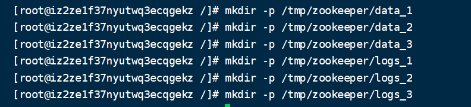
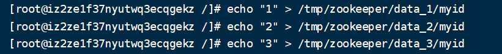
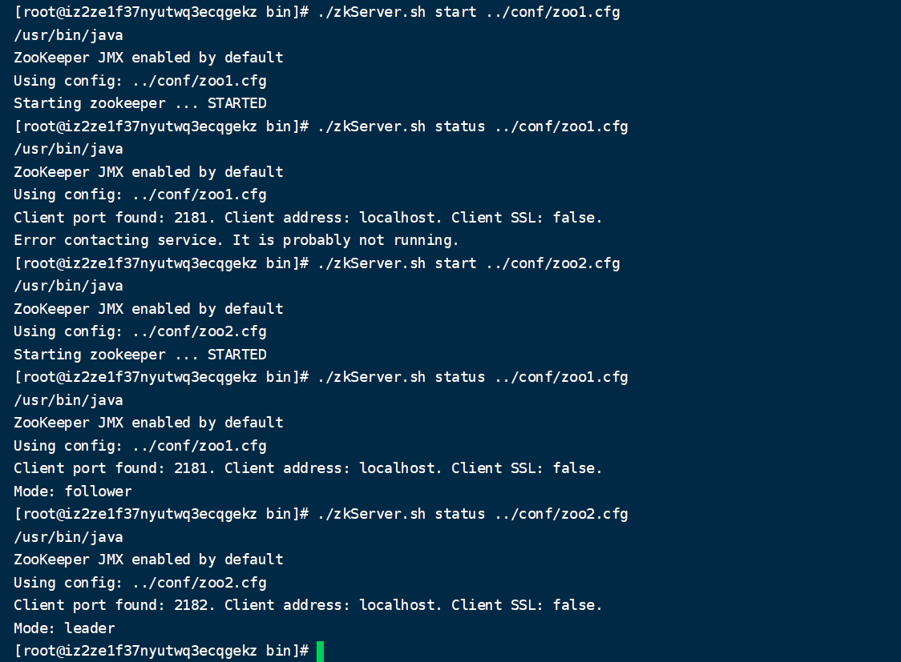
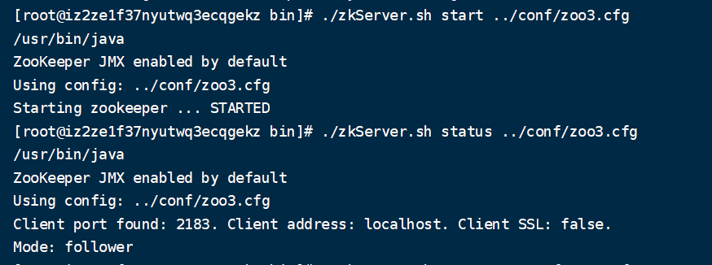
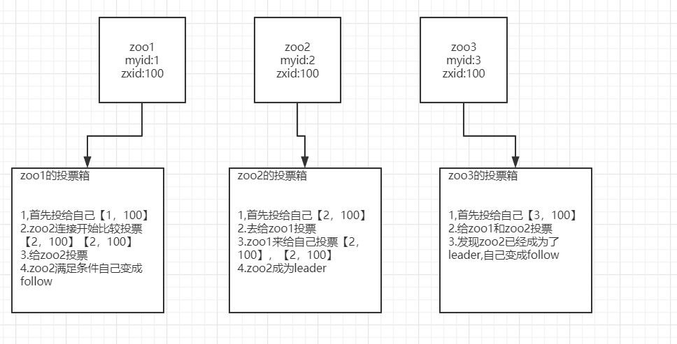
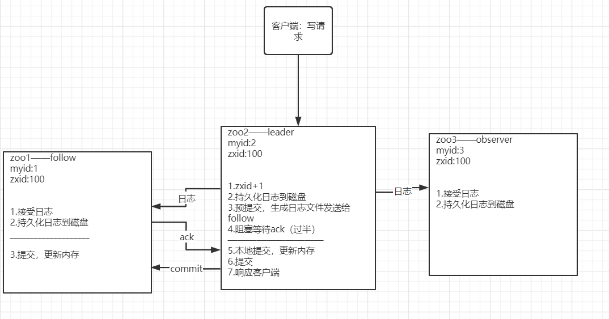

### Zookeeper集群，ZAB协议，脑裂

#### 一、搭建Zookeeper集群

1. 创建数据和日志目录  
    

2. 为每一个服务端创建一个myid  
      

3. 创建3个集群配置文件zoo1.cfg,zoo2.cfg,zoo3.cfg
    ```
    # 客户端与服务端心跳间隔，单位毫秒
    tickTime=2000
    # 同步数据允许时间，10个tickTime
    initLimit=10
    # Leader与Follow的心跳间隔，5个tickTime
    syncLimit=5
    # 数据存储位置
    dataDir=/tmp/zookeeper/data_1
    # 日志存储位置
    dataLogDir=/tmp/zookeeper/logs_1
    # 服务端端口
    clientPort=2181
    # 同步数据端口和心跳端口
    server.1=localhost:2887:3887
    server.2=localhost:2888:3888
    server.3=localhost:2889:3889
    ```
4. 启动zoo1.cfg和zoo2.cfg并观察服务状态,发现当启动zoo1.cfg的时候，zoo1的服务端并没有准备好，当启动zoo2的服务时，此时集群正式构建，zoo1成为follow，zoo2成为leader。可见集群配置至少要有两个节点  
    
5. 这时，我们再启动zoo3.cfg，猜测zoo3节点的状态是什么？      
      
    我们发现zoo3节点居然还是follow，zoo2仍旧是leader，这是为什么？下面进行介绍——zk的选举机制
    
#### Zookeeper的选举机制

#### 二、Zookeeper的选举流程
1. 首先每台服务启动时，都会有一个自己的myid，并且每一个服务都有一个投票箱，记录谁投票给了自己，并且记录有投票给自己的那一方目前数据的版本是什么（前面讲的zxid）
2. 当zoo1启动的时候，zoo1向自己的投票箱子里面先投票给自己，假设当前数据版本为100，此时zoo1投票箱子里面有一票【1，100】，等待其他服务选举
3. 当zoo2启动的时候，zoo2向自己的投票享自里面先投票给自己，假设当前数据版本也是100，此时zoo2投票箱子里面有一票【2,100】,然后此时zoo2发现还有zoo1可以进行投票，进行投票并且将当前的选票与zoo1的选票去对比，发现【2,100】>【1,100】，zoo1的票箱就转投给了zoo2，此时zoo1票箱由【1,100】->【1,100】,【2,100】->【2,100】,【2，100】，然后zoo1此时得到了zoo2的投票，那么他也要给zoo2去投票，zoo2的票箱变为【2,100】,【2，100】
4. 此时zoo2的票箱为【2，100】,【2，100】,已经触发了过半机制（目前2个节点投票给自己>总共2台有投票权的节点/2），zoo2晋升为leader节点，选举结束，zoo1变为follow节点
5. 此时zoo3启动，节点数据达到3，此时zoo2的票数2>3/2，仍旧可以是leader节点，此时zoo3就自动变成follow节点
6. 最终三台机器启动，leader为zoo2,而不是zoo1和zoo3,优先于于zoo2的myid=2>zoo1的myid=1，以及已经是满足leader了

       
##### 什么是leader节点，follow节点，observer节点
1. leader：zookeeper经过选举机制选举出来唯一拥有**写功能**的节点
2. follow: zookeeper参与投票的读节点
3. observer: 没有权利参与选举的读节点

##### 为什么要有observer这个节点呢？
原因：主要原因是2pc，两阶段提交中leader节点会阻塞等待follow节点的ack，获得过半ack才提交，比较消耗性能，下面来详细介绍两阶段提交  
zookeeper通过两阶段提交尽量保证强一致性，其实还是最终一致性的。因为读是可以从observer和follower节点读取的，两阶段又是过半ack，此时很可能其中一些节点数据还没有同步完成

#### 三、两阶段提交

##### 两阶段提交流程
1. 首先一个请求通过socket连接来执行写操作，也就是通过leader节点进行写操作
2. leader节点得到请求，将当前的zxid+1，然后持久化到磁盘中
3. 持久化之后，开始预提交，先生成日志对象，对象里面包含最新的zxid以及写操作的内容，然后发送给follow节点和observer节点，将当前的leader节点进行阻塞，等待ack，并且此时更新数据到自己的内存中
4. follow和observer节点接收到日志对象之后，也是先持久化到磁盘中，此时只有follow节点返回ack给leader节点 **（这也是为什么observer没有选举功能的原因）**
5. 当leader接收到的ack达到一半以上时，leader节点给follow节点发送commit指令，让他将落盘的日志信息更新到他的内存里
6. 响应给客户端，写操作完成

       
##### 两阶段提交的关键点
1. 先落磁盘，再更新内存，只要follow节点落盘了，那么基本上就能更新数据了，就发消息给leader节点，说数据同步完成了
2. 阻塞ack过半机制

#### 四、补偿机制

##### 什么是补偿机制
当一个节点因为网络原因，没有及时ack或者心跳断开，假如断开时zxid为100，当它重连成功，重新进行选举，假如此时发过来的日志对象的zxid已经是110时，会触发数据同步，丢弃当前节点的数据，直接将leader节点的数据全量同步过来，leader节点落盘的数据和redis的rdb/aof机制类似，多的话会进行整合，然后一次性发过来。

##### 为什么要有补偿机制
假如当前节点的zxid为100，但是接受到的是110，然后zxid为109的命令为create /node 1,zxid为110的命令为set /node 1，此时如果直接执行zxid为110的显然会报错，就必须得重新同步数据

#### 五、脑裂——Zookeeper没有脑裂！

犹记得刚入职的时候，发现组内zookeeper出问题，其他服务都连不上的时候，大佬们在讨论说可能是zk脑裂导致的，如今自己学习了，才发现zk根本没有脑裂呀！或许可能是zk新版本解决了这个问题
##### 什么是脑裂？
当有两个机房，部分节点在A机房，另外一部分节点在B机房，然后A,B机房出现网络问题，A机房节点和B机房节点各自去进行选举了，出现两个leader，导致有两个写的口子，导致数据一致性不能保证

##### Zookeeper是怎么解决脑裂问题的？
Zookeeper的选举过半机制，即假设现在有6台机器，A有3台，B有3台，那么选举所要达到的票数需要是4，6/3+1，根本选不出来leader节点，即集群无法对外进行提供服务了

##### 为什么推荐生产环境使用奇数的zk节点
1. 可用性：因为3台机器的时候，挂一台，还可以选举出leader节点，4台机器的时候，挂一台，也可以选举出leader节点，可用性上来说，挂一台，3个机器和4个机器都可以接受。
2. leader节点选举：假如是6台，两个环境，3，3，最终选举不出来节点，还不如是5台，2，3，一方还能选举出来3>=5/2+1

#### 六、ZAB协议（Zookeeper Atomic Broadcast Zookeeper原子广播）
1. Zookeeper通过ZAB协议来保证分布式事务的最终一致性
2. ZAB协议就是Leader,Follow模型——只通过Leader来写，然后通过2PC同步消息给Follow和Observer，提供读功能


    