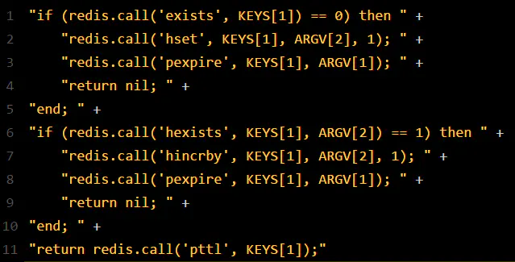

### 如何利用Redis和Zookeeper实现分布式锁

#### 一、Redis实现分布式锁方式
1. Redission框架
2. RedLock：红锁

#### Redission框架

用起来纵享丝滑
```
RLock lock = redission.getLock("lockStr");
lock.lock();
lock.unlock()
```

##### 实现流程
1. 给redis发送lua脚本，保证原子性
  
    

2. 加锁：通过hash算法找到一台redis节点，执行上述脚本

3. 加锁成功：通过watch dog，每十秒查看一次，如果锁要延期了，但是锁还被占有，那就延长加锁事件

##### 脚本解析
- KEYS[1]:lockStr
- ARGV[1]:锁生存时间，默认30秒
- ARGV[2]:加锁的客户端ID,xxx-xxxx-xxxx-xxxx-xxxx:1
1. redis.call('exists', KEYS[1] == 0) 

    首先判断lockStr这个键是否存在，如果存在向下执行
2. redis.call('hset', KEYS[1], ARGV[2], 1)；redis.call('pexpire',KEYS[1],ARGV[1]);
    
    如果没有，就以hash结构，进行存储。存储完毕,设置过期时间，默认30秒
    
3. 此时客户端1获取分布式锁，客户端2去获取锁，执行上述的lua，发现key已经有了，二次判断hash结构内是否存在当前客户端2的信息，并且值为1，为头信息；如果不满足，则返回pttl，返回lockStr锁的剩余时间，进入while循环，尝试加锁

4. 如果此时客户端2获取到了锁，并且之前就是自己，就进行重入，执行hincrby命令，并且重新设置过期时间
    
5. 释放锁，就是直接删除这个key——lockStr

##### Redission的问题

1. 对于redis-cluster，master节点会异步给slave节点同步数据，如果主节点宕机，会切换到从节点，从节点数据不完整，导致出现两个客户端同时获取到了分布式锁

***
#### RedLock

1. 业务场景： 多台master，节点完全独立，节点之间不需要数据同步
2. 客户端用相同的key和随机值在每个节点上请求锁
3. 请求锁的超时时间小于锁自动释放时间，如果超过半数的redis获取到了锁，就说明获取到了
4. 如果没有获取到，释放其他已经锁的Redis

***
#### Zookeeper分布式锁
1. 利用临时顺序节点

##### 实现流程
1. 客户端A尝试加锁，在节点lock_node节点下创建一个临时顺序节点
2. 查看当前创建的节点是否是头节点，如果是头节点就创建成功
3. 客户端B去尝试加锁，发现在lock_node节点上的头节点并不是自己，就启用一个监听器去监听上一个节点
4. 如果客户端A释放节点，delete之后，客户端B监听器监听到解锁信息，去获取到锁信息

##### 为什么使用临时顺序节点？
1. 临时节点：当客户端宕机之后，会自动释放锁
2. 顺序节点：排队机制


 