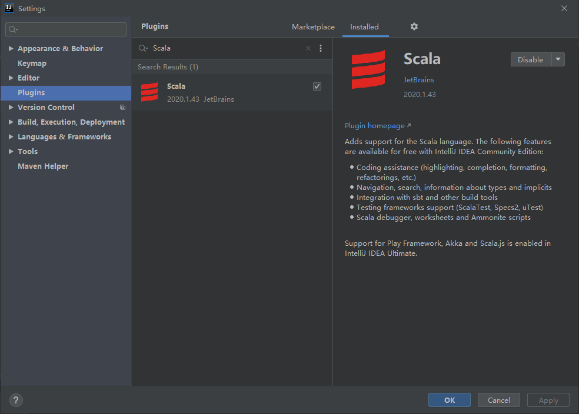
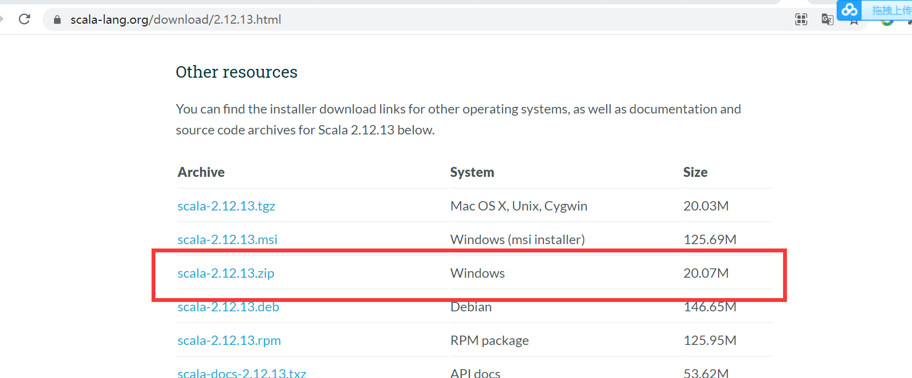
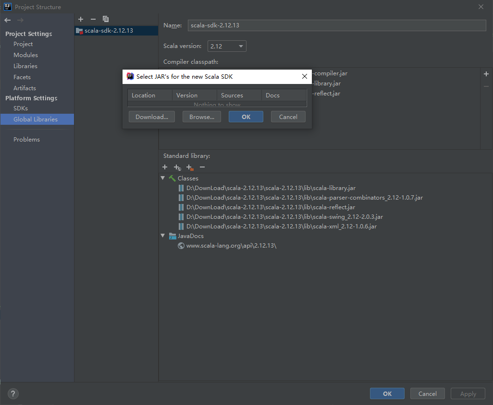

#### 如何使用IDEA开发Spark项目
1. Spark主流使用Scala开发，IDEA需要安装Scala插件
2. 官方网站下载scala包
3. 引入Spark的Maven依赖

##### 一、安装IDEA插件



##### 二、下载Scala包

1. 下载的是2.12.13版本

2. 通过Project导入下载好的包


##### 三、引入maven依赖
```
<dependencies>
    <dependency>
        <groupId>org.apache.spark</groupId>
        <artifactId>spark-core_2.12</artifactId>
        <version>3.0.0</version>
    </dependency>
</dependencies>
```
