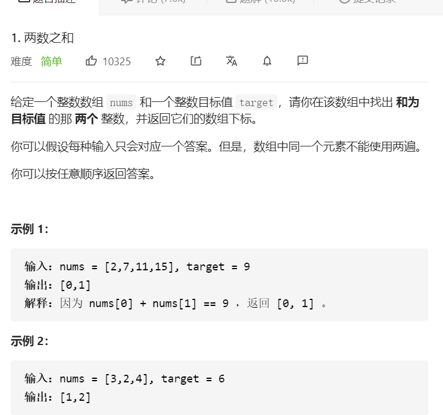
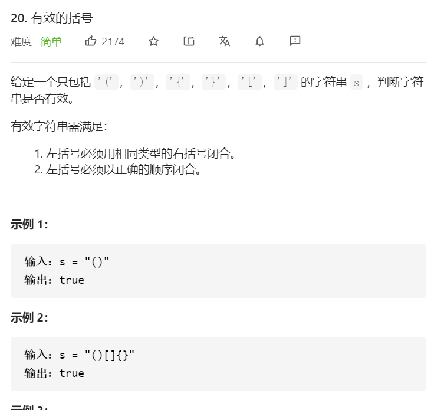
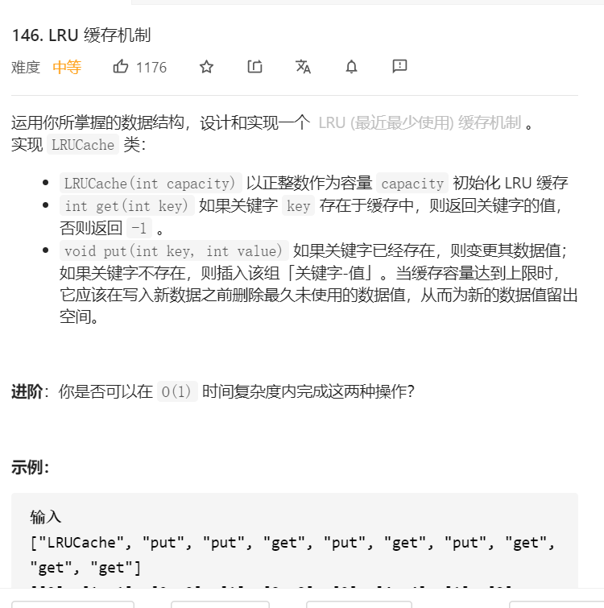

前言：阿里三面主要考察数据结构，当时表现并不好

##### 一、LeetCode1.两数之和

解题思想：利用Map，判断条件为：目标值-当前值在map中是否存在
```
public int[] twoSum(int[] nums, int target) {
    Map<Integer, Integer> map = new HashMap<>();
    for (int i = 0; i < nums.length; i++) {
        Integer value = map.get(target - nums[i]);
        map.put(nums[i], i);
        if (value != null && value != i) {
            return new int[] {i, value};
        }
    }
    return null;
}
```

##### 二、LeetCode20.有效的括号

解题思想：利用栈的特性
```
public boolean isValid(String s) {
      Stack<Character> stack = new Stack<>();
    for (int i = 0; i < s.length(); i++) {
        if (stack.isEmpty()) {
            stack.push(s.charAt(i));
        } else {
            Character peek = stack.peek();
            if (s.charAt(i) == ')' && peek == '(') {
                stack.pop();
            } else if (s.charAt(i) == ']' && peek == '[') {
                stack.pop();
            } else if (s.charAt(i) == '}' && peek == '{') {
                stack.pop();
            } else {
                stack.push(s.charAt(i));
            }
        }
    }
    return stack.isEmpty();
}
```
##### 三、LeetCode146.LRU缓存机制

解题思想：利用hash表+双端节点，hash表保证查找为O(1)，双端节点来维护LRU的状态，提前初始化好伪头节点和伪尾节点，后续就无需判断
```
/**
 * 内部结构
 */
private class Node {
    int key;
    int value;
    Node pre;
    Node next;

    public Node() {

    }

    public Node(int key, int value) {
        this.key = key;
        this.value = value;
    }
}

/**
 * hash表
 */
private Map<Integer, Node> cacheMap = new HashMap<>();

/**
 * 目前数目
 */
private int size;

/**
 * 容量
 */
private int capacity;

/**
 * 头，尾
 */
private Node head, tail;

public LruCache() {

}

public LruCache(int capacity) {
    cacheMap = new HashMap<>(capacity);
    head = tail = new Node();
    head.next = tail;
    tail.pre = head;
    this.capacity = capacity;
}

/**
 * get方法
 *
 * @return
 */
public int get(int key) {

    Node node = cacheMap.get(key);
    if (node == null) {
        return -1;
    }
    moveToHead(node);
    return node.value;
}

/**
 * put方法
 *
 * @param key
 * @param value
 */
public void put(int key, int value) {

    Node node = cacheMap.get(key);
    if (node == null) {
        Node newNode = new Node(key, value);
        addToHead(newNode);
        cacheMap.put(key, newNode);
        size++;
        if (size > capacity) {
            int removeKey = removeTail();
            cacheMap.remove(removeKey);
            size--;
        }
    } else {
        node.value = value;
        moveToHead(node);
    }
}

/**
 * 添加节点到头部
 *
 * @param node
 */
private void addToHead(Node node) {

    head.next.pre = node;
    node.next = head.next;
    head.next = node;
    node.pre = head;
}

/**
 * 将某个节点移到头节点
 *
 * @param node
 */
private void moveToHead(Node node) {

    removeNode(node);
    addToHead(node);
}

/**
 * 移除尾部节点
 */
private int removeTail() {

    int removeKey = tail.pre.key;
    tail.pre.pre.next = tail;
    tail.pre = tail.pre.pre;
    return removeKey;
}

/**
 * 移除某个节点
 *
 * @param node
 */
private void removeNode(Node node) {

    node.pre.next = node.next;
    node.next.pre = node.pre;
}
```